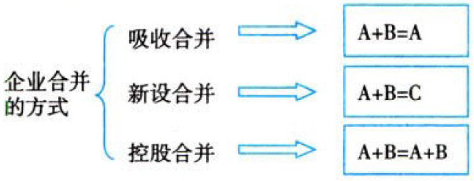

企业合并

# 1. 企业合并概述

## 1.1. 企业合并的界定

### 1.1.1. 概念

企业合并是将两个或两个以上单独的企业（主体）合并形成一个报告主体的交易或事项。【2个主体-\>1个主体】

### 1.1.2. 构成企业合并至少包括两层含义

①取得对另一个或多个企业（或业务）的`控制权`。【控制】

②所合并的企业必须构成`业务`。【业务】

业务是指企业内部某些生产经营活动或资产负债的组合，该组合具有`投入`、加工`处理`过程和`产出`能力，能够`独立计算`其`成本`费用或所产生的`收入`等。目的在于为投资者提供股利、降低成本或带来其他经济利益，有关资产或资产、负债组合是否构成业务，企业应当结合实际情况进行判断。【活的】

若不构成业务，就不按企业合并准则处理。应将`购买成本`按购买日所取得各项可辨认资产、负债的相对公允价值为基础进行`分配`，不按照企业合并准则进行处理，按照`权益性交易`原则不得确认商誉或当期损益。【买死物，不是合并】【死物无商誉】

若构成业务（非同一控制），当合并成本大于取得的可辨认净资产公允价值份额时，其差额确认为`商誉`；合并成本小于取得的可辨认净资产公允价值份额时，其差额确认为`负商誉`，计入当期损益。【活物有商誉】

提示：在企业合并中，交易费用应被`费用化`。【不得虚增资产】

提示：业务合并中购买的资产和承担的债务因账面价值与计税基础不同形成的暂时性差异应确认`递延所得税`影响。【影响递延所得税】

### 1.1.3. 不包括在企业合并准则规范范围内的交易或事项

①购买子公司的`少数股权`，考虑到该交易或事项发生前后，不涉及控制权的转移，报告主体未发生变化，不属于企业合并。【没有2合1】

②两方或多方形成`合营`企业。【没有2合1】

## 1.2. 企业合并的方式

企业合并的方式包括`吸收`合并【吞】、`新设`合并【仔】、`控股`合并【控】，如下图所示：



## 1.3. 企业合并类型的划分

### 1.3.4. 两类

①同一控制下企业合并：是指参与合并的企业在合并前后均受同一方或相同的多方`最终控制`且该控制并非暂时性的。【左口袋到右口袋】

②非同一控制下企业合并：是指参与合并各方在合并前后不受同－方或相同多方最终控制的合并交易，即除判断属于同一控制下企业合并的情况以外其他的企业合并。【买卖】

### 1.3.5. 要点

判断某一企业合并是否属于同一控制下的企业合并，应当把握以下`要点`：{

①能够对参与合并各方在合并前后均实施最终控制的一方通常指企业集团的`母公司`。

②能够对参与合并的企业在合并前后均实施最终控制的相同多方，是指根据合同或协议的约定，拥有最终决定参与合并企业的财务和经营决策，并从中获取利益的`投资者群体`。

③实施控制的`时间性`要求，是指参与合并各方在最终控制方的控制时间一般在`1年`以上（含1年），企业合并后所形成的报告主体在最终控制方的控制时间也应达到`1年`以上（含1年）。

④企业之间的合并是否属于同一控制下的企业合并，应综合构成企业合并交易的各方面情况，按照`实质重于形式`的原则进行判断。通常情况下，同一控制下的企业合并是指发生在同一`企业集团`内部企业之间的合并。同受`国家`控制的企业之间发生的合并，不应仅仅因为参与合并各方在合并前后均受国家控制而将其作为同一控制下的企业合并。

}

# 2. 企业合并.会计处理

## 2.4. 同一控制下企业合并的处理

### 2.4.6. 权益结合法

同一控制下企业合并应用的是`权益结合法`。

权益结合法，亦称`股权结合法`、`权益联营法`，是企业合并业务会计处理方法之一。它视企业合并为参与合并的双方，通过股权的`交换`形成的所有者权益的`联合`，而非资产的`交易`。换言之，它是由两个或两个以上经营主体对一个联合后的企业或集团公司开展经营活动的资产贡献，即经济资源的`联合`。【没有买卖】

在权益结合法中，原所有者权益继续存在，以前会计基础保持不变。参与合并的各企业的资产和负债继续按其原来的`账面价值`计量，合并后企业的利润包括合并日之前本年度已实现的利润；以前年度累积的留存利润也应予以合并。【资产不变，利润不变】

合并方在企业合并中取得的资产和负债，应当按照合并日被合并方的资产、负债在最终控制方的`合并报表`中的`账面价值`计量。合并方取得的可辨认净资产`账面价值`份额与支付的合并对价账面价值（或发行股份面值总额）的差额，应当调整`资本公积`（资本溢价或股本溢价）；资本公积（资本溢价或股本溢价）不足冲减的，调整留存收益。【只调资本公积】

提示：同一控制下企业合并中不产生`新的`资产和负债。【资产不变，利润不变】

提示：原最终控制方取得被合并方控制权时确认的`商誉`应作为合并方合并中取得的资产`确认`，但合并过程中不产生`新的`商誉。【商誉不变】

### 2.4.7. 长期股权投资.确认+计量

:moneybag:【会计分录】长期股权投资.确认+计量

```
借：长期股权投资 // 合并日A%+B
    应收股利 // 享有被投资单位已宣告但尚未发放的现金股利
  贷：资产/负债 // 支付的合并对价的账面价值
      资本公积——资本溢价/股本溢价 // 倒挤的差额
```

`A`%+`B`：享有被合并方相对于最终控制方而言的所有者权益`账面价值`的份额+最终控制方收购被合并方形成的`商誉`。

### 2.4.8. 合并日.合并财务报表

同一控制下企业合并的基本处理原则是，视同合并后形成的报告主体在`合并日`及以前期间一直存在。【如果最开始就是合并状态，会怎样？】

#### 2.4.8.1. 合并资产负债表

被合并方的有关资产、负债应以其`账面价值`并入合并财务报表（合并方与被合并方采用的会计政策、会计期间不同的，按照`合并方`的会计政策、会计期间，对被合并方有关资产、负债进行`调整`）。这里的账面价值是指被合并方的资产、负债（包括最终控制方收购被合并方时形成的商誉）在最终控制方`合并财务报表`中的账面价值。【看最终控制方的数据】

合并方与被合并方在合并日及以前期间发生的交易，应作为内部交易进行`抵销`。

合并方的财务报表`比较数据`追溯调整的期间应不早于双方处于最终控制方的控制之下孰晚的时间。【追溯至同被控制的时刻】

合并财务报表的主体是母公司和子公司组成的企业集团，该集团的所有者是母公司投资者，因此，在合并日，应`抵销`母公司长期股权投资与子公司所有者权益。

:moneybag:【会计分录】抵销分录

```
借：股本
    资本公积
    其他综合收益
    盈余公积
    利润分配——未分配利润
  贷：长期股权投资
      少数股东权益
```

提示：抵销分录不产生`新的`商誉，但在被合并方是最终控制方以前年度从外部第三方收购来的情况下，借方应反映最终控制方收购被合并方时形成的商誉。

在编制合并日合并财务报表时，应将母公司长期股权投资和子公司所有者权益抵销，但子公司原由企业集团其他企业控制时的留存收益在合并财务报表中是存在的，所以对于被合并方在企业合并前实现的留存收益（盈余公积+未分配利润）中归属于合并方的部分，在合并工作底稿中，应编制下列会计分录：

:moneybag:【会计分录】`合并`抵销分录【恩，看不懂，需要程序支援】

```
借：资本公积 // 以资本溢价/股本溢价的贷方余额为限
  贷：盈余公积 // 归属于现行母公司部分
      利润分配——未分配利润 // 归属于现行母公司部分
```

提示：因合并方的资本公积（资本溢价或股本溢价）余额不足，被合并方在合并前实现的留存收益中归属于合并方的但在合并资产负债表中未予恢复的部分，应在合并财务报表`附注`中进行说明。【利润可能没有充分显示在利润表中】

#### 2.4.8.2. 合并利润表

合并方在编制合并日的合并利润表时，应包含合并方及被合并方自合并`当期期初`至合并日实现的净利润。【从期初开始算】

双方在当期发生的交易，应当按照合并财务报表的有关原则进行`抵销`。

#### 2.4.8.3. 合并现金流量表

同合并利润表的编制原则。

## 2.5. 非同一控制下企业合并的处理

非同一控制下企业合并处理的基本原则是`购买法`。即将企业合并视为购买企业以一定的价款购进被购买企业的机器设备、存货等资产项目，同时承担该企业的所有负债的行为，从而按合并时的`公允价值`计量被购买企业的净资产，将投资成本（购买价格）超过享有净资产公允价值份额的差额确认为`商誉`的会计方法。【买卖，会有商誉】

非同一控制下企业合并`成本`的确定及相关会计处理参见[“长期股权投资与合营安排”](资产.长期股权投资.md)的相关介绍。

应予说明的是，企业合并发生的`当期期末`，因合并中取得的各项可辨认资产、负债及或有负债的公允价值或企业合并成本只能暂时确定的，购买方应当以所确定的暂时价值为基础对企业合并进行确认和计量。购买日后`12个月`内对确认的暂时价值进行调整的，视为在购买日确认和计量。【1年内调整，都视为购买日干的】

## 2.6. 企业合并涉及的或有对价

### 2.6.9. 同一控制

同一控制下企业合并形成的长期股权投资初始确认时可能存在`或有对价`。

在这种情况下，应按照《企业会计准则第13号——或有事项》（以下简称“或有事项准则”）的规定，判断或有对价是否满足确认预计负债或者确认资产的`条件`，以及确认的`金额`；确认相关负债或资产的，其金额与后续或有对价结算金额的差额`不影响`损益，而应当调整“`资本公积——资(股)本溢价`”，“`资本公积——资(股)本溢价`”不足冲减的，调整`留存收益`。【不能改变损益，就在资本公积里折腾】

### 2.6.10. 非同一控制

某些情况下，合并各方可能在合并协议中约定，根据未来一项或多项`或有事项`的发生，购买方通过发行额外证券、支付额外现金或其他资产等方式追加合并对价，或者要求返还之前已经支付的对价。【对赌吗？】

购买方应当将合并协议约定的`或有对价`作为企业合并转移对价的一部分，按照其在购买日的公允价值计入企业合并`成本`。

或有对价符合`权益工具`和`金融负债`定义的，购买方应当将支付或有对价的义务确认为一项`权益`或`负债`；符合资产定义并满足`资产`确认条件的，购买方应当将符合合并协议约定条件的、可回收的部分已支付合并对价的`权利`确认为一项`资产`。

购买日后`12个月`内出现对购买日已存在情况的新的或者进一步证据而需要调整或有对价的，应当予以确认并对原计入合并`商誉`的金额进行调整。【1年内调整，都视为购买日干的】

其他情况下发生的或有对价变化或调整，应当区分以下情况进行会计处理：或有对价为权益性质的，不进行会计处理；【权益太玄，视而不见】或有对价为资产或负债性质的，按照企业会计准则有关规定处理，如果属于《企业会计准则第22号——金融工具确认和计量》中的金融工具，应当按照［以公允价值计量且其变动计入当期`损`益］进行会计处理，不得指定为以［公允价值计量且其变动计入其他`综`合收益］的金融资产。

提示：一般情况下，被购买方原股东以持有购买方股票作为业绩承诺对价，因`股数不固定`，不能作为权益工具处理，应按金融资产处理。

## 2.7. 反向购买的处理

### 2.7.11. 反向购买的会计处理

非同一控制下的企业合并，以`发行权益性证券`交换股权方式进行的，通常发行权益性证券的一方为购买方。但某些企业合并中，发行权益性证券的一方因其生产经营决策在合并后被参与合并的另一方所控制的，发行权益性证券的一方虽然为法律上的母公司，但其为会计上的被购买方，该类企业合并通常称为“反向购买”。【钱归你，你归我】

例如，A公司为一家规模`较小`的上市公司，B公司为一家规模`较大`的贸易公司。B公司拟通过收购A公司的方式达到上市目的，但该交易是通过A公司向`B公司原股东`发行普通股用以交换B公司原股东持有的对`B公司股权`方式实现。该项交易后，B公司原控股股东持有A公司50%以上股权，A公司持有B公司50%以上股权，A公司为法律上的母公司、B公司为法律上的子公司，但从`会计`角度来看，A公司为被购买方，`B公司`为购买方。

#### 2.7.11.4. 企业合并成本

反向购买中，企业合并成本是指，假设法律上的子公司（会计上的购买方）以`发行权益性证券`的方式，获取了在合并后报告主体的股权`比例`，那么，应向法律上的母公司（会计上的被购买方）的股东发行的权益性证券`数量`乘以其`公允价值`计算的结果。【按正向购买计算】

购买方的权益性证券在购买日存在公开报价的，通常应以公开报价作为其公允价值；购买方的极益性证券在购买日不存在可靠公开报价的，应参照购买方的公允价值和被购买方的公允价值两者之中有更为明显证据支持的作为基础，确定购买方假定应发行权益性证券的公允价值。【标准：公开市价-\>购买方公允价值-被购买方公允价值】

#### 2.7.11.5. 合并财务报表的编制

`反向购买`主要表现在购买日编制合并财务报表的操作中，其总的原则是应体现`“反向”`，比如，反向购买的合并财务报表以`法律上子公司`（会计上购买方）为主体，保留子公司的股东权益各项目，`抵销`法律上母公司（会计上被购买方）的股东权益各项目。【实质重于形式】

反向购买后，法律上的母公司应当遵从以下原则编制合并财务报表：{

①合并财务报表中，法律上子公司的资产、负债应以其在合并前的`账面价值`进行确认和计量。【“子”没有被卖】

②合并财务报表中的留存收益和其他权益余额应当反映的是`法律上子公司`在合并前的留存收益和其他权益余额。【“子”没有被卖】

③合并财务报表中的权益性工具的金额应当反映`法律上子公司`合并前发行在外的股份面值【原面值】以及假定在确定该项企业合并成本过程中新发行的权益性工具的金额【按正向购买计算】。但是在合并财务报表中的权益结构应当反映`法律上母公司`的权益结构，即法律上母公司发行在外权益性证券的数量及种类。【金额vs结构，怎么处理？】

④法律上母公司的有关可辨认资产、负债在并入合并财务报表时，应以其在`购买日`确定的公允价值进行合并，企业合并成本大于合并中取得的法律上母公司（被购买方）可辨认净资产公允价值的份额体现为`商誉`，小于合并中取得的法律上母公司（被购买方）可辨认净资产公允价值的份额确认为合并`当期损益`。【同于普通购买的处理】

⑤合并财务报表的`比较信息`应当是`法律上子公司`的比较信息（即法律上子公司的前期合并财务报表）。【实质重于形式】

⑥法律上子公司的有关股东在合并过程中`未`将其持有的股份转换为法律上母公司股份的，该部分股东享有的权益份额在合并财务报表中应作为`少数股东权益`列示。【嗯哼】该部分少数股东权益反映的是少数股东按持股比例计算享有法律上子公司`合并前`净资产账面价值的份额。另外，对于法律上母公司的所有股东，在本次交易后持有合并后主体的权益，虽然该项合并中其被认为被购买方，但其享有合并形成报告主体的净资产及损益，不应作为少数股东权益列示。【实质重于形式】

}

上述反向购买的会计处理原则仅适用于`合并财务报表`的编制。法律上母公司在该项合并中形成的对法律上子公司长期股权投资成本的确定，应当应从《企业会计准则第2号——长期股权投资》的相关规定。

假定A上市公司于2×19年3月31日通过定向增发本公司普通股对B公司进行合并，B公司原股东能够对A上市公司实施控制。合并财务报表中合并金额的计算如下表所示：

| 项目                                      | 合并金额                                                                                                            |
|-------------------------------------------|---------------------------------------------------------------------------------------------------------------------|
| 流动资产                                  | A公司在购买日的公允价值＋B公司账面价值                                                                              |
| 非流动资产                                | A公司在购买日的公允价值（不含反向购买时产生的长期股权役资）+B公司账面价值                                           |
| 商誉                                      | B公司的合并成本－A公司可辨认净资产公允价值的份额（如为负数应反映在留存收益中）                                      |
| 资产总额                                  | 合计                                                                                                                |
| 流动负债                                  | A公司在购买日的公允价值＋B公司账面价值                                                                              |
| 非流动负债                                | A公司在购买日的公允价值＋B公司账面价值                                                                              |
| 负债总额                                  | 合计                                                                                                                |
| 股本（A公司股票股数）                     | B公司合并前发行在外的股份面值×A公司持有B公司股份比例＋假定B公司在确定该项企业合并成本过程中新发行的权益性工具的面值 |
| 资本公积                                  | 差额                                                                                                                |
| 盈余公积                                  | B公司合并前盈余公积×A公司持有B公司股份比例                                                                          |
| 未分配利润                                | B公司合并前未分配利润×A公司持有B公司股份比例                                                                        |
| 少数股东权益（B公司的少数股东享有的部分） | 少数股东按持有B公司股份比例计算享有B公司合并前净资产账面价值的份额                                                  |
| 所有者权益总额                            | 资产总额－负债总额                                                                                                  |

#### 2.7.11.6. 每股收益的计算

发生反向购买当期，用于计算每股收益的发行在外普通股`加权平均数`：{

①自`当期期初`至`购买日`，发行在外的普通股数量应`假定`为在该项合并中法律上母公司向法律上子公司股东发行的普通股数量。【A发了多少股】

②自`购买日`至`期末`发行在外的普通股数量为法律上母公司`实际`发行在外的普通股股数。【A一共多少股】

}

反向购买后对外提供`比较`合并财务报表的，其`比较前期`合并财务报表中的基本每股收益，应以`法律上子公司`在每一比较报表期间归属于普通股股东的净损益`除以`在反向购买中法律上母公司向法律上子公司股东发行的普通股股数计算确定。【子公司利润/A发了多少股】

上述假定［法律上子公司发行的普通股股数］在比较期间内和自反向购买发生期间的期初至购买日之间未发生变化。如果［法律上子公司发行的普通股股数］在此期间发生了`变动`，计算每股收益时应适当考虑其影响进行调整。

### 2.7.12. 非上市公司购买上市公司股权实现间接上市的会计处理

非上市公司以所持有的对子公司投资等资产为对价取得上市公司的控制权，构成`反向购买`的，上市公司编制合并财务报表时应当区别以下情况处理：{

①交易发生时，上市公司未持有任何资产、负债或仅持有现金、［以公允价值计量且其变动计入当期损益］的金融资产等不构成业务的资产或负债的，上市公司在编制合并财务报表时，购买企业应按照`权益性交易`原则进行处理，不得确认商誉或计入当期损益。【空壳上市公司？】

②交易发生时，上市公司保留的资产、负债构成`业务`的，对于形成非同一控制下企业合并的，企业合并成本与取得的上市公司可辨认净资产公允价值份额的差额应当确认为`商誉`或计入`当期损益`。【又在重复老话了】

}

非上市公司取得上市公司的`控制权`，构成反向购买的，上市公司在其`个别财务报表`中应按照长期股权投资初始计量原则确认取得资产的入账价值。上市公司的`前期`比较个别财务报表应当为其`自身`个别财务报表。

# 3. 总结

End。
