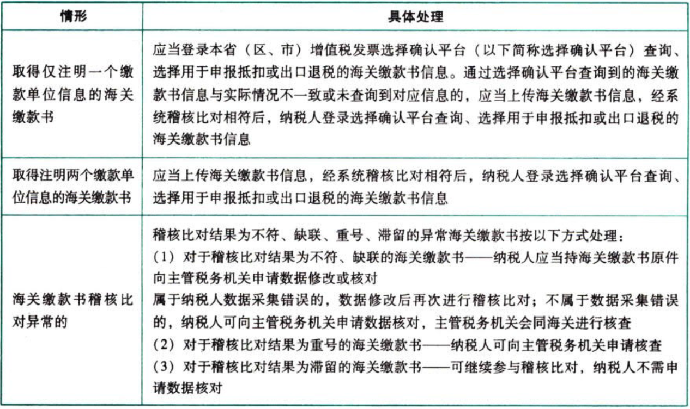

C02增值税.一般纳税人应纳税额的计算

# 1. 一般纳税人.应纳税额的计算:star: :star: :star: 

```
应纳税额＝当期销项税额－当期可抵扣进项税额
```
当期应纳税额计算结果若为正数，当期应缴纳增值税；计算结果若为负数，形成`留抵税额`，待下期与下期进项税额一并从下期销项税额中抵扣，满足规定条件的，留抵税额可以`申请退税`。

## 1.1. 计算应纳税额的时间限定

（1）关于当期销项税额的“当期”，与纳税义务发生时间和增值税发票开具时间相呼应。

（2）关于当期进项税额的“当期”是重要的时间概念，有必备的条件。我国现行增值税可以当期抵扣的进项税额有两类实施方法——购进扣税法和计算扣税法。

购进扣税法——这是我国目前增值税进项税额抵扣的基本方法。增值税的“链条税”特征，销售方的销项税对应购买方的进项税。我国曾在信息化程度不高的时期，要求纳税人在规定时限内对取得的进项税额发票进行认证，不论该发票上所列的货物是否投人生产或销售，经过认证的发票，税额可以进行进项税额的抵扣。随着“放管服”的不断推进，自2019年3月1日起，全部一般纳税人都`取消了增值税发票认证`。

增值税一般纳税人取得2017年1月1日及以后开具的增值税专用发票、海关进口增值税专用缴款书、机动车销售统一发票、收费公路通行费增值税电子普通发票，取消认证确认、稽核比对、申报抵扣的期限。

纳税人在进行增值税纳税申报时，应当通过本省（自治区、直辖市和计划单列市）`增值税发票综合服务平台`对上述扣税凭证信息进行用途确认。

增值税一般纳税人取得海关进口增值税专用缴款书（以下简称海关缴款书）后如需申报抵扣或出口退税，按以下方式处理：



## 1.2. 几个特殊计算规则

### 1.2.1. 扣减当期销项税额的规定

纳税人因销售折让、中止或者退回而退还给购买方的增值税额，应当从退还当期的销项税额中扣减。

一般纳税人发生应税销售行为，开具增值税专用发票后，应税销售行为发生退回或者折让、开票有误等情形，应按国家税务总局的规定开具`红字增值税专用发票`。未按规定开具红字增值税专用发票的，不得扣减销项税额或销售额。

### 1.2.2. 扣减当期进项税额的规定

一般纳税人因购进货物、劳务、服务、无形资产或不动产退回或折让而从销售方收回的增值税税额，应从发生当期的进项税额中扣减。如不按规定扣减，造成进项税额虚增，不纳或少纳增值税的，都将被认定为是`逃避缴纳税款`行为，按规定予以处罚。

对商业企业向供货方收取的与商品销售量、销售额挂钩（如以一定比例、金额、数量计算）的各种返还收入，均应按`平销返利行为`的有关规定冲减当期增值税进项税额。

已抵扣进项税额的购进货物或应税劳务和应税行为，如果事后改变用途，用于不得抵扣进项税额的项目时，应将购进货物或应税劳务和应税行为的进项税额从当期的进项税额中扣减，即作`进项税额转出`处理。无法准确确定该项进项税额的，按当期`实际成本`计算应扣减的进项税额。扣减进项税额计算依据不是按该货物或者应税劳务和应税行为的原进价，而是按发生上述情况的当期该货物或者应税劳务和应税行为的“实际成本”与征税时该货物或应税劳务和应税行为适用的税率计算应扣减的进项税额。

```
实际成本＝进价+运费+保险费+其他有关费用。
```
### 1.2.3. 进项税额结转抵扣的税务处理

纳税人在计算应纳税额时，如果出现当期销项税额小于当期进项税额不足抵扣的部分（留抵税额），可以结转下期继续抵扣；满足规定条件的，留抵税额可以申请退税。

### 1.2.4. 一般纳税人注销时存货及留抵税额的处理

一般纳税人注销或被取消辅导期一般纳税人资格，转为小规模纳税人时，其存货不作进项税额转出处理，其留抵税额也不予以退税。【时光静止了】

### 1.2.5. 特殊的不得抵扣的规定

有以下情形的，应当按照销售额和增值税税率计算应纳税额，不得抵扣进项税额，也不得使用增值税专用发票：

（1）一般纳税人`会计核算不健全`，或者不能够提供准确税务资料的；

（2）应当办理一般纳税人资格登记而`逾期仍未办理`的。
