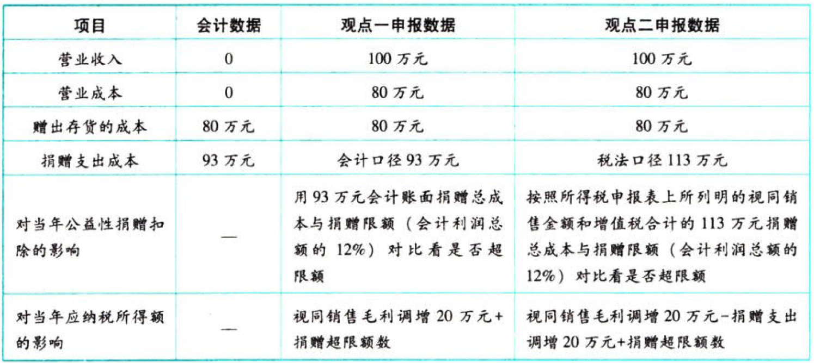

C04.企业所得税法.各项扣除.扣除项目及其标准

## 0.1. 税前扣除原则和范围

### 0.1.1. 扣除项目及其标准:star: :star: :star: 

#### 0.1.1.1. 工资、薪金支出

##### 0.1.1.1.1. 基本规定

企业发生的`合理的`工资、薪金支出准予据实扣除。

（1）注意工资薪金的“合理”性。“合理的工资、薪金”是指企业按照股东大会、董事会、薪酬委员会或相关管理机构制定的工资薪金制度规定`实际发放`给员工的工资、薪金。属于`国有性质`的企业，其工资、薪金不得超过政府有关部门给予的`限定数额`；超过部分，`不得计入`企业工资、薪金总额，也`不得`在计算企业应纳税所得额时`扣除`。

（2）注意工资薪金的“据实”性。可扣除的工资薪金有“实际发放”的特征。企业在年度`汇算清缴结束前`向员工实际支付的已预提汇缴年度工资薪金，准予在汇缴年度按规定扣除。例如某企业2019年12月的职工工资在当月预提计入成本费用，但跨年在2020年1月才实际支付，则该项工资可在计算2019年度应纳税所得额时扣除。【工资也是权责发生制】

（3）注意福利性补贴的两类处理规则。企业福利性补贴支出，凡`列入`企业员工工资薪金制度、`固定`与工资薪金`一起发放`且符合上述“合理”“据实”条件的，可作为企业发生的工资薪金支出，按规定在税前扣除。不能同时符合上述合理工资、薪金支出条件的福利性补贴，应作为职工福利费，按规定计算限额税前扣除。

##### 0.1.1.1.2. 特殊规定

（1）企业接受外部劳务派遣用工所实际发生的费用，应分两种情况按规定在税前扣除：按照协议（合同）约定直接支付给劳务派遣公司的费用，应作为`劳务费`支出；直接支付给员工个人的费用，应作为`工资薪金`支出和`职工福利费`支出。其中属于工资薪金支出的费用，准予计入企业工资薪金总额的基数，作为计算其他各项相关费用扣除的依据。

（2）企业因雇用季节工、临时工、实习生、返聘离退休人员所实际发生的费用，应区分为`工资薪金`支出和`职工福利费`支出，并按《企业所得税法》规定在企业所得税前扣除。其中属于工资薪金支出的，准予计入企业工资薪金总额的基数，作为计算其他各项相关费用扣除的依据。

要明确非常规用工支出不是劳务支出，对非常规用工要注意区分福利部门用工和生产经营活动用工。`非福利部门`的非常规用工的工资也属于工资薪金总额，可作为职工福利费、工会经费、职工教育经费的扣除限额计算基数；`福利部门`的非常规用工的工资则属于福利费支出。

（3）上市公司依照`《上市公司股权激励管理办法》`要求建立`职工股权激励计划`，并按我国企业会计准则的有关规定，在股权激励计划`授予`激励对象时，按照该股票的`公允价格`及数量，计算确定作为上市公司相关年度的`成本或费用`，作为换取激励对象提供服务的对价。

视不同情况进行不同的涉税处理：

①对股权激励计划实行后立即可以行权的，上市公司可以根据`实际行权时该股票的公允价格－激励对象实际行权支付价格`的差额，计算确定作为当年上市公司`工资薪金`支出，依照税法规定进行税前扣除。

②对股权激励计划实行后，需待一定服务年限或者达到规定业绩条件（以下简称“等待期”）方可行权的。上市公司等待期内会计上计算确认的相关成本费用，`不得`在对应年度计算缴纳企业所得税时`扣除`。在股权激励计划`可行权后`，上市公司方可根据该股票`实际行权时的公允价格－当年激励对象实际行权支付价格`的差额，计算确定作为当年上市公司`工资薪金`支出，依照税法规定进行税前扣除。

##### 0.1.1.1.3. 提示

①上市公司实行股权激励计划，实质上是通过减少企业的资本公积，换取公司激励对象的服务；或者说，公司是通过`资本公积`的减少，作为支付给激励对象提供服务的`报酬`，因此该费用应属于与企业生产经营活动相关的支出，应当准予在税前扣除。由于股权激励计划的对象是企业员工，其所发生的支出，应属于企业职工工资薪金范畴。

②在居民企业实行股权激励计划的费用扣除问题上，存在着税会差异：企业会计准则规定，上市公司股权激励计划一旦开始实施，其估计的金额将计入成本费用。即从授予开始，员工开始提供服务，该服务的成本就应计入企业成本费用。但是税法强调支出的确定性，对于企业工资薪金支出，必须按每年度“实际支付”金额据实扣除。因此，根据税法的规定，这种工资性费用应在激励对象行权时给予扣除。此外，根据我国个人所得税法的有关规定，对个人取得股权激励计划标的物（可公开交易的股票期权除外），在计算个人所得税时，也是在个人实际行权时，确认为个人所得，作为个人工资薪金所得项目征税。因此，个人确认收入，与企业确认成本费用，形成相互匹配。

#### 0.1.1.2. 职工福利费、工会经费、职工教育经费

职工福利费、工会经费、职工教育经费三项费用不是采用计提或预提的方法支出，而采用的是“据实支出、限额控制”的方法。其中职工教育经费超支的部分，准予在以后纳税年度结转扣除。

| 项目         | 扣除限额        | 超标部分           |
|--------------|-----------------|--------------------|
| 职工福利费   | 工资薪金总额14% | 不得扣除           |
| 工会经费     | 工资薪金总额2%  | 不得扣除           |
| 职工教育经费 | 工资薪金总额8%  | 在以后年度结转扣除 |

##### 0.1.1.2.4. 特别提示

（1）工会经费扣除要有`凭据`。企业拨缴的工会经费，应取得合法、有效的工会经费专用收据或者代收凭据依法在税前扣除。

（2）职工教育经费扣除有范围限定。企业员工参加`学历教育`（如硕士、博士、EMBA）的费用`不能`作为职工教育经费扣除，只能由个人自行负担。

（3）`软件生产企业`发生的职工教育经费中的`职工培训费用`，根据规定可以`全额`在企业所得税前`扣除`。软件生产企业应准确划分职工教育经费中的职工培训费支出，对于不能准确划分的，以及准确划分后职工教育经费中扣除职工培训费用的余额，一律按照工资、薪金总额8%的比例扣除。

`核力发电企业`为培养核电厂`操纵员`发生的`培养费用`，可作为企业的`发电成本`在税前`扣除`。企业应将核电厂操纵员培养费与员工的职工教育经费严格区分，单独核算，员工实际发生的职工教育经费支出不得计入核电厂操纵员培养费直接扣除。

（4）三项经费按照合理的工资、薪金总额计算税前扣除限额；作为扣除限额计算基数的企业工资、薪金支出还要注意是否合理和据实，不符合规定的职工工资总额不得在企业所得税前扣除，也不能作为计算“三项经费”税前扣除限额的依据。

（5）职工教育经费的超支，属于税法与会计的暂时性差异；职工福利费、工会经费的超支，属于税法和会计的永久性差异。

#### 0.1.1.3. 社会保险费和其他保险费

| 保险种类                                  | 可扣除？ |
|-------------------------------------------|----------|
| 社会保险(五险一金).符合规定范围和标准     | √        |
| 商业保险.责任险                           | √        |
| 商业保险.经营财险                         | √        |
| 商业保险.`个人家庭`财险                 | ×        |
| 商业保险.寿险.补充保险.符合规定范围和标准 | √        |
| 商业保险.寿险.特殊工种的人身安全保险费    | √        |
| 商业保险.寿险.`其他`                    | ×        |

（1）为特殊工种职工支付的人身安全保险费和符合国务院财政、税务主管部门规定的商业保险费可以扣除。

（2）企业为投资者或职工支付的补充养老保险费、补充医疗保险费，在国务院财政、税务主管部门规定的范围和标准内，准予扣除。

（3）企业参加雇主责任险、公众责任险等责任保险，按照规定缴纳的保险费，准予在企业所得税税前扣除。

#### 0.1.1.4. 利息费用

（1）非金融企业向`金融企业`借款的利息支出、`金融企业的`各项`存款利息支出`和同业拆借`利息支出`、企业经批准发行`债券的利息支出`可据实扣除。

（2）非金融企业向非金融企业借款的利息支出，`不超过`按照金融企业`同期同类`贷款利率计算的数额的部分可据实`扣除`，超过部分不允许扣除。

金融企业不等同于银行。所谓金融企业，是指各类银行、保险公司及经中国人民银行批准从事金融业务的非银行金融机构。包括国家专业银行、区域性银行、股份制银行、外资银行、中外合资银行以及其他综合性银行；还包括全同性保险企业、区域性保险企业、股份制保险企业、中外合资保险企业以及其他专业性保险企业；也包括城市、农村信用社、各类财务公司以及其他从事信托投资、租赁等业务的专业和综合性非银行金融机构。非金融企业，是指除上述金融企业以外的所有企业、事业单位以及社会团体等企业或组织。

（3）关联企业利息费用的扣除

①核心内容：进行两个合理性的衡量——`总量`的合理性和`利率`的合理性。

第一个合理性——从`资本结构`角度判别借款总量的合理性，即通过债资比例来判别关联借款总量是否超标。债资比例（接受关联方债权性投资与其权益性投资的比例），金融企业5:1，其他企业2:1。

借款总量合理性的衡量结果——超过债资比例的利息不得在当年和以后年度扣除。

第二个合理性——通过`合理利率`标准来判别那些未超过债资比例的利息是否符合合理的水平，使利率水平符合合理性。

②关联方利息支出的其他规定：企业能按规定提供相关资料并证明相关交易活动符合`独立交易`原则的；或者该企业的实际税负`不高于`境内关联方的，其实际支付给境内关联方的利息支出，在计算应纳税所得额时准予扣除。

（4）企业向自然人借款的利息支出

向`有关联关系`的自然人借款的利息支出——企业向股东或其他与企业有关联关系的自然人借款的利息支出，符合规定条件的（关联方债资比例和利率标准），`准予`扣除。

向没有关联关系的自然人借款的利息支出——企业向除上述规定以外的内部职工或其他人员借款的利息支出，其借款情况同时符合以下条件的，其利息支出在`不超过`按照金融企业同期同类贷款利率计算的数额的部分，准予扣除：

①企业与个人之间的借贷是`真实、合法、有效`的，并且不具有非法集资目的或其他违反法律、法规的行为；

②企业与个人之间签订了`借款合同`。

#### 0.1.1.5. 借款费用

（1）企业在生产经营活动中发生的合理的不需要资本化的借款费用，`准予`扣除。

（2）企业为购置、建造固定资产、无形资产和经过12个月的建造才能达到预定可销售状态的存货发生借款的，在有关资产购置、建造期间发生的合理的借款费用，应当作为资本性支出计入有关资产的成本；有关资产交付使用后发生的借款利息，可在发生当期扣除。

（3）企业通过发行债券、取得贷款、吸收保户储金等方式融资而发生的合理的费用支出，符合资本化条件的，应计入相关资产成本；不符合资本化条件的，应作为财务费用，准予在企业所得税前据实扣除。

按照此项规定，不需资本化的融资费用，不必分期摊销，可直接据实扣除。


#### 0.1.1.6. 汇兑损失

汇率折算形成的汇兑损失，除已经计入有关资产成本以及与向所有者进行利润分配相关的部分外，`准予`扣除。

#### 0.1.1.7. 业务招待费

企业发生的与生产经营活动有关的业务招待费支出，按照`实际发生额的60%`扣除，但最高不得超过当年销售（营业）收入的`5‰`。

对从事股权投资业务的企业（包括集团公司总部、创业投资企业等），其从被投资企业所分配的股息、红利以及股权转让收入，可以按规定的比例计算业务招待费扣除限额。

企业在筹建期间，发生的与筹办活动有关的业务招待费支出，可按`实际发生额的60%`计入企业筹办费，并按有关规定在税前扣除。

解释：

（1）作为业务招待费税前扣除限额计算基数的收入，是当年销售（营业）收入，这一收入口径不是会计口径，而是`税法规定的口径`，包括会计上确认的`主营业务收入`、`其他业务收入`和会计上不确认收入而`税法上视同销售的收入`，但是不含营业外收入、投资收益等。

（3）业务招待费的税前扣除限额计算基数与广告费和业务宣传费的税前扣除限额计算基数是一致的，都为销售（营业）收入。

（4）由于投资是从事`股权投资业务`的企业的主营业务，所以其从被投资企业所分配的股息、红利以及股权转让收入是其主营业务收入。从事股权投资业务的企业，其业务招待费的税前扣除限额计算基数包括从被投资企业所分配的股息、红利以及股权转让收入。

（5）对于筹建期间的业务招待费支出，采用了业务招待费的扣除标准、筹办费的扣除方法。业务招待费的扣除标准体现在实际发生额的60%的比例限制；筹办费的扣除方法则是纳税人可采用在生产经营当年一次性扣除，或者作为长期待摊费用不短于3年摊销。

税法认定的筹办费中不含“业务招待费”的40%部分，对筹办费进行分期摊销的企业，应注意各摊销期的纳税调整。

#### 0.1.1.8. 广告费和业务宣传费

（1）企业发生的符合条件的广告费和业务宣传费支出，除国务院财政、税务主管部门另有规定外，不超过当年`销售（营业）收入15%`的部分，准予扣除；超过部分，`准予结转`以后纳税年度扣除。

（2）自2016年1月1日起至2020年12月31日止，对`化妆品制造或销售`、`医药制造`、`饮料制造（不含酒类制造）`企业发生的广告费和业务宣传费支出，不超过当年销售（营业）收入`30%`的部分，准予扣除；超过部分，`准予`在以后纳税年度`结转`扣除。

（3）对签订广告费和业务宣传费分摊协议（以下简称“分摊协议”）的`关联企业`，其中一方发生的不超过当年销售（营业）收入税前扣除限额比例内的广告费和业务宣传费支出可以在本企业扣除，也可以将其中的部分或全部按照分摊协议归集至另一方扣除。另一方在计算本企业广告费和业务宣传费支出企业所得税税前扣除限额时，可将按照上述办法归集至本企业的广告费和业务宣传费不计算在内。

【举例】甲乙两企业是关联企业，签订有广告费分摊协议，甲企业当期实际发生广告费1000万元，未超限额，按照分摊协议将其中300万元分摊给乙企业扣除，则乙企业接受分摊的300万元限额内的广告费可以直接在乙企业当期的税前列支，不受乙企业自身广宣费限额的影响。若甲企业将超出自身限额的广告费分摊给乙企业，趟出限额的部分不得在乙企业税前列支。

（4）企业在筹建期间，发生的广告费和业务宣传费支出，可按`实际发生额`计入企业筹办费，并按有关规定在税前扣除。

（5）`烟草企业`的烟草广告费和业务宣传费支出，一律`不得`在计算应纳税所得额时扣除。

#### 0.1.1.9. 招待vs广告宣传vs赞助

（1）业务招待费和业务宣传费不是同一个概念。

业务招待费是因管理、购销等各个部门业务需要而进行的`交际应酬`的开支，如请客吃饭、娱乐等，发生在各个部门的交际应酬费都归集在“`管理费用——业务招待费`”中。两个税前扣除限额择其小者扣除。

业务宣传费计入`销售费用`，只有一个税前扣除限额。

（2）业务招待费、广告费和业务宣传费计算税前扣除限额的基数都是销售（营业）收入，不是企业全部收入。销售（营业）收入包括销售货物收入、提供劳务收入等主营业务收入，让渡资产使用权（收取资产租金或使用费）收入等其他业务收入和会计上不确认收入而税法上视同销售的收入等，但是不含营业外收入和投资收益等。

（3）广告费和业务宣传费的超标准部分可无限期向以后纳税年度结转扣除，属于税法与会计制度的暂时性差异；而业务招待费的超标准部分不能向以后纳税年度结转扣除，属于税法与会计制度的永久性差异。

（4）要注意广告费、业务宣传费与赞助费的区别，广告费支出的三个条件：广告通过工商部门批准的`专门机构`制作；已实际支付费用并取得相应发票；通过一定的媒体传播。与生产经营无关的非广告性质的赞助费支出在企业所得税前`不得`列支。

#### 0.1.1.10. 环境保护专项资金

企业依照法律、行政法规有关规定提取的用于环境保护、生态恢复等方面的`专项资金`，`准予扣除`；上述专项资金提取后改变用途的，不得扣除。

#### 0.1.1.11. 租赁费

企业根据生产经营活动的需要租入固定资产支付的租赁费，按照以下方法扣除：

（1）属于经营性租赁发生的租入固定资产的租赁费支出，根据租赁期限`均匀`扣除。

（2）属于融资性租赁发生的租入固定资产的租赁费支出，构成融资租入固定资产价值的部分应当提取`折旧费用`，分期扣除；租赁费支出不得在当期直接扣除。

#### 0.1.1.12. 劳动保护费

（1）劳动保护支出是指确因工作需要为雇员配备或提供工作服、手套、安全保护用品、防暑降温用品等所发生的支出。企业发生的`合理的劳动保护支出`，`准予扣除`。

（2）自2011年7月1日起，企业根据其工作性质和特点，由企业统一制作并要求员工工作时统一着装所发生的`工作服饰`费用，根据规定，`可以`作为企业合理的支出给予税前`扣除`。

#### 0.1.1.13. 公益性捐赠支出

##### 0.1.1.13.5. 基本规定

企业实际发生的公益性捐赠支出，在年度`利润总额12%`以内的部分，准予在计算应纳税所得额时`扣除`。

2016年9月1日起，公益性捐赠支出超过年度利润总额12%的部分，准予以后`三年`内在计算应纳税所得额时`结转`扣除。这里的年度利润总额，是指企业按照国家统一`会计制度`的规定计算的大于零的数额。

特殊规定：自2019年1月1日至2022年12月31日，企业通过`公益性社会组织或者县级`（含县级）以上人民政府及其组成部门和直属机构，用于`目标脱贫地区`的扶贫捐赠支出，准予在计算企业所得税应纳税所得额时`据实扣除`。在政策执行期限内，目标脱贫地区实现脱贫的，可继续适用上述政策。（新增）

##### 0.1.1.13.6. 归纳

（1）要注意区分公益性捐赠与非公益性捐赠。非公益性捐赠企业所得税税前不得扣除。

这里所说的公益性捐赠，必须符合对象和渠道两个条件。对象条件——列举的慈善活动、公益事业。渠道条件——县级（含县级）以上人民政府及其组成部门和直属机构或公益性社会组织。

`《中华人民共和国慈善法》`规定公益活动包括以下内容：①扶贫、济困；②扶老、救孤、恤病、助残、优抚；③救助自然灾害、事故灾难和公共卫生事件等突发事件造成的损害；④促进教育、科学、文化、卫生、体育等事业的发展；⑤防治污染和其他公害，保护和改善生态环境；⑥符合本法规定的其他公益活动。

不符合对象或渠道条件的捐赠，如纳税人直接向受赠人的捐赠等，不属于公益性捐赠，在计算应纳税所得额时不得扣除，应作纳税调整。

（2）年度利润总额，是按照国家规定计算出来的`年度会计利润`，`尚未扣除`允许弥补的`以前年度的亏损`。

（4）企业发生的超标准的公益性捐赠，当年不得扣除，准予向以后年度结转扣除，但结转年限自捐赠发生年度的次年起最长不得超过三年。企业在对公益性捐赠支出计算扣除时，应先扣除以前年度结转的捐赠支出，再扣除当年发生的捐赠支出。即结转后，先发生的支出先扣除。

（5）公益性捐赠有货币捐赠和非货币捐赠之分。非货币性捐赠要分解为`视同销售`货物和`捐赠支出`两个行为。

关于捐赠成本的争议：企业将货物用于捐赠，一方面要确认视同销售收入和视同销售成本；另一方面按规定衡量该捐赠是公益性捐赠还是非公益性捐赠，如果是公益性捐赠，则要考虑是否超过了规定的捐赠税前扣除限额，如果是非公益性捐赠，不得在税前扣除。这里考虑视同销售收入和视同销售成本及同时考虑捐赠税前扣除限额的思路要在做综合题的时候特别注意。




观点二与观点一计算出的视同销售毛利（20万元）是一致的，但是捐赠成本存在20万元的差异，这正是税法口径的捐赠成本与会计口径的捐赠成本之间的差异，这是因为企业所得税要求该企业视同销售收入100万元和视同销售成本80万元都要体现在企业所得税纳税申报表中，视同销售造成税法口径的捐赠成本为113万元。按照观点二，上述会计处理与税务处理不一致的地方，在年终所得税汇算清缴填申报表时应该作纳税调整处理，其中税收捐赠成本与会计捐赠成本的差异，列入申报表“其他”项目。从应纳税所得额调整结果看，观点二比观点一多调增了捐赠成本，在捐赠不超支时所计算出来的应纳税所得额，观点二低于观点一。但在捐赠均超支的前提下，采用观点二比观点一会产生多调增超支捐赠增加所得的后果。

由于上述两类方法没有文件约束，2013年CPA税法考试综合题答案用的就是观点一。但国家税务总局稽查培训对稽查人员的政策把握要求及税务师涉税服务实务考试使用的是观点二。

#### 0.1.1.14. 有关资产的费用

（1）企业转让各类固定资产发生的费用，允许扣除。

（2）企业按规定计算的固定资产折旧费、无形资产和递延资产的摊销费，准予扣除。

企业转让各类固定资产发生的费用包括清理费用。

企业转售固定资产的收益，记入资产处置损益或营业外收入账户影响应纳税所得额。

#### 0.1.1.15. 总机构分摊的费用

非居民企业在中国境内设立的机构、场所，就其中国境外总机构发生的与该机构、场所生产经营有关的费用，能够提供总机构出具的费用汇集范围、定额、分配依据和方法等证明文件，并合理分摊的，准予扣除。

#### 0.1.1.16. 资产损失

（1）企业当期发生的固定资产和流动资产盘亏、毁损净损失，准予扣除。

（2）企业因存货盘亏、毁损、报废等原因不得从销项税额中抵扣的进项税额，应视同企业资产损失，准予与存货损失合并在企业所得税前按规定扣除。

#### 0.1.1.17. 其他项目

如会员费、合理的会议费、差旅费、违约金、诉讼费用等，准予扣除。

#### 0.1.1.18. 手续费及佣金支出

对于与生产经营有关的手续费、佣金支出有五个方面的限制：

（1）手续费、佣金有`支付对象`限制。

手续费、佣金的支付对象不能是本企业的人员（含雇员、代理人、代表人等），也不能是对方单位的人员，前者属于工资、薪金性质的奖金；后者属于回扣、返利等，甚至属于给对方当权者的职务贿赂。手续费、佣金的支付对象应该是具有合法经营资格的`中介服务机构`或`个人`。

企业应与具有合法经营资格的中介服务企业或个人签订代办协议或合同，并按国家有关规定支付手续费及佣金。

（2）手续费及佣金支出有`计算基数和开支比例`限制。

①对于保险企业，`财产保险企业`按
`(当年全部保费收入－退保金等)×15%`计算限额；`人身保险企业`按`(当年全部保费收入－退保金等)×10%`计算限额。

自2019年1月1日起，保险企业发生与其经营活动有关的手续费及佣金支出，不超过`(当年全部保费收入－退保金等)×18%`的部分，在计算应纳税所得额时准予相除；超过部分，`允许结转`以后年度扣除。（教材未更新）

保险企业发生的手续费及佣金支出税前扣除的其他事项继续按原相关规定处理。

②对于其他企业，按与具有合法经营资格中介服务机构或个人（不含交易双方及其雇员、代理人和代表人等）所签订服务协议或合同确认的`收入金额×5%`计算限额。

③`从事代理服务、主营业务收入为手续费、佣金的企业（如证券、期货、保险代理等企业）`，其为取得该类收入而实际发生的营业成本（包括手续费及佣金支出），准予在企业所得税前`据实扣除`。（注意：无比例限制）

以佣金（手续费）收入为主营业务收入的企业，为取得佣金（手续费）而发生的佣金（手续费）支出是营业成本，而不是销售费用；且其佣金（于续费）支出没有扣除限额标准，准予据实扣除。

（3）手续费及佣金支出`不能`计入回扣、业务提成、返利、进场费等费用。

（4）手续费和佣金有`支付方式`限制。

除委托个人代理外，企业以`现金`等非转账方式支付的手续费及佣金`不得`在税前扣除。

（5）`权益化`的手续费、佣金`不得`扣除。

如企业为发行权益性证券支付给有关证券承销机构的手续费及佣金`不得`在税前扣除。

#### 0.1.1.19. 企业维简费支出

维简费指的是从成本费用中提取的专用于`维持简单再生产`的资金。从会计核算角度看，维简费的提取影响成本费用，能否得到税法认可进行所得税前的扣除，2013年之前，不同行业有不同的规定。自2013年1月1日起，各行业维简费的基本规则进行了统一。

（1）实际发生的开支区分收益性支出与资本性支出——企业实际发生的维简费支出，属于收益性支出的，可作为当期费用在税前扣除；属于资本性支出的，应计入有关资产成本，并按企业所得税法规定计提折旧或摊销费用在税前扣除。

（2）不认可预提的方式——企业按照有关规定预提的维简费，不得在当期税前扣除。

解释：2013年之前，煤矿企业维简费支出执行的就是上述政策，但其他行业没有具体规定，导致非煤矿企业无所适从，各地执行口径也有差异。2013年1月1日起，各行业企业维简费处理规定都与煤矿企业维简费的税收政策类同。因此，上述政策对煤矿企业而言没有变化，前后一致，但一些非煤矿企业就有可能会有前后政策的变化。对于本规定实施前，企业按照有关规定提取且已在当期税前扣除的维简费，按以下规定处理：

预提并已税前扣除的维简费，未使用的（提而未用），并未作纳税调整的，可不作纳税调整，应首先抵减2013年实际发生的维简费，仍有余额的，继续抵减以后年度实际发生的维简费，至余额为零时，企业方可按收益性支出、资本性支出各自的规定处理。

预提并已税前扣除的维简费，未使用的（提而未用），已作纳税调整的，不再调回，直接按收益性支出、资本性支出各自的规定处理。

预提并已税前扣除的维简费，已使用的（提后已用），已用于资产投资并形成相关资产全部成本的，该资产提取的折旧或费用摊销额，不得税前扣除；已用于资产投资并形成相关资产部分成本的，该资产提取的折旧或费用摊销额中与该部分成本对应的部分，不得税前扣除：已税前扣除的，应调整作为2013年度应纳税所得额。

#### 0.1.1.20. 企业参与政府统一组织的棚户区改造支出

企业参与政府统一组织的工矿（含中央下放煤矿）棚户区改造、林区棚户区改造、垦区危房改造并同时符合一定条件的`棚户区改造支出`，`准予`在企业所得税前`扣除`。同时符合一定条件的棚户区改造支出，须同时满足6项条件。在企业所得税年度纳税申报时，企业应向主管税务机关提供其棚户区改造支出同时符合6项规定条件的书面说明材料。

#### 0.1.1.21. 金融企业涉农贷款和中小企业贷款损失准备金税前扣除

（1）中小企业贷款，是指金融企业对年`销售额`和`资产总额`均不超过`2亿元`的企业贷款。

（2）金融企业对其涉农贷款和中小企业贷款进行风险分类后，接照以下比例计提的贷款损失准备金，准予在计算应纳税所得额时扣除：

| 贷款类别   | 贷款损失准备金计提比例 |
|------------|------------------------|
| 关注类贷款 | 2%                     |
| 次级类贷款 | 25%                    |
| 可疑类贷款 | 50%                    |
| 损失类贷款 | 100%                   |

（3）金融企业发生的符合条件的涉农贷款和中小企业贷款损失，应`先冲减`已在税前扣除的贷款损失`准备金`，`不足`冲减部分可`据实`在计算应纳税所得额时`扣除`。

#### 0.1.1.22. 金融企业贷款损失准备金企业所得税税前扣除有关政策

除涉农贷款和中小企业贷款外的金融企业贷款，自2019年1月1日起至2023年12月31日止，损失准备金企业所得税税前扣除按以下规定处理：

（1）准予税前提取贷款损失准备金的范围：

①`贷款`（含抵押、质押、保证、信用等贷款）

②银行卡透支、贴现、信用垫款（含银行承兑汇票垫款、信用证垫款、担保垫款等）、进出口押汇、同业拆出、应收融资租赁款等各项具有`贷款特征`的风险资产

③由金融企业转贷并承担对外还款责任的`国外贷款`，包括国际金融组织贷款、外国买方信贷、外国政府贷款、日本国际协力银行不附条件贷款和外国政府混合贷款等资产

不得提取贷款损失准备金的范围：

金融企业的委托贷款、代理贷款、国债投资、应收股利、上交央行准备金以及金融企业剥离的债权和股权、应收财政贴息、失行款项等`不承担风险和损失的资产`

（2）金融企业准予当年税前扣除的贷款损失准备金计算公式如下：

```
准予当年税前扣除的贷款损失准备金＝本年末准予提取贷款损失准备金的贷款资产余额X1%－截至上年末已在税前扣除的贷款损失准备金的余额
```
金融企业按上述公式计算的数额如为`负数`，应当相应`调增`当年应纳税所得额。

（3）金融企业发生的符合条件的贷款损失，应先`冲减`已在税前扣除的贷款损失`准备金`，`不足`冲减部分可`据实`在计算当年应纳税所得额时`扣除`。

【总结】超过税法规定的年度列支限额，但可结转以后纳税年度扣除的项目：职工教育经费、广告费和业务宣传费、保险企业手续费及佣金支出（2019年1月1日之后）、公益性捐赠支出（3年）。
