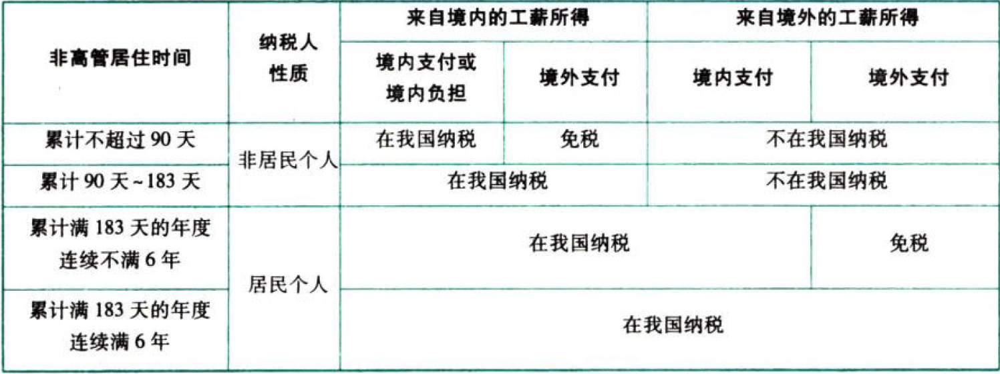
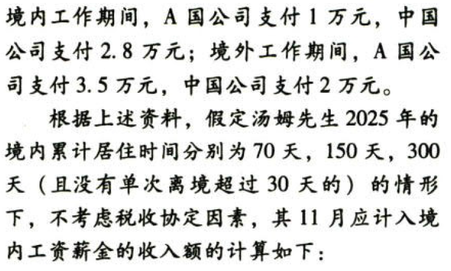

C05.个人所得税法.在中国境内无住所的个人取得工资薪金所得的征税问题（调整）

## 0.1. 与工资薪金相关的几个重要问题的处理:star: :star: :star: 

### 0.1.1. 在中国境内无住所的个人取得工资薪金所得的征税问题（调整）

（1）关于工资薪金所得来源地的确定，要明确工资薪金的来源地与支付地是可能存在差异的。即个人实际`在中国境内工作期间`取得的工资薪金，不论是由中国境内还是境外企业或个人雇主支付的，均属于来源于中国境内的所得；个人实际在中国境外工作期间取得的工资薪金，不论是由中国境内还是境外企业或个人雇主支付的，均属于来源于中国境外的所得。

（2）无住所个人一个纳税年度内在中国境内累计居住天数，按照在中国境内累计停留的天数计算。在中国`境内停留的当天满24小时`的，计入中国`境内居住天数`，在中国境内停留的当天不足24小时的，不计入中国境内居住天数。【境内居住天数=境内当天停留满24小时的天数】

（3）境内工作期间按照个人在`境内工作天数`计算：

```
在境内工作的天数＝`境内`实际工作天数＋境内工作期间在`境内外`享受的公休假、个人休假天数＋`境内外`接培训的天数
```
在境内、境外单位同时担任职务或者仅在境外单位任职的个人，在境内停留的当天不足24小时的，按照`半天`计算境内工作天数。

无住所个人在境内、境外单位同时担任职务或者仅在境外单位任职，且当期同时在境内、境外工作的，按照工资薪金所属`境内/境外工作天数`占当期公历天数的比例计算确定来源乎境内/境外工资薪金所得的收入额。境外工作天数＝公历天数－境内工作天数。

#### 0.1.1.1. 无住所个人为非居民个人【旅行者】的情形

（1）`非居民个人境内居住时间≤90天`的情形。

在一个纳税年度内，在境内累计居住不超过90天的非居民个人，仅就归属于`境内工作期间`并由`境内雇主支付或者负担`的工资薪金所得计算缴纳个人所得税。

```
工资薪金收入额＝境内支付额×境内工作天数/公历天数
```
（2）`90天＜非居民个人境内居住时间＜183天`的情形。

在一个纳税年度内，在境内累计居住超过90天但不满183天的非居民个人，取得归属于`境内工作期间`的工资薪金所得，均应当计算缴纳个人所得税；其取得归属于境外工作期间的工资薪金所得，不征收个人所得税。


```
工资薪金收入额＝(境内支付额＋境外支付额)×境内工作天数/公历天数
```
#### 0.1.1.2. 无住所个人为居民个人【自己人】的情形

在一个纳税年度内，在境内累计居住满183天的无住所居民个人【自己人】，取得工资薪金所得，当月工资薪金收入额按照以下规定计算：

（1）无住所居民个人在境内居住累计满183天的年度`连续不满6年`的情形。

在中国境内无住所的个人，在中国境内居住累计满183天的年度连续不满6年的，经向主管税务机关`备案`，其取得的全部工资薪金所得，除归属于`境外`工作期间且由`境外`单位或者个人支付的工资薪金所得部分外，均应计算缴纳个人所得税。


```
工资薪金收入额＝境内外总额×(1－境外支付/境内外总额×境外工作天数/公历天数)
```
（2）无住所居民个人在境内居住累计满183天的年度`连续满6年`的情形。

在境内居住累计满183天的年度连续满6年后，不符合《个人所得税法实施条例》第四条优惠条件的无住所居民个人，其从境内、境外取得的`全部`工资薪金所得均应计算缴纳个人所得税。即：

```
当月工资薪金收入额＝当月境内外工资薪金总额
```
在中国境内居住累计满183天的任一年度中`有一次离境超过30天`的，其在中国境内居住累计满183天的年度的连续年限`重新起算`。

#### 0.1.1.3. ［归纳与说明］

在中国境内无住所的个人，我国对其实施税收管辖权的范围，随着其居住时间的增长而扩大。具体规则如下表：







对于担任`境内居民企业`的董事、监事、高层管理职务的个人（以下统称`高管人员`），无论是否在境内履行职务，取得由境内居民企业支付或者负担的董事费、监事费、工资薪金或者其他类似报酬（以下统称高管人员报酬），属于来源于境内的所得。【境内支付给高管的，全额扣缴】

所称高层管理职务包括企业正、副（总）经理、各职能总师、总监及其他类似公司管理层的职务。


