C05.个人所得税法

# 1. 纳税义务人与征税范围

## 1.1. 纳税义务人

### 1.1.1. 基本规定

个人所得税的纳税人不仅涉及中国公民，也涉及在中国境内取得所得的外籍人员（包括无国籍人员）和港、澳、台同胞，还涉及个体户、个人独资企业和合伙企业的个人投资者。

由于一国两制和税收管辖权的缘放，我国现行税法中关于“中国境内”不含港澳台。

### 1.1.2. 居民个人和非居民个人的划分:star: :star: 

个人所得税的纳税人按照国际通用的做法，依据`住所`和`居住时间`两个标准，区分为居民个人和非居民个人，分别承担不同的纳税义务。

①住所标准：“在中国境内有住所”是指因户籍、家庭、经济利益关系而在中国境内习惯性居住。

②居住时间标准：“无住所而一个纳税年度内在中同境内居住累计满183天”是指在一个纳税年度（公历1月1日起至12月31日止，下同）内，在中国境内居住累计满183天。

具体划分见下表：

| 类别       | 判定标准                       | 纳税义务                                                                                       |
|------------|--------------------------------|------------------------------------------------------------------------------------------------|
| 居民个人   | 满足住所标准or居住时间标准     | 负有`无限`纳税义务，其所取得的应纳税所得，无论是来源于境内还是境外，都要在中国缴纳个人所得税 |
| 非居民个人 | 住所标准、居住时间标准均不满足 | 负有`有限`纳税义务，只就去来源于中国境的所得，向中国缴纳个人所得税                           |

【案例】在我国境内无住所的某外籍人员2019年9月15日来华工作，2020年4月30日结束工作离境，则该外籍人员是我同的非居民个人。这是因为该外籍人员在我国境内无住所且在2019年和2020年两个纳税年度中都未在我国境内居住累计满183天，则其为我国非居民个人。

### 1.1.3. 税法中关于无住所个人境内居住天数和境内实际工作期间的具体规定

（1）无住所个人一个纳税年度内在中国境内累计居住天数，按照个人在中国境内累计`停留的天数`计算。在中国境内`停留的当天满24小时`的，计入中国境内`居住天数`，在中国境内停留的当天不足24小时的，不计入中国境内居住天数。【境内居住天数=境内当天停留满24小时的天数】

此规定，用于判断无住所个人是`居民个人`还是`非居民个人`。

此规定，也用于判断无住所个人因`实际累计居住时间的长短`而享受何种优惠政策。

（2）`境内工作期间`按照个人在境内`工作天数`计算：

```
在境内工作的天数＝`境内`实际工作天数＋境内工作期间在`境内外`享受的公休假、个人休假天数＋`境内外`接培训的天数
```
在境内、境外单位同时担任职务或者仅在境外单位任职的个人，在境内停留的当天不足24小时的，按照`半天`计算境内工作天数。

此规定，用于计算应纳税额。

【案例】潘先生为香港居民，在深圳工作，每周一早上来深圳上班，周五晚上回香港。由于周六和周日在香港，周一和周五当天停留都不足24小时，不计入境内居住天数，因此每周可计入境内居住的天数仅为3天。按照全年52周计算，滞先生一个纳税年度内在境内居住天数为156天，不构成居民个人。

## 1.2. 征税范围

### 1.2.4. 工资、薪金所得:star: :star: :star: 

工资薪金所得，是指个人因`任职或受雇`而取得的工资薪金、奖金、年终加薪、劳动分红、津贴、补贴以及与任职或受雇有关的其他所得。

奖金是指所有具有工资性质的奖金，免税奖金的范围在税法中另有规定。

工资薪金所得建立在取得收入者与支付单位之间存在任职受雇关系上，这种任职受雇关系在现实中主要体现为`劳动关系或人事关系`。

[与工资薪金所得相关的项目](../../../../CPA6in1/CPA6in1/2税法/C05.个人所得税法.与工资薪金所得相关的项目.md)

辨析下列五方面的差异：

（1）劳动分红属于劳动所得，列入工资薪金所得项目征收个人所得税；股份分红属于资本利得，列入利息、股息、红利所得项目征收个人所得税。

（2）不属于工资薪金所得的项目。具体包括：独生子女补贴；执行公务员工资制度未纳入基本工资总额的补贴、津贴差额和家属成员的副食品补贴；托儿补助费；差旅费津贴、误餐补助，但是单位以误餐补助名义发放给职工的补助、津贴不包括在内；外国来华留学生，领取的生活津贴费、奖学金。

（3）军队干部取得的补贴、津贴中有8项`不计入`工资薪金所得项目征税，包括：政府特殊津贴；福利补助；夫妻分居补助费；随军家属无工作生活困难补助；独生子女保健费；子女保教补助费；机关在职军以上干部公勤费（保姆费）；军粮差价补贴。

（4）军队干部取得的`暂不征税`的补贴、津贴，包括：军人职业津贴；军队设立的艰苦地区补助；专业性补助；基层军官岗位津贴（营连排长岗位津贴）；伙食补贴。

（5）辨析法定退休、内部退养、提前退休。

`法定退休`，适用于各类人员。属于达到法定退休年龄的正式退休。按照国家统一规定发放的退休费、离休费、离休生活补助费免税。

`提前退休`，适用于机关、企事业单位人员。属于正式退休。按照规定提前退休的人员可享受此待遇。取得按照统一标准发放的`一次性补贴`收入应按照工资薪金所得纳税。

`内部退养`，适用于企业减员增效和行政事业单位、社会团体在机构改革过程中实行内部退养办法人员。属于`非正式退休`。因未达到法定退休年龄，由企业发给基本生活费，达到退休年龄时正式办理退休手续。办理内部退养手续后从原任职单位取得的一次性收入和至法定离退休年龄之间取得的基本生活费收入均应按工资薪金所得纳税。

### 1.2.5. 劳务报酬所得:star: :star: :star: 

劳务报酬所得，是指个人独立从事各种`非雇佣的劳务`取得的所得。包括设计、装潢、安装、制图、化验、测试、医疗、法律、会计、咨询、讲学、翻译、审稿、书画、雕刻、影视、录音、录像、演出、表演、广告、展览、技术服务、介绍服务、经纪服务、代办服务以及其他劳务。

个人兼职取得的收入应按照“劳务报酬所得”项目缴纳个人所得税。

个人担任公司董事监事，且不在公司任职受雇的，属于劳务报酬所得。

个人担任公司董事监事，且在公司（包括关联公司）任职受雇的，属于工资薪金所得。

在商品营销活动中，企业和单位对营销业绩突出的营销人员以培训班、研时会、工作考察等名义组织旅游活动，通过免收差旅费、旅游费对个人实行的营销业绩奖励（包括实物、有价证券等），应根据所发生费用的金额并入营销人员当期的劳务收入。营销人员为雇员的，属于工资薪金所得；营销人员为非雇员的，属于劳务报酬所得。

### 1.2.6. 特许权使用费所得:star: :star: :star: 

特许权使用费所得，是指个人提供专利权、商标权、著作权、非专利技术以及其他特许权的使用权取得的所得。

提供著作权的使用权取得的所得（不包括稿酬所得）属于特许权使用费所得。

对于作者将自己的文字作品手稿原件或复印件公开拍卖（竞价）取得的所得，属于提供著作权的使用权所得，故应按特许权使用费所得项目征收个人所得税。

特许权使用费所得的突出特征是提供专利权、商标权、著作权、非专利技术等的使用权的所得。

### 1.2.7. 稿酬所得:star: :star: :star: 

个人因其作品以图书、报刊形式出版、发行而取得的所得。作者去世后，财产继承人取得的遗作稿酬，亦应按此项目征收个人所得税。

纳税人将其作品以图书、报刊形式出版、发表取得的所得，按照“稿酬所得”征税；未出版发表而从外单位取得的报酬按照“劳务报酬所得”征税。

任职、受雇于报纸、杂志等单位的记者、编辑等专业人员，因在本单位的报纸、杂志上发表作品而取得的所得，属于因任职、受雇而取得的所得，应与其当月工资收入合并，按“工资薪金所得”项目征收个人所得税。

除上述专业人员以外，其他人员在本单位的报纸、杂志上发表作品取得的所得，应按“稿酬所得”项目征收个人所得税。

出版社或报刊、杂志内部的专业审稿人员的审稿收入属于工资薪金所得；外聘审稿人员的审稿报酬属于劳务报酬所得。

### 1.2.8. 经营所得:star: 

个体工商户从事生产、经营活动取得的所得，个人独资企业投资人、合伙企业的个人合伙人来源于境内注册的个人独资企业、合伙企业生产、经营的所得。

个体工商户以业主为个人所得税纳税义务人。

个人依法从事办学、医疗、咨询以及其他有偿服务活动取得的所得。

个人对企业、事业单位承包经营、承租经营以及转包、转租取得的所得。

个人从事其他生产、经营活动取得的所得。例如：个人因从事彩票代销业务而取得的所得；从事个体出租车运营的出租车驾驶员取得的收入。

| 归属           | 分类         | 具体内容                                                                                                                                                                                                         |
|----------------|--------------|------------------------------------------------------------------------------------------------------------------------------------------------------------------------------------------------------------------|
| 出租车归属个人 | 经营所得     | 从事个体出租车运营的出租车驾驶员取得的收入<br/>出租车属个人所有，但挂靠出租车经营单位或企事业单位，驾驶员向挂靠单位缴纳管理费的<br/>出租汽车经营单位将出租车所有权转移给驾驶员的，出租车驾驶员从事客货营运取得的收入 |
| 出租车不属个人 | 工资薪金所得 | 出租车经营单位对出租车驾驶员采取单车承包或承租方式运营，出租车驾驶员从事客货营运取得的收入                                                                                                                       |

个体工商户和从事生产、经营的个人，取得与生产、经营活动无关的其他各项应税所得，应分别按照其他应税项目的有关规定，计算征收个人所得税。如对外投资取得的股息所得，应按“利息、股息、红利所得”项目的规定单独计征个人所得税。

个人承包后工商登记改变为个体工商户的，不缴纳企业所得税，按照经营所得缴纳个人所得税。

个人承包后工商登记仍为企业的，缴纳企业所得税。若承包、承租人对企业经营成果不拥有所有仅，仅按合同（协议）规定取得一定所得的，应按工资薪金所得项目征收个人所得税。若承包、承租人按合同（协议）规定只向发包方、出租方缴纳一定的费用，缴纳承包，承租费后的企业经营成果归承包、承租人所有的，其取得的所得按经营所得项目征收个人所得税。

### 1.2.9. 利息、股息、红利所得:star: :star: 

利息、股息、红利所得，是指个人拥有债权、股权而取得的利息、股息、红利所得。

个人股东获得转增的股本，应按照“利息、股息、红利所得”项目，适用20%的税率征收个人所得税。

个人独资企业、合伙企业的个人投资者以企业资金为本人、家庭成员及其相关人员支付与企业生产、经营无关的消费性支出及购买住房、汽车等财产性支出，按照“经营所得”计算缴纳个人所得税；除个人独资企业、合伙企业以外的其他企业的个人投资者，以企业资金为本人、家庭成员及其相关人员支付与企业生产经营无关的消费性支出，以及购买汽车、住房等财产性支出，按照“利息、股息、红利所得”计算缴纳个人所得税；企业为投资者以外的职工购房，按照“工资薪金所得”计算缴纳个人所得税。

个人独资企业、合伙企业用企业资金为某个人投资者或其家庭成员购买房屋等财产，属于经营所得。

个人独资企业、合伙企业以外的其他企业用企业资金为其个人投资者或其家庭成员购买房屋等财产，属于利息、股息、红利所得。

企业用企业资金为本企业除投资者以外的雇员购买房屋等财产，属于工资薪金所得。

### 1.2.10. 股权收购问题

1名或多名个人投资者以股权收购方式取得被收购企业100%股权，股权收购前，被收购企业原账面金额中的“资本公积、盈余公积、未分配利润”等盈余积累未转增股本，而在股权交易时将其一并计入股权转让价格并履行了所得税纳税义务。股权收购后，企业将原账面金额中的盈余积累向个人投资者（新股东，下同）转增股本，有关个人所得税问题区分以下情形处理：

（1）新股东以不低于净资产价格收购股权的，企业原盈余积累已全部计入股权交易价格，新股东取得盈余积累转增股本的部分，不征收个人所得税。

（2）新股东以低于净资产价格收购股权的，企业原盈余积累中，对于股权收购价格减去原股本的差额部分已经计入股权交易价格，新股东取得盈余积累转增股本的部分，不征收个人所得税；对于股权收购价格低于原所有者权益的差额部分未计入股权交易价格，新股东取得盈余积累转增股本的部分，应按照“利息、股息、红和l所得”项目征收个人所得税。

新股东以低于净资产价格收购企业股权后转增股本，应按照下列顺序进行，即先转增应税的盈余积累部分，然后再转增免税的盈余积累部分。

【解释】转增股本的企业原账面金额中的盈余积累是由原股东创造并拥有，原股东在转让股权过程中没有事先转增股本，而是将其一并计入了股权交易价格中，新自然人股东为此已经支付了对价，如对此次转增股本征税则存在重复征税问题，有违税收公平原则。此外，为支持企业正常重组行为，考虑到企业股权转让过程中，盈余积累与股权转让所得存在相互转化的可能性，税收政策方面，对于原股东转让股权前事先利润分配与新股东事后利润分配应尽量保证税负平衡，不应由于原股东事先利润分配与新股东事后利润分配而产生较大视负差异。

【案例】甲企业原账面资产总额8000万元，负债3000万元，所有者权益5000万元，其中：实收资本（股本）1000万元，资本公积、盈余公职、未分配利润等盈余积累合计4000万元。假定多名自然人投资者（新股东）向甲企业原股东购买该企业100%股权，股权收购价4500万元，新股东收购企业后，甲企业将资本公积、盈余公职、未分配利润等盈余积累4000万元向新股东转增实收资本。

【分析】在新股东4500万元股权收购价格中，除了实收资本1000万元外，实际上相当于以3500万元购买了原股东4000万元的盈余积累，即4000万元盈余积累中，有3500万元计入了股权交易价格，剩余500万元未计入股权交易价格。甲企业向新股东转增实收资本时，其中所转增的3500万元不征收个人所得税，所转增的500万元应按“利息、股息、红利所得”项目缴纳个人所得税。

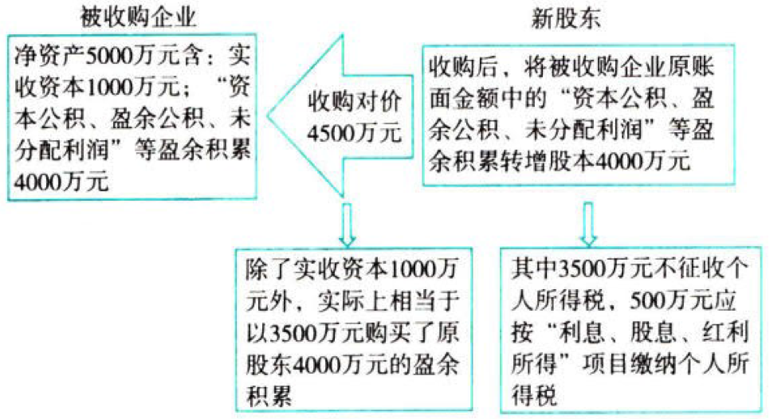

【归纳】利息、股息、红利所得的征免规定：


### 1.2.11. 财产租赁所得:star: :star: :star: 

财产租赁所得是指个人出租不动产、机器设备、车船以及其他财产取得的所得。

个人取得的财产转租收入，属于“财产租赁所得”的征税范围。

产权所有人死亡，在未办理产权继承手续期间，该财产出租且有租金收入的，以领取租金的个人为纳税义务人。

### 1.2.12. 财产转让所得:star: :star: :star: 

财产转让所得，是指个人转让有价证券、股权、合伙企业中的财产份额、不动产、机器设备、车船以及其他财产取得的所得。

转让境内上市公司股票取得的所得免征个人所得税。

#### 1.2.12.1. 企业改组改制过程中个人取得量化资产征税问题

（1）个人在形式上取得企业量化资产（取得的仅作为分红依据，不拥有所有权的企业量化资产）——不征个人所得税；

（2）个人实质上取得企业量化资产（以股份形式取得的拥有所有权的企业量化资产）——暂缓征收个人所得税；

（3）个人转让量化资产——按“财产转让所得”项目计征个人所得税；

（4）个人取得量化资产的分红（以股份形式取得企业量化资产参与企业分配而获得的股息、红利）——按“利息、股息、红利所得”项目征收个人所得税。

#### 1.2.12.2. 个人住房转让所得应纳税额的计算

个人住房转让应以实际成交价格为转让收入。纳税人申报的住房成交价格明显低于市场价格且无正当理由的，征收机关依法有权根据有关信息核定其转让收入，但必须保证各税种计税价格一致。

对转让住房收入计算个人所得税应纳税所得额时，纳税人可凭原购房合同、发票等有效凭证，经税务机关审核后，允许从其转让收入中减除房屋原值、转让住房过程中缴纳的税金及有关合理费用。

作者将自己的文字作品手稿原件或复印件拍卖取得的所得，按照“特许权使用费所得”项目缴纳个人所得税。

个人拍卖别人的作品手稿或个人拍卖除文字作品手稿原件及复印件外的其他财产，都应按照“财产转让所得”项目缴纳个人所得税。

### 1.2.13. 股票与股权转让规定归纳

（1）个人转让深沪上市公司流通股股票差价免征个人所得税；

（2）内地个人投资者通过沪港通、深港通投资香港联交所上市股票取得的转让差价所得，暂免征收个人所得税；

（3）香港市场投资者（包括企业和个人）投资上交所上市A股、深交所上市A股取得的转让差价所得，暂免征收所得税；

（4）个人转让限售股按规定缴纳个人所得税；

（5）个人转让非上市公司股票按规定缴纳个人所得税；

（6）个人转让股权按照财产转让所得缴纳个人所得税。

### 1.2.14. 偶然所得:star: :star: 

偶然所得，是指个人得奖、中奖、中彩以及其他偶然性质的所得。主要包括：

（1）个人为单位或他人提供担保获得收入；

（2）房屋产权所有人将房屋产权无偿赠与他人的，受赠人因无偿受赠房屋取得的受赠收入；

（3）企业在业务宣传、广告等活动中，随机向本单位以外的个人赠送礼品（包括网络红包），以及企业在年会、座谈会、庆典以及其他活动中向本单位以外的个人赠送礼品，个人取得的礼品收入；

（4）个人取得的企业向个人支付的不竞争款项。

企业赠送的具有价格折扣或折让性质的消费券、代金券、抵用券、优惠券等礼品不属于偶然所得。

### 1.2.15. 房屋产权无偿赠与免税情形

房屋产权所有人将房屋产权无偿赠与他人，符合以下情形的，对当事双方不征收个人所得税：

（1）房屋产权所有人将房屋产权无偿赠与配偶、父母、子女、祖父母、外祖父母、孙子女、外孙子女、兄弟姐妹；

（2）房屋产权所有人将房屋产权无偿赠与对其承担直接抚养或者瞻养义务的抚养人或者赔养人；

（3）房屋产权所有人死亡，依法取得房屋产权的法定继承人、遗嘱继承人或者受遗赠人。

## 1.3. 所得来源地的确定

所得的来源地和所得的支付地不是一个概念，来源于中国境内的所得，其支付地可能在境内，也可能在境外；来源于中国境外的所得，其支付地可能在境外，也可能在境内。

除另有规定外，下列所得，不论支付地点是否在中国境内，均为来源于中国境内的所得：

（1）因任职、受雇、履约等在中国境内提供劳务取得的所得；

（2）将财产出租给承租人在中国境内使用而取得的所得；

（3）转让中国境内的不动产等财产或者在中国境内转让其他财产取得的所得：

（4）许可各种特许权在中国境内使用而取得的所得；

（5）从中国境内企业、事业单位、其他组织以及居民个人取得的利息、股息、红利所得。

【案例】外籍人员詹姆斯受雇于我国境内某合资企业担任长驻总经理，合同期三年。合同规定其月薪5000美元，其中2000美元由中国境内企业支付，3000美元由境外母公司支付。则其来源于我国境内的所得是每月5000美元。因为所得支付地不等于所得来源地，其因任职受雇在中国境内提供劳务而取得的所得，不管于何处支付，都属于来源于中国境内的所得。

# 2. 税率与应纳税所得额的确定

## 2.4. 税率

### 2.4.16. 综合所得适用税率

综合所得个人所得税税率表（居民个人适用）

| 级数 | 全年应纳税所得额(x) | 税率 | 速算扣除数(元) |
|------|---------------------|------|----------------|
| 1    | 000000≤X≤036000     | 3%   | 0              |
| 2    | 036000≤x≤144000     | 10%  | 2520           |
| 3    | 144000≤x≤300000     | 20%  | 16920          |
| 4    | 300000≤x≤420000     | 25%  | 31920          |
| 5    | 420000≤x≤660000     | 30%  | 52920          |
| 6    | 660000≤x≤960000     | 35%  | 85920          |
| 7    | 960000≤x            | 45%  | 181920         |

适用情形：居民个人综合所得、工薪预知、解除劳动关系－次性补偿、提前退休一次性补贴、股权激励行权、企业（职业）年金按年或一次性领取。

### 2.4.17. 个人所得税月度税率表

月度税率表（选择单独计税的全年一次性奖金、非居民个人工资薪金、劳务报酬、稿酬、特许权使用费等适用）

| 级数 | 全年应纳税所得额(x) | 税率 | 速算扣除数(元) |
|------|---------------------|------|----------------|
| 1    | 00000≤X≤03000       | 3%   | 0              |
| 2    | 03000≤x≤12000       | 10%  | 210            |
| 3    | 12000≤x≤25000       | 20%  | 1410           |
| 4    | 25000≤x≤35000       | 25%  | 2660           |
| 5    | 35000≤x≤55000       | 30%  | 4410           |
| 6    | 55000≤x≤80000       | 35%  | 7160           |
| 7    | 80000≤x             | 45%  | 15160          |

适用情形：居民个人年终奖单独计算，企事业单位向职工低价售房，内退一次性补贴，企业（职业）年金按月或按季领取，非居民个人工资薪金所得、劳务报酬所得、稿酬所得、特许权使用费所得。

### 2.4.18. 经营所得适用税率

经营所得个人所得税税率表

| 级数 | 全年应纳税所得额(x) | 税率 | 速算扣除数(元) |
|------|---------------------|------|----------------|
| 1    | 000000≤X≤030000     | 5%   | 0              |
| 2    | 030000≤x≤090000     | 10%  | 1500           |
| 3    | 090000≤x≤300000     | 20%  | 10500          |
| 4    | 300000≤x≤500000     | 30%  | 40500          |
| 5    | 500000≤x            | 35%  | 65500          |

### 2.4.19. 其他所得适用税率

利息、股息、红利所得，财产租赁所得，财产转让所得和偶然所得，适用`20%`的比例税率。

财产租赁所得中，个人出租住房取得的所得减按10%的税率征税。

## 2.5. 应纳税所得额的确定:star: :star: :star: 

《个人所得税法》对纳税义务人的征税方法有三种：一是按年计征，如经营所得，居民个人取得的综合所得；二是按月计征，如非居民个人取得的工资薪金所得；三是按次计征，如利息、股息、红利所得，财产租赁所得，财产转让所得，偶然所得和非居民个人取得的劳务报酬所得、稿酬所得、特许权使用费所得等。

工资薪金所得、劳务报酬所得、稿酬所得、特许权使用费所得，居民个人取得的该四项所得，成为综合所得，按纳税年度合并计算个人所得税；非居民个人取得该四项所得，按月（工资薪金）或按次（劳务报酬、稿酬、特许权使用费）分项计算个人所得税，不做年度合并。

经营所得，按年度计税。

利息股息红利所得、财产租赁所得、财产转让所得、偶然所得，属于分类所得，按次计税。

### 2.5.20. 每次收入的确定

按次计征的方法中，如何准确划分“次”是十分重要的。《个人所得税法实施条例》对个人所得的“次”作出了明确规定。

利息股息红利所得，以支付利息股息红利时取得的收入为一次。

偶然所得，以每次取得该项收入为一次。

劳务报酬所得、稿酬所得、特许权使用费所得，属于一次性收入的，以取得该项收入为一次。

劳务报酬所得、稿酬所得、特许权使用费所得，属于同一项目连续取得收入的，以一个月内取得的收入为一次。

一次性劳务报酬收入以分月支付方式取得的，以一个月内取得的收入为一次。

财产租赁所得，以一个月内取得的收入为一次。

### 2.5.21. 应纳税所得额的确定

个人所得税的计税依据是应纳税所得额，应纳税所得额不等同于收入，需要从收入中对基本生活费、取得收入付出的代价、慈善捐赠等方面的支出进行扣除，不同征税方法有着不同的费用减除规定，进而影响应纳税所得额的确定。

（1）居民个人综合所得or取得经营所得的个人没有综合所得的，可扣除：

| 扣除项目     | 内容                                                     |
|--------------|----------------------------------------------------------|
| 基本减除费用 | 60000元/年                                               |
| 专项扣除     | 五险一金                                                 |
| 专项附加扣除 | 上有老，下有小，会生病，没住房，得深造                   |
| 其他扣除     | 企业年金、职业年金、商业健康保险、税收递延型商业养老保险 |

（2）劳务报酬所得、特许权使用费所得，按减除20%的余额为收入额。（收入额＝所得×80%）

（3）稿酬所得，减除20%，再减按70%的余额为收入额。（收入额＝稿酬×80%×70%）

（4）经营所得，减除成本、费用、损失。

（5）财产租赁所得，每次减除20%（最低减除800元）。

（6）财产转让所得，减除财产原值和合理费用。

（7）利息股息红利所得、偶然所得，不得扣除。另有规定除外。

### 2.5.22. 专项扣除的具体规定

居民个人按照国家规定的范围和标准缴纳的基本养老保险、基本医疗保险、失业保险等社会保险费和住房公积金等。

### 2.5.23. 专项附加扣除的具体规定

#### 2.5.23.3. 赠养老人

纳税人赡养一位及以上被赡养人的赡养支出，统一按以下标准定额扣除：纳税人为独生子女的，接照每月2000元（每年24000元）的标准定额扣除；纳税人为非独生子女的，由其与兄弟姐妹分摊每月2000元（每年24000元）的扣除额度，每人分摊的额度最高不得超过每月1000元（每年12000元）。可以由赡养人均摊或者约定分摊，也可以由被赡养人指定分摊。约定或者指定分摊的须签订书面分摊协议，指定分摊优于约定分摊。具体分摊方式和额度在一个纳税年度内不得变更。

所称被赡养人是指年满60周岁的父母，以及子女均己去世的年满60周岁的祖父母、外祖父母。

扣除主体：负有赡养义务的所有子女；祖父母、外祖父母的子女均已经去世，负有赡养义务的孙子女、外孙子女。

包含的支出范围：

（1）被赡养人中一位或多位年满60周岁

（2）被赌养人是祖父母、外祖父母的，祖父母、外祖父母的子女均已去世

不包含的支出范围：赡养的其他关系人（如岳父母、公婆等）

#### 2.5.23.4. 子女教育

纳税人年满3周岁的子女接受学前教育和学历教育的相关支出，按照每个子女每月1000元（每年12000）的标准定额扣除。

父母可以选择，由其中一方按扣除标准的100%扣除，也可以选择由双方分别按扣除标准的50%扣除，具体扣除方式在一个纳税年度内不能变更。

纳税人子女在中国境外接受教育的，纳税人应当留存境外学校录取通知书、留学签证等相关教育的证明资料备查。

扣除主体：法定监护人，包括学生父母、继父母、养父母以及父母之外的担任未成年人的法定监护人的其他人。

包含的支出范围：

（1）年满3周岁的子女接受学前教育

（2）子女的境内和境外的全日制义务教育、高中阶段教育和高等教育（学历教育）

（3）拥有义务教育学籍的特殊教育（如聋哑学校）

不包含的支出范围：

（1）不满3周岁子女的教育

（2）子女的境内外非学历教育

（3）在职研究生教育

（4）进入博士后工作站期间

#### 2.5.23.5. 大病医疗

在一个纳税年度内，纳税人发生的与基本医保相关的医药费用支出，扣除医保报销后个人负担（指医保目录范围内的自付部分）累计超过15000元的部分，由纳税人在办理年度汇算清缴时，在80000元限额内据实扣除。

纳税人及其配偶、未成年子女发生的医药费用支出应按前述规定分别计算扣除额。

纳税人发生的医药费用支出可以选择由本人或者其配偶扣除；未成年子女发生的医药费用支出可以选择由其父母一方扣除。

留存医药服务收费及医保报销相关票据原件（或复印件）等资料备查。

扣除主体：本人或配偶；未成年子女选择父母任一方。

包含的支出范围：纳税人或配偶、未成年子女分别在一个纳税年度内医保目录范围内的自付部分累计超过15000元的部分（在80000元限额内据实扣除）

不包含的支出范围：

（1）医保目录范围外的医药费支出

（2）医保目录范围内未超过大病医疗支出的“起扣线”（15000元）的部分

（3）纳税人父母的医药费支出

#### 2.5.23.6. 住房贷款利息

纳税人本人或配偶，单独或共同使用商业银行或住房公积金个人住房贷款，为本人或其配偶购买中国境内住房，发生的首套住房贷款利息支出，在实际发生贷款利息的年度，按照每月1000（每年12000元）的标准定额扣除，扣除期限最长不超过240个月。

纳税人只能享受一套首套住房贷款利息扣除。

所称首套住房贷款是指购买住房享受首套住房贷款利率的住房贷款。

夫妻双方可约定选择自其中一方扣除，确定后，一个纳税年度内不得变更。

夫妻双方婚前分别购买住房发生的首套住房贷款，其贷款利息支出，婚后可以选择其中一套购买的住房，由购买方按扣除标准的100%扣除，也可以由夫妻双方对各自购买的住房分别按扣除标准的50%扣除，具体扣除方式在一个纳税年度内不能变更。

留存住房贷款合同、贷款还款支出凭证备查。

扣除主体：未婚者本人；已婚夫妻选择一方；婚前各自购房的选择一套一方100%扣或双方对各自购买的住房分别扣50%。

包含的支出范围：本人或者配偶购买中国境内住房，贷款来源于商业银行或者住房公积金的首套住房贷款利息支出。

不包含的支出范围：

（1）购买中国境外住房

（2）父母贷款但产权登记为子女的购房

（3）商业银行或者住房公积金之外的贷款购房

（4）与首套住房贷款利率水平不相符

（5）享受首套住房贷款利息扣除后的再次购房

（6）贷款购房当年已享受住房租金专项附加扣除

#### 2.5.23.7. 住房租金

纳税人在主要工作城市没有自有住房而发生的住房租金支出，可以按照以下标准定额扣除：

| 类型                                                         | 扣除标准                  |
|--------------------------------------------------------------|---------------------------|
| 直辖市、省会（首府）城市、计划单列市以及国务院确定的其他城市 | 每月1500元（每年18000元） |
| 市辖区户籍人口越过100万的城市                                | 每月1100元（每年13200元） |
| 市辖区户籍人口不越过100万的城市                              | 每月800元（每年9600元）   |

纳税人无任职受雇单位的，主要工作城市为受理其综合所得汇算清缴的税务机关所在城市。

夫妻双方主要工作城市相同的，只能由一方扣除住房租金支出。

纳税入及其配偶在一个纳税年度内不得同时分别享受住房贷款利息专项附加扣除和住房租金专项附加扣除。

住房租金支出由签订租赁住房合同的承租人扣除。

留存住房租赁合同、协议等有关资料备查。

扣除主体：住房租赁合同的承程人，具体为：未婚本人扣；已婚且夫妻双方主要工作城市相同的，由承租人扣；已婚且夫妻双方主要工作城市不同的，分别扣除。

包含的支出范围：在主要工作城市没有自有位房但签订住房租赁合同租房的。

不包含的支出范围：

（1）在主要工作城市有自有住房（取得自有住房产权证或购买向有住房时的契税完税证明）

（2）不付租金的职工宿舍或借住房

（3）纳税人及其配偶在一个纳税年度内己享受住房贷款利息专项附加扣除

#### 2.5.23.8. 继续教育

纳税人在中国境内接受学历（学位）继续教育的支出，在学历（学位）教育期间按照每月400元（每年4800元）定额扣除。同一学历（学位）继续教育的扣除期限不能超过48个月（4年）。

纳税人接受技能人员职业资格继续教育、专业技术人员职业资格继续教育支出，在取得相关证书的当年，按照3600元定额扣除。

个人接受本科及以下学历（学位）继续教育，符合税法规定扣除条件的，可以选择由其父母扣除，也可以选择由本人扣除。

纳税人接受技能人员职业资格继续教育、专业技术人员职业资格继续教育的，应当留存相关证书等资料备查。

可选择由其父母扣除，也可本人扣除的支出范围：个人接受境内本科及以下学历（学位）继续教育（参加教育部认可学籍的夜大、函授，现代远程教育、广播电视大学等非金日制教育）。

只能本人扣除的支出范围：

（1）城内在职研究生教育

（2）纳税人接受人社部发布的国家职业资格目录列明的（如焊工、游泳救生员等）技能人员职业资格继续教育

（3）纳税人接受人社部发布的国家职业资格目录列明的（如CPA、TA等）专业技术人员职业资格继续教育

不包含的支出范围：

（1）境外继续教育

（2）境外颁发的技能证书

（3）境内人社部发布的国家职业资格目录之外的教育和证书

（4）同一学历（学位）越过4年（48个月）扣除期限的继续教育支出

（5）同一纳税人，在同一纳税年度可以同时享受一个学历（学位）继续教育和一个职业资格继续教育。不能同时享受多个学历（学位）继续教育或多个职业资格继续救育

### 2.5.24. 其他扣除的具体规定

（1）个人缴付符合国家规定的企业年金、职业年金。在不超过本人缴费工资计税基数的4%标准内的部分，从应纳税所得额中扣除。

（2）个人自行购买的符合国家规定的商业健康保险，单位应自其提交保费凭单的次月起，按照不超过200元/月（2400元/年）的限额，在计算其个人所得税应纳税所得额时扣除。单位统一为员工购买符合规定的商业健康保险产品的支出，应分别计入员工个人工资薪金，视同个人购买，自购买产品的次月起按200元/月（2400元/年）的限额予以扣除。

（3）税收递延型商业养老保险的支出。试点地区个人通过个人`商业养老资金账户`购买符合规定的商业养老保险产品的支出，允许在一定标准内税前扣除，扣除限额按照当月工资薪金、连续性劳务报酬收入的6%和1000元孰低办法确定。

（4）国务院规定可以扣除的其他项目。

### 2.5.25. 非居民个人

非居民个人的工资薪金所得，以每月收入额减除费用5000元后的余额为应纳税所得额；劳务报酬所得、稿酬所得、特许权使用费所得，以每次收入额为应纳税所得额。

非居民个人的劳务报酬所得、稿酬所得、特许权使用费所得也是以收入减除20%的费用后的余额为收入额。稿酬所得的收入额减按70%计算。但是非居民的这几项收入额仅分项计税，不合并计算。

### 2.5.26. 经营所得

经营所得，以每一纳税年度的收入总额减除戚本、费用以及损失后的余额，为应纳税所得额。

所称成本、费用，是指生产、经营活动中发生的各项直接支出和分配计入成本的间接费用以及销售费用、管理费用、财务费用；所称损失，是指生产、经营活动中发生的固定资产和存货的盘亏、毁损、报废损失，转让财产损失，坏账损失，自然灾害等不可抗力因素造成的损失以及其他损失。

取得经营所得的个人，没有综合所得的，计算其每一纳税年度的应纳税所得额时，应当减除费用60000元、专项扣除、专项附加扣除以及依法确定的其他扣除。专项附加扣除在办理汇算清缴时减除。

在个人税收递延型商业养老保险试点区域内，取得个体工商户生产经营所得、对企事业单位的承包承租经营所得的个体工商户业主、个人独资企业投资者、合伙企业自然人合伙人和承包承租经营者，其缴纳的税收递延型商业养老保险保费准予在申报扣除当年计算应纳税所得额时予以限额据实扣除，相除限额按照不超过当`年应税收入的6%`和`12000元`孰低征协法确定。

从事生产、经营活动，未提供完整、准确的纳税资料，不能正确计算应纳税所得额的，由主管税务机关核定应纳税所得额或者应纳税额。

个人独资企业的投资者以全部生产经营所得为应纳税所得额；合伙企业的投资者按照合伙企业的全部生产经营所得和合伙协议约定的分配比例，确定应纳税所得额，合伙协议没有约定分配比例的，以全部生产经营所得和合伙人数量平均计算每个投资者的应纳税所得额。

上述所称生产经营所得，包括企业分配给投资者个人的所得和企业当年留存的所得（利润）。

### 2.5.27. 财产租赁所得

财产租赁所得，每次收人不超过4000元的，减除费用800元；4000元以上的，减除20%的费用，其余额为应纳税所得额。

### 2.5.28. 财产转让所得

财产转让所得，以转让财产的收入额减除财产原值和合理费用后的余额，为应纳税所得额。财产原值，是指：

（1）有价证券，为买人价以及买入时按照规定缴纳的有关费用。

（2）建筑物，为建造费或者购进价格以及其他有关费用。

（3）土地使用权，为取得土地使用权所支付的金额、开发土地的费用以及其他有关费用。

（4）机器设备、车船，为购进价格、运输费、安装费以及其他有关费用。

（5）其他财产，参照以上方法确定。

纳税义务人未提供完整、准确的财产原值凭证，不能正确计算财产原值的，由主管税务机关核定其财产原值。

合理费用，是指卖出财产时按照规定支付的有关税费。

利息、股息、红利所得和偶然所得，以每次收入额为应纳税所得额。

### 2.5.29. 应纳税所得额的其他规定:star: :star: 

#### 2.5.29.9. 非货币所得的确定

个人所得的形式，包括现金、实物、有价证券和其他形式的经济利益；所得为实物的，应当按照取得的凭证上所注明的价格计算应纳税所得额，无凭证的实物或者凭证上所注明的价格明显偏低的，参照市场价格核定应纳税所得额；所得为有价证券的，根据票面价格和市场价格核定应纳税所得额；所得为其他形式的经济利益的，参照市场价格核定应纳税所得额。

#### 2.5.29.10. 中介费的扣除

对个人从事技术转让、提供劳务等过程中所支付的中介费，如能提供有效、合法凭证的，允许从其所得中扣除。

#### 2.5.29.11. 捐赠的扣除（新增）

个人通过中华人民共和国境内公益性社会组织、县级以上人民政府及其部门等国家机关，向教育、扶贫、济困等公益慈善事业的捐赠（以下简称公益捐赠），发生的公益捐赠支出，可以按照个人所得税法有关规定中明确的比例，在计算应纳税所得额时扣除。

##### 2.5.29.11.1. 捐赠渠道

境内公益性社会组织，包括依法设立或登记并按规定条件和程序取得公益性捐赠税前扣除资格的慈善组织、其他社会组织和群众团体

##### 2.5.29.11.2. 捐赠扣除比例

一般规定：

（1）捐赠额未超过纳税人申报的应纳税所得额30%的部分，可以从其应纳税所得锁中扣除，超过部分不得扣除：（2）个人捐赠住房作为廉租住房、公租房，符合税收法律法规规定的，对其公益性捐赠支出未越过其申报的应纳税所得额30%的部分，准予从其应纳税所得额中扣除。

特殊规定：国务院规定对公益慈善事业捐赠实行全额税前扣除的，从其规定

##### 2.5.29.11.3. 多项捐赠的扣除次序确定

个人同时发生按30%扣除和全额扣除的公益捐赠支出，自行选择扣除次序

##### 2.5.29.11.4. 捐赠支出金额的确定

（1）捎赠货币性资产的，按照实际捐赠金额确定

（2）捐赠股权、房产的，按照个人持有股权、房产的财产原值确定

（3）捐赠除股权、房产以外的其他非货币性资产的，按照非货币位资产的市场价格确定

##### 2.5.29.11.5. 捐赠票据的取得与提供

（1）公益捐赠票据的开具与取得：公益性社会组织、国家机关在接受个人捐赠时，应当按照规定开具捐赠票据；个人索取捐赠票据的，应予以开具。个人发生公益捐赠时不能及时取得捐赠票据的，可以暂时凭公益捐赠银行支付凭证拍除，并向扣缴义务人提供公益捐赠银行支付凭证复印件。个人应在捐赠之日起90日内向扣缴义务人补充提供捐赠票据，如果个人未按规定提供捐赠票据的，扣缴义务人应在30日内向主管税务机关报告。机关、企事业单位统一组织员工开展公益捐赠的，纳税人可以凭汇总开具的捐赠票据和员工明细单扣除

（2）预扣预缴、代扣代缴税款时对捐赠票据的提供：个人通过扣缴义务人享受公益捐赠扣除政策，应当告知扣缴义务人符合条件可扣除的公益捐赠支出金额，并提供捐赠票据的复印件，其中捐赠股权、房产的还应出示财产原值证明。扣缴义务人应当核照规定在预扣预缴、代扣代缴税款时予扣除，并将公益捐赠扣除金额告知纳税人

##### 2.5.29.11.6. 归纳

财政部、税务总局2019年第99号公告中，对居民个人和非居民个人的公益捐赠支出，分别做了具体规定：

###### 2.5.29.11.6.1. 居民个人

可以在财产租赁所得、财产转让所得、利息股息红利所得、偶然所得（以下统称“分类所得”）、综合所得或者经营所得中扣除。

（1）允许跨项扣除：在当期一个所得项目扣除不完的公益捐赠支出，可以按规定在其他所得项目中继续扣除

（2）允许选择扣除顺序：根据各项所得的收入、公益捐赠支出、适用税率等情况，自行决定在综合所得、分类所得、经营所得中扣除的公益捐赠支出的顺序

在综合所得中扣除公益捐赠支出的处理

可在捐赠当月取得的分类所得中扣除。当月分类所得应扣除未扣除的公益捐赠支出，可以按照以下规定追补扣除：

（1）扣缴义务人已经代扣但尚未解缴税款的，居民个人可以向扣缴义务人提出追补扣除申请，退还已扣税款

（2）扣缴义务人已经代扣且解缴税款的，居民个人可以在工艺捐赠之日起90日内提请扣缴义务人向征收税款的税务机关办理更正申报追补扣除，税务机关和扣缴义务人应当予以办理

（3）居民个人自行申报纳税的，可以在公益捐赠之日起90日内向主管锐务机关办理更正申报追补扣除。居民个人捐赠当月有多项多次分类所得的，应先在其中一项一次分类所得中扣除。已经在分类所得中扣除的公益捐赠支出.不再调整到其他所得中扣除

在经营所得中扣除公益捐赠支出的处理

（1）个体工商户发生的公益捐赠支出，在其经营所得中扣除

（2）个人独资企业、合伙企业发生的公益捐赠支出，其个人投资者应当按照捐赠年度合伙企业的分配比例（个人独资企业分配比例为100%），计算归属于每一个人投资者的公益捐赠支出，个人投资者应将其归属的个人独资企业、合伙企业公益捐赠支出和本人需要在经营所得扣除的其他公益捐赠支出合并，在其经营所得中扣除

（3）在经营所得中扣除公益捐赠支出的，可以选择在预缴税款时扣除，也可以选择在汇算清缴时扣除

（4）经营所得采取核定征收方式的，不扣除公益捐赠支出

###### 2.5.29.11.6.2. 非居民个人

非居民个人发生的公益捐赠支出，未超过其在公益捐赠支出发生的当月应纳税所得额30%的部分，可以从其应纳税所得额中扣除。扣除不完的公益捐赠支出，可以在经营所得中继续扣除。非居民个人按规定可以在应纳税所得额中扣除公益捐赠支出而未实际扣除的，参照上述“在分类所得中应扣未扣公益捐赠支出补迫扣除规定”处理

# 3. 税收优惠:star: :star: :star: 

个人所得税的减免税优惠是需要考生掌握的重要内容。由于个人所得税税收优惠政策多而杂，这里分类收录易考的主要优惠政策。

## 3.6. 免征个人所得税的优惠

（1）省级人民政府、国务院部委和中国人民解放军军以上单位，以及外国组织颁发（颁布）的科学、教育、技术、文化、卫生、体育、环境保护等方面的奖金（奖学金）。

（2）国债和国家发行的金融债券利息；地方政府债券利息。

（3）按照国家统一规定发给的补贴、津贴。

指按照国务院规定发给的政府特殊津贴、院士津贴和国务院规定免纳个人所得税的补贴、津贴。

（4）福利费、抚恤金、救济金。

福利费，是指根据国家有关规定，从企业、事业单位、国家机关、社会团体提留的福利费或者工会经费中支付给个人的生活补助费；救济金，是指各级人民政府民政部门支付给个人的生活困难补助费。

（5）保险赔款。

（6）军人的转业费、复员费。

（7）按照国家统一规定发给干部、职工的安家费、退职费、基本养老金或者退休费、离休费、离休生活补助费。

（8）依照我国有关法律规定应予免税的各国驻华使馆、领事馆的外交代表、领事官员和其他人员的所得。

（9）中国政府参加的国际公约以及签订的协议中规定免税的所得。

（10）个人按照省级以上人民政府规定的比例缴付的住房公积金、医疗保险金、基本养老保险金、失业保险金，允许在个人应纳税所得额中扣除，免予征收个人所得税。

（11）个人举报、协查各种违法、犯罪行为而获得的奖金。

（12）个人办理代扣代缴税款手续，按规定取得的扣缴手续费。

（13）个人转让自用达5年以上并且是家庭唯一的生活用房取得的所得。

（14）自用5年以上是指个人购房至转让房屋的时间达5年以上。家庭唯一生活用房是指在同一省、自治区、直辖市范围内纳税人（有自己偶的为夫妻双方）仅拥有一套住房。

（15）符合地方政府规定条件的城镇住房保障家庭从地方政府领取的住房租赁补贴，免征个人所得税。

## 3.7. 外籍个人所得税免税优惠

（1）外籍个人以非现金形式或实报实销形式取得的住房补贴、伙食补贴、搬迁费、洗衣费。外籍个人按合理标准取得的境内、外出差补贴。外籍个人取得的探亲费［仅限于外籍个人在我国的受雇地与其家庭所在地（包括配偶或父母居住地）之间搭乘交通工具，且每年不超过两次的费用｝、语言训练费、子女教育费等，经当地税务机关审核批准为合理的部分。

2019年1月1日至2021年12月31日期间，外籍个人符合居民个人条件的，可以选择享受个人所得税专项附加扣除，也可以选择享受住房补贴、语言训练费、子女教育费等津补贴免税优惠政策，但不得同时享受。外籍个人一经选择，在一个纳税年度内不得变更。

自2022年1月1日起，外籍个人不再享受住房补贴、语言训练费、子女教育费津补贴免税优惠政策，应按规定享受专项附加扣除。

（2）外籍个人从外商投资企业取得的股息、红利所得。

（3）凡符合下列条件之一的外籍专家取得的工资薪金所得可免征个人所得税：

根据世界银行专项贷款协议由世界银行直接派往我同工作的外国专家。

联合国组织直接派往我国工作的专家。

为联合国援助项目来华工作的专家。

援助国派往我国专为该国无偿援助项目工作的专家。

根据两国政府签订文化交流项目来华工作两年以内的文教专家，其工资薪金所得由该国负担的。

根据我国大专院校国际交流项目来华工作两年以内的文教专家，其工资薪金所得由该国负担的。

通过民间科研协定来华工作的专家，其工资薪金所得由该国政府机构负担的。

## 3.8. 几项特殊的免税优惠

（1）股权分置改革中非流通股股东通过对价方式向流通股股东支付的股份、现金等收入，暂免征收流通股股东应缴纳的个人所得税。

（2）对被拆迁人按照国家有关城镇房屋拆迁管理办法规定的标准取得的拆迁补偿款（含因棚户区改造而取得的拆迁补偿款），免征个人所得税。

（3）对个人投资者从投保基金公司取得的行政和解金，暂免征收个人所得税。

（4）对国际奥委会及其相关实体、国际残奥委会及其相关实体的外籍雇员、官员、教练员、训练员以及其他代表在2019年6月1日至2022年12月31日期间临时来华，从事与北京冬奥会相关的工作，取得由北京冬奥组委支付或认定的收入，免征个人所得税。（新增）

## 3.9. 减征个人所得税的优惠

（1）个人投资者持有2019～2023年发行的铁路债券取得的利息收入，减按50%计入应纳税所得额计算征收个人所得税。税款由兑付机构在向个人投资者兑付利息时代扣代缴。（新增）

（2）向2019年1月1日起至2023年12月31日止，一个纳税年度内在船航行时间累计满183天的远洋船员，其取得的工资薪金收入减按50%计入应纳税所得额，依法缴纳个人所得税。远洋船员可选择在当年预扣预缴税款或者次年个人所得税汇算清缴时享受上述减征优惠政策。（新增）

（3）有下列情形之一的，可减征个人所得税，具体幅度和期限，由省、自治区、直辖市人民政府规定，并报同级人大常委会备案：

残疾、孤老人员和烈属的所得。

因自然灾害遭受重大损失的。

罔务院可以规定其他减税情形，报全国人民代表大会常务委员会备案。

# 4. 境外所得的税额扣除:star: :star: :star: 

税法规定，居民个人从中国境外取得的所得，准予其在应纳税额中抵免已在境外缴纳的个人所得税税额。但抵免额不得超过该纳税人境外所得依照我国税法规定计算的应纳税额。

居民个人在一个纳税年度内来源于中国境外的所得，依照所得来源国家（地区）税收法律规定在中国境外已缴纳的所得税税额允许在抵免限额内从其该纳税年度应纳税额中抵免。

居民个人来源于一国（地区）的综合所得、经营所得以及其他分类所得项目的应纳税额为其抵免限额。

## 4.10. 改革后的个人所得税法，境外所得抵免限额的计算需要历经三个步骤。

### 4.10.30. 第一步

来源于境外的综合所得，与境内综合所得合并计算应纳税额。

来源于境外的经营所得，与境内经营所得合并计算应纳税额。

其他分类所得（利息股息红利所得，财产租赁所得，财产转让所得和偶然所得）不与境内所得合并，应当分别单独计算应纳税额。

### 4.10.31. 第二步

```
来源于一国（地区）综合所得的抵免限额＝中国境内和境外综合所得依照第一步计算的综合所得应纳税额x来源于该国（地区）的综合所得收入额÷中国境内和境外综合所得收入额合计。
来源于一国（地区）经营所得的抵免限额＝中国境内和境外经营所得依照第一步计算的经营所得应纳税额x来源于该国（地区）的经营所得应纳税所得额÷中国境内和境外经营所得应纳税所得额合计。
来源于一国（地区）其他分类所得的抵兔限额＝该国（地区）的其他分类所得依照第一步计算的应纳税额。
```
### 4.10.32. 第三步

```
来源于一国（地区）所得的抵免限额＝来源于该国（地区）综合所得抵免限额＋来源于该国（地区）经营所得抵免限额＋来源于该国（地区）其他分类所得抵免限额
```
【注意】这里避免国际间重复征税的原理与企业所得税相同，但计算境外税款抵免限额的方法采用的是分国分项计算、分国加总的方法，不同于企业所得税的境外税款抵免限额可选择分国法和综合法的计算方法。

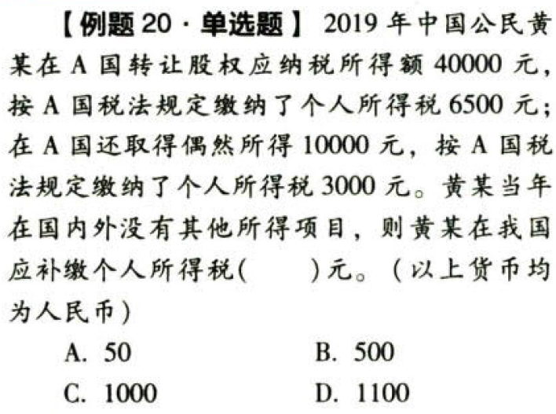


# 5. 应纳税额的计算

## 5.11. 居民个人综合所得应纳税额的计算:star: :star: :star: 

```
全年应纳税额＝∑(每一级数的全年应纳税所得额×对应级数的适用税率)
＝(全年收入额－60000元－专项扣除－专项附加扣除－其他扣除)×适用税率－速算扣除数
```


## 5.12. 非居民个人取得工资薪金所得、劳务报酬所得、稿酬所得、特许权使用费所得应纳税额的计算:star: :star: 

非居民个人在我国取得的所得项目不能体现其整体负担能力，也难以采用汇算清缴的方式来汇总计算综合所得的个人所得税，所以非居民个人在我国取得工资薪金所得，劳务报酬所得，稿酬所得和特许权使用费所得，按月或者按次分项计算个人所得税，不办理汇算清缴。

```
每月/次应纳税额＝∑应纳税所得额i×适用税率i－速算扣除数i
＝[(工资薪金所得收入额－5000元)×适用税率1－速算扣除数1]
＋[(劳务报酬收入×80%)×适用税率2－速算扣除数2]
＋[(特许权使用费收入×80%)×适用税率3－速算扣除数3]
＋[(稿酬收入×80%×70%)×适用税率4－速算扣除数4]
```
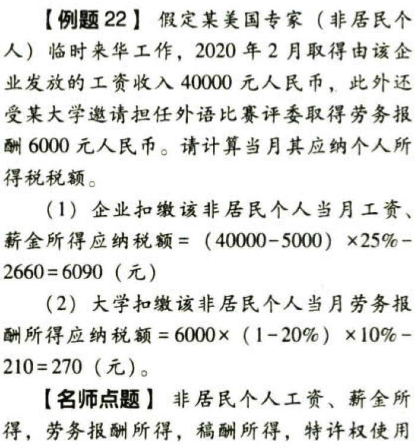


## 5.13. 经营所得应纳税额的计算:star: :star: 

经营所得应纳税额的计算公式为：

```
应纳税额＝全年应纳税所得额×适用税率－速算扣除数
＝(全年收入总额－成本、费用以及损失)×适用税率－速算扣除敏
```
取得经营所得的个人，没有综合所得的，计算其每一纳税年度的应纳税所得额时，应当减除费用6万元、专项扣除、专项附加扣除、依法确定的其他扣除。专项附加扣除在办理汇算清缴时减除。

### 5.13.33. 个体工商户应纳税额的计算

个体正商户的生产经营所得以业主为个人所得税纳税义务人。

个体工商户的生产经营所得，以每一纳税年度的收入总额，减除成本、费用、税金、损失、其他支出以及允许弥补的以前年度亏损后的余额，为应纳税所得额。其中可扣除的税金是指个体工商户在生产经营活动中发生的除个人所得税和允许抵扣的增值税以外的各项税金及其附加。

#### 5.13.33.12. 个体工商户特殊的扣除标准归纳如下：:star: :star: 

（1）个体工商户业主的工资薪金支出不得税前扣除，但可以依照法律法规扣除一定的费用：个体工商户业主的费用扣除标准统一确定为60000元/年（5000元/月）

（2）取得经营所得的个体工商户业主，对其购买符合规定的商业健康保险产品支出，可按照规定标准（限额2400元/年，200元/月）在个人所得税前扣除

（3）个体工商户生产经营活动中，应当分别核算生产经营费用和个人、家庭费用。对于生产经营与个人，家庭生活混用难以分清的费用，其40%视为与生产经营有关费用，准予如除

（4）在个人税收递延型商业养老保险试点区域内，取得经营所得的个体工商户业主缴纳的税收递延型商业养老保险保费准予在申报扣除当年计算应纳税所得额时予以限额据实扣除，扣除限额按照不超过当年应税收入的6%和12000元孰低办法确定

（5）个体工商户代其从业人员或者他人负担的税款，不得税前扣除

（6）个体工商户在生产经营活动中发生的下列利息支出，准予扣除：

向金融企业借款的利息支出

向非金融企业和个人借款的利息支出，不超过按照金融企业同期同类贷款利率计算的数额的部分

（7）个体工商户按照规定缴纳的摊位费、行政性收费、协会会费等，按实际发生数额扣除

（8）企业拨缴的职工教育经费支出在工资薪金总额2.5%的标准内据实扣除

（9）个体工商户通过公益性社会团体或者县级以上人民政府及其部门，用于《中华人民共和国公益事业捐赠法》规定的公益事业的捐赠，捐赠额不超过其应纳税所得额30%的部分可以据实扣除

财政部、国家税务总局规定可以全额在税前扣除的捐赠支出项目，按有关规定执行

（10）个体工商户研究开发新产品、新技术、新工艺所发生的开发费用，以及研究开发新产品、新技术而购置单台价值在10万元以下的测试仪器和试验性装置的购置费准予直接扣除：单台价值在10万元以上（含10万元）的测试仪器和试验性装置，按固定资产管理，不得在当期直接扣除

#### 5.13.33.13. 个体工商户与企业所得税扣除标准相同的扣除项目：:star: 

从业人员工资；为从业人员缴纳的基本养老保险费、基本医疗保险费、失业保险费、生育保险费、工伤保险费和住房公积金；向当地工会组织拨缴的工会经费、实际发生的职工福利费；借款费用；租赁费；汇兑损益；业务招待费、广告费和业务宣传费；劳动保护费；亏损弥补等规定，均与企业所得税的基本规定一致

#### 5.13.33.14. 适用税率

五级越额累进税率

#### 5.13.33.15. 应纳税额计算公式

```
应纳税额＝应纳税所得额×适用税率－速算扣除数
＝（全年收入总额－戚本、费用以及损失）×适用税率－速算扣除数
```
#### 5.13.33.16. 其他规定

（1）要注意个体工商户生产经营所得与其取得的其他方面所得的划分。取得与生产经营无关的各项应税所得，应分别适用各应税项目的规定计算征收个人所得税。例如：个体户王某在生产经营之外偶然中奖取得的收入，应按偶然所得缴纳个人所得税

（2）个体工商户资产的税务处理，参照企业所得税相关法律、法规和政策规定执行

（3）个体工商户有两处或两处以上经营所得的，选择向其中一处经营管理所在地主管税务机关办理年度汇总申报

（4）个体工商户终止生产经营的，应当在注销工商登记或者向政府有关部门办理注销前向主管税务机关结清有关纳税事宜

### 5.13.34. 个人独资企业、合伙企业生产经营所得应纳税额的计算:star: :star: 

个人独资企业、合伙企业经营所得的税额计算与个体工商户基本一致，也分为查账征税方式和核定征收方式，适用5级超额累进税率。但个人独资企业和合伙企业计税管理方式有自身的特点。

#### 5.13.34.17. 查账征税方式

##### 5.13.34.17.7. 查账征税方式的特殊计税规则

投资者兴办两个或两个以上个人独资企业，于年终汇算清缴时，采用以下步骤：

①汇总其投资兴办的所有企业的经营所得

②按汇总所得作为应纳税所得额，并按此金额确定税率计算整体应纳税额

③将整体应纳税额按各企业经营所得占所有企业经营所得的比重分配，算出各企业的应纳所得税额

④计算各企业应补缴的税款

##### 5.13.34.17.8. 查账征税应纳税额计算公式

```
应纳税额＝应纳税所得额×适用税率－速算扣除数
＝(全年收入总额－成本、费用以及损失)×适用税率－速算扣除数
```
##### 5.13.34.17.9. 实际经营期

个人独资企业和合伙企业困在纳税年度中间开业、合并、注销及其他原因，导致该纳税年度的实际经营期不足1年的，对个人独资企业投资者和合伙企业自然人合伙人的生产经营所得计算个人所得税时，以其实际经营期为1个纳税年度。役资者本人的费用扣除标准，统一确定为60000元/年，即5000元/月。计算公式如下：

```
应纳税所得额＝该年度收入总额－成本、费用及损失－当年投资者本人的费用扣除额
当年投资者本人的费用扣除额＝月减除费用（5000元/月）×当年实际经营月份数
应纳税额＝应纳税所得额×适用税率－速算扣除数
```
##### 5.13.34.17.10. 商业健康保险

个人独资企业技资者、合伙企业自然人合伙人对其购买符合规定的商业健康保险产品支出，可按照限额2400元/年（200元/月）规定标准在个人所得税前扣除

##### 5.13.34.17.11. 其他扣除

试点地区个人独资企业投资者、合伙企业自然人合伙人通过个人商业养老资金账户购买符合规定的税收递延型商业养老保险产品，缴纳的保费准予在申报扣除当年计算应纳税所得额时予以限额据实相除，扣除限额后照不超过当年应税收入的6%和1200元/月孰低办法确定

#### 5.13.34.18. 核定征收方式

##### 5.13.34.18.12. 核定征收方式的计税规则

（1）核定征收方式包括定额征收、核定应税所得率征收以及其他合理的征收方式，与企业所得税类似

（2）实行核定征税的投资者，不能享受个人所得税的优惠政策

（3）实行查账征税改为核定征税的纳税人，在查账征税方式下认定的年度经营亏损未弥补完的部分，不得再继续弥补

##### 5.13.34.18.13. 核定应税所得率征收方式应纳税额计算公式

```
应纳税额＝应纳税所得额×适用税率
应纳税所得额＝收入总额×应税所得率
＝成本费用支出额/(1－应税所得率)×应税所得率
```
#### 5.13.34.19. 适用税率

五级超额累进税率

#### 5.13.34.20. 其他规定

个人独资企业、合伙企业的个人投资者以企业资金为本人、家庭成员及其相关人员支付与企业生产经营无关的消费性支出及购买汽东、住房等财产性支出，视为企业对个人投资者的利润分配，并入投资者个人的经营所得，依照“经营所得”项目计征个人所得税

### 5.13.35. 对企事业单位的承包经营、承租经营所得应纳税额的计算:star: :star: 

#### 5.13.35.21. 应纳税所得额的计算

对企事业单位的承包经营、承租经营所得，以每一纳税年度的收入总额，减除必要费用后的余额，为应纳税所得额

每一纳税年度的收入总额，是指纳税人按照承包经营、承租经营合同规定分得的经营利润和工资薪金性质的所得之和；必要费用按年减除60000元

企事业单位承包承租经营者自行购买符合条件的商业健康保险产品的支出，在不超过2400元/年（200元/月）的标准内扣除

试点地区承包承租经营者通过个人商业养老资金账户购买符合规定的税收递延型商业养老保险产品，缴纳的保费准予在申报扣除当年计算应纳税所得额时予以限额据实扣除，扣除限额披照不超过当年应税收入的6%和12000元孰低办法确定

#### 5.13.35.22. 适用税率

五级超额累进税率

#### 5.13.35.23. 应纳税额计算公式

```
应纳税额＝应纳税所得额×适用税率－速算扣除数
＝(纳税年度收入总额－必要费用)×适用税率－速算扣除数
```
#### 5.13.35.24. 计税方法

（1）按年计税：在一个纳税年度内分次取得承包、承租经营收入要预缴个人所得税，在取得所得的次年3月31日前汇算清缴，多退少补

（2）在一个纳税年度中，承包经营、承租经营的经营期不足1年的，以其实际经营期为一个纳税年度

## 5.14. 财产租赁所得应纳税额的计算:star: :star: :star: 

### 5.14.36. 应纳税所得额的计算

每次/月收入不超过4000元的：

```
应纳税所得额＝每次/月/）收入额－准予扣除项目－修缮费用（800元为限）－800元
```
每次/月收入超过4000元的：

```
应纳税所得额＝［每次/月收入领－准予扣除项目－修缮费用（800元为限）]×(1－20%)
```
财产租赁收入扣除费用包括：税费、基金＋修缮费＋法定扣除标准

个人将承租房屋转租取得的租金收入也按照财产租赁所得征税，扣除费用包括：税费、基金＋向出租方支付的租金＋修缮费＋法定扣除标准

（1）在出租财产过程中缴纳的税金和教育费附加等税费要有完税（缴款）凭证

（2）取得转租收入的个人向出租方支付的租金要有房屋租赁合同和合法的支付凭据

（3）由纳税人负担的该出租财产实际开支的修缮费用要能够提供有效、准确的凭证；允许扣除的修缮费每月以800元为限，一次扣除不完的，未扣完的余额可无限期向以后月份结转扣除

（4）法定扣除标准为800元或20%

### 5.14.37. 关于“次”的规定

财产租赁所得以－个月内取得的收入为一次

### 5.14.38. 适用税率

财产租赁所得适用20%的比例税率

对个人按市场价格出租住房取得的所得，减按10%的税率征收个人所得税

### 5.14.39. 应纳税额计算公式

```
应纳税额＝应纳税所得额×20%(10%)
```
### 5.14.40. 提示

国家税务总局《关于个人转租房屋取得收入征收个人所得税问题解读稿》对财产租赁所得个人所得税前扣除税费的扣除次序问题重新进行了明确，即在计算财产租赁所得个人所得税时，应首先扣除财产租赁过程中缴纳的税费（不含本次出租的增值税。因为地值税是价外税，没有包含在收入额中，所以不能扣除）；其次扣除个人向出租方支付的租金和增值税额（此项增值税是转租方支付给出租方的增值税，即计算二房东所得时扣除支付给一房东的增值税）；第三扣除由纳税人负担的该出租财产实际开支的修缮费用；最后减除税法规定的费用扣除标准，即经上述前三项减除后，如果余额不足4000元，则减去800元，如果余额超过4000元，则减去20%。

在实际征税过程中，有时会出现财产租赁所得的纳税人不明确的情况。对此，在确定财产租赁所得纳税人时，应以产权凭证为依据。无产权凭证的，由主管税务机关根据实际情况确定纳税人。如果产权所有人死亡，在未办理产权继承手续期间，该财产出租且有租金收入的，以领取领取租金收入的个人为纳税人。

## 5.15. 财产转让所得应纳税额的计算:star: :star: :star: 

### 5.15.41. 应纳税所得额的计算

财产转让所得，以转让财产的收入额减除财产原值和合理费用后的余额，为应纳税所得额

（1）财产原值，是指：

有价证券，为买入价以及买人时按照规定缴纳的有关费用

建筑物，为建造费或者购进价格以及其他有关费用

土地使用权，为取得土地使用权所支付的金额、开发土地的费用以及其他有关费用

机器设备、车船，为购进价格、运输费、安装费以及其他有关费用

其他财产，参照以上方法确定

纳税义务人未提供完整、准确的财产原值凭证，不能正确计算财产原值的，由主管税务机关核定其财产原值

（2）合理费用，是指卖出财产时按照规定支付的有关税费

### 5.15.42. 适用税率

财产转让所得适用20%的比例税率

### 5.15.43. 应纳税额计算公式

```
应纳税额＝应纳税所得额x适用税率
＝（收入总额－财产原值，合理费用）x20%
```
【解释】财产转让所得在教材中主要涉及：个人住房转让所得、股票（权）转让所得、量化资产股份转让所得、购买和处置债权取得的所得、个人拍卖财产所得（特殊情况除外）。

### 5.15.44. 个人住房转让所得应纳税额的计算

个人住房转让应以实际成交价格为转让收人。纳税人申报的住房成交价格明显低于市场价格且无正当理由的，征收机关依法有权根据有关信息核定其转让收入，但必须保证各税种计税价格一致。

对转让住房收入计算个人所得税应纳税所得额时，纳税人可凭原购房合同、发票等有效凭证，经税务机关审核后，允许从其转让收入中减除房屋原值、转让住房过程中缴纳的部分税金及有关合理费用。

#### 5.15.44.25. 房屋原值的确定

商品房：购置该房屋实际支付的房价款＋相关税费

自建住房：实际发生的建造费用＋建造和取得产权时实际缴纳的相关税费

经济适用房（含集资合作建房、安居工程住房）：原购房入实际支付的房价款＋相关税费＋按规定缴纳的土地出让金

已购公有住房：原购公有住房标准面积×当地经济适用房价格＋超标准面积实际支付的房价款＋按规定缴纳的所得收益＋相关税费

城镇拆迁安置住房：

（1）房屋拆迁取得货币补偿后购置房屋的：购置该房屋实际支付的房价确定款＋相关税费

（2）房屋拆迁采取产权调换方式的：《房屋拆迁补偿安置协议》注明的价歉＋相关税费

（3）房屋拆迁采取产权调换方式，被拆迁入除取得所调换房屋，又取得部分货币补偿的：〈房屋拆迁补偿安置协议》注明的价款＋缴纳的相关税费，货币补偿

（4）房屋拆迁采取产权调换方式，被拆迁入取得所调换房屋，又支付部分货币的：《房屋拆迁补偿安置协议》注明的价款＋缴纳的相关税费＋货币补偿

#### 5.15.44.26. 转让住房过程中缴纳的税金

纳税人在转让住房时实际缴纳的城市维护建设税，教育费附加、地方教育附加、土地地值税、印花税等税金。

#### 5.15.44.27. 合理费用的确定

纳税人按照规定实际支付的住房装修费用、住房贷款利洗、手续费、公证费等费用

支付的住房装修费用。纳税人能提供实际支付装修费用的税务统一发票，并且发票上所列付款人姓名与转让房屋产权人一致的，经税务机关审核，其转让的住房在转让前实际发生的装修费用，可在以下规定比例内扣除：

（1）已购公有住房、经济适用房：最高扣除限额为房屋原值的15%

（2）商品房及其他住房：最高扣除限额为房屋原值的10%

纳税人原购房为装修房，即合同注明房价款中含有装修费（铺装了地板，装配了活具、厨具等）的，不得再重复扣除装修费用

支付的住房贷款利息。纳税人出售以按揭贷款方式购置的住房，其向贷款银行实际支付的住房贷款利息，凭贷款银行出具的有效证明据实扣除

纳税人按照有关规定实际支付的手续费、公证费等，凭有关部门出具的有效证明据实扣除

### 5.15.45. 境内上市公司股票转让

境内上市公司股票转让所得免征个人所得税，但上市公司限售股转让所得应缴纳个人所得税。

自2010年1月1日起，对个人转让限售股取得的所得，按照“财产转让所得”，适用20%的比例税率征收个人所得税。

所称限售股，包括：

（1）上市公司股权分置改革完成后股票复牌日之前股东所持原非流通股股份，以及股票复牌日至解禁日期间由上述股份草生的送、转股；

（2）2006年股权分置改革新老划断后，首次公开发行股票并上市的公司形成的限售股，以及上市首日至解禁日期间由上述股份擎生的送、转股；

（3）个人从机构或其他个人受让的未解禁限售股；

（4）个人因依法继承或家庭财产依法分割取得的限售股；

（5）个人持有的从代办股份转让系统转到主摄市场（或中小板、创业摄市场）的限售股；

（6）上市公司吸收合并中，个人持有的原被合并方公司限售股所转换的合并方公司股份；

（7）上市公司分立中，个人持有的被分立方公司限售股所转换的分立后公司股份；

（8）财政部、国家税务总局、法制办和证监会共同确定的其他限售股。

个人转让限售股，以每次限售股转让收入，减除股票原值和合理税费后的余额，为应纳税所得额。

```
应纳税所得额＝限售股转让收入－（限售股原值＋合理税费）
应纳税额＝应纳税所得额x20%
```
限售股转让收入，是指转让限售股股票实际取得的收入。限售股原值，是指限售股买入时的买人价及按照规定缴纳的有关费用。合理税费，是指转让限售股过程中发生的印花税、佣金、过户费等与交易相关的税费。

如果纳税人未能提供完整、真实的限售股原值凭证的，不能准确计算限售股原值的，主管税务机关一律按限售股转让收入的15%核定限售股原值及合理税费。

自2018年11月1日（含）起，对个人转让新三板挂牌公司非原始股取得的所得，暂免征收个人所得税。对个人转让新三板挂牌公司原始股取得的所得，按照“财产转让所得”，适用20%的比例税率征收个人所得税。

2019年9月1日之前，个人转让新三板挂牌公司原始股的个人所得税，征收管理办法按照现行股权转让所得有关规定执行，以股票受让方为扣缴义务人，由被投资企业所在地税务机关负责征收管理。

自2019年9月1日（含）起，个人转让新三板挂牌公司原始股的个人所得税，以股票托管的证券机构为扣缴义务人，由股票托管的证券机构所在地主管税务机关负责征收管理。

### 5.15.46. 个人转让股权应纳税额的计算

股权是指自然人股东（以下简称“个人”）投资于在中国境内成立的企业或组织（以下统称“被投资企业”，不包括个人独资企业和合伙企业）的股权或股份。2015年1月1日起施行的《股权转让所得个人所得税管理办法（试行）》，规范了个人转让股权计税的规则和流程。

#### 5.15.46.28. 股权转让行为

（1）出售股权

（2）公司回购股权

（3）发行人首次公开发行新股时，被投资企业股东将其持有的股份以公开发发行方式一并向投资者发售

（4）股权被司法或行政机关强制过户

（5）以股权对外授资或进行其他非货币性交易

（6）以股权抵偿债务

（7）其他般权转移行为

以上情形，股权已经发生了实质上的转移，而且转让方也相应获取了报酬或免除了责任，因此都应当属于股权转让行为，个人取得的所得应按规定缴纳个人所得税

#### 5.15.46.29. 纳税人和扣缴义务人

个人股权转让所得个人所得貌，以股权转让方为纳税人，以受让方为扣缴义务人。受让方无论是企业还是个人，均应按个人所得税法规定认真履行扣缴税款义务

#### 5.15.46.30. 收入确定的原则和方法

股权转让收入应当按照公平交易原则确定。纳税人转让股权，应当获得与之相匹配的回报，无论回报是何种形式或名义，都应作为股权转让收入的组成部分

通常情况下，股权转让收入就是转让方在转让当期或后续期间获得的各种形式及名义的转让所得

#### 5.15.46.31. 核定收入

l符合下列情形之一的，主管税务机关可以核定股权转让收入：

（1）申报的股权转让收入明显偏低且无正当理由的

（2）未按照规定期限办理纳税申报，经税务机关责令限期申报，逾期仍不申报的

（3）转让方无法提供或拒不提供股权转让收入的有关资料

（4）其他应核定股权转让收入的情形

【解释】属于对违反了公平交易原则或不配合税收管理的纳税人实施的一种税收保障措施

2.符合下列情形之一，视为股权转让收入明显偏低：

（1）申报的股权转让收入低于股权对应的净资产份额的。其中，被投资企业拥有土地使用仪、房屋、房地产企业未销售房产、知识产权、探矿权、采矿权、股权等资产的，申报的股权转让收入低于股权对应的净资产公允价值份额的

（2）申报的股权转让收入低于初始投资成本或低于取得该股权所支付的价款及相关税费的

（3）申报的股权转让收入低于相同或类似条件下同一企业同一股东或其他股东股权转让收入的

（4）申报的股权转让收入低于相同或类似条件下同类行业的企业股权转让收入的

（5）不具合理性的无偿让渡股权或股份

（6）主管税务机关认定的其他情形

3.符合下列条件之一的股权转让收入明显偏低，视为有正当理由：

（1）能出具有效文件，证明被投资企业因国家政策调整，生产经营受到重大影响，导致低价转让股权

（2）继承或将股权转让给其能提供具有法律效力身份关系证明的配偶、父母、子女、祖父母、外祖父母、孙子女、外孙子女、兄弟姐妹以及对转让人承担直接抚养或者赌养义务的抚养人或者赡养人

（3）相关法律、政府文件或企业章程规定，并有相关资料充分证明转让价格合理且真实的本企业员工持有的不能对外转让股权的内部转让

（4）股权转让双方能够提供有效证据证明其合理性的其他合理情形

#### 5.15.46.32. 转让收入的确认

【解释】主管税务机关在对股权转让收入进行核定时，必须依次按照净资产核定法、类比法、其他合理方法的先后顺序进行选择。被授资企业账证健全或能够对资产进行评估核算的，应当采用净资产核定法进行核定。被投资企业净资产难以核实的，如；民股东存在其他符合公平交易原则的股权转让或类似情况的股权转让，主管税务机关可以采用类比法核定股权转让收入。以上方法都无法适用的，可采用其他合理方法

净资产主要依据被投资企业会计报表计算确定。对于土地使用权、房屋、房地产企业未销售房产、知识产权、探矿权、采矿权、股权等资产占企业总资产比例越过20%的被投资企业，其以上资产需要按照评估后的市场价格确定。评估有关资产时，由纳税人选择有资质的中介机构，同时，为了减少纳税人资产评估方面的支出，对6个月内多次发生股权转让的情况，给予了简化处理，对净资产未发生重大变动的，可参照上一次的评估情况

#### 5.15.46.33. 股权原值的确认

【解释】通常情况下，股权原值按照纳税人取得股权时的实际支出进行确认。直日纳税人在获得股权时，转让方已经被核定征收过个人所得税的，纳税人在此次转让时，股权原值可以按照取得股权时发生的合理税费与税务机关核定的转让方股权转让收入之和确定。这也是为了使整个转让环节前后衔接，避免重复征税

对自然人多次取得同一被投资企业股权的，转让部分股权时，采用“加权平均法”确定其股权原值

#### 5.15.46.34. 纳税地点

个人股权转让所得个人所得税以被投资企业所在地税务机关为主管税务机关。股权转让所得纳税人需要在被投资企业所在地办理纳税申报

### 5.15.47. 个人因购买和处置债权取得所得的计税方法

个人通过招标、竞拍或其他方式购置债权以后，通过相关司法或行政程序主张债权而取得的所得，应按照“财产转让所得”项目缴纳个人所得税。

个人通过上述方式取得“打包”债权，只处置部分债权的，其应纳税所得额按以下方式确定：

（1）以每次处置部分债权的所得，作为一次财产转让所得征税。

（2）其应税收入按照个人取得的货币资产和非货币资产的评估价值或市场价值的合计数确定。

（3）所处置债权成本费用（财产原值），按下列公式计算：当次处置债权成本费用＝个人购置“打包”债权实际支出x当次处置债权账面价值（或拍卖机构公布价值）÷“打包”债权账面价值（或拍卖机构公布价值）

（4）个人购买和处置债权过程中发生的拍卖招标手续费、诉讼费、审计评估费以及缴纳的税金等合理税费，在计算个人所得税时允许扣除。

### 5.15.48. 个人拍卖

个人拍卖除文字作品原稿及复印件外的其他财产，应以其转让收入额减除财产原值和合理费用后的余额为应纳税所得额，按照“财产转让所得”项目适用却o/o税率缴纳个人所得税。

纳税人如不能提供合法、完整、准确的财产原值凭证，不能正确计算财产原值的，按转让收入额的3%征收率计算缴纳个人所得税；拍卖品为经文物部门认定是海外回流文物的，按转让收入额的2%征收率计算缴纳个人所得税。

【相关链接】作者将自己的文字作品手稿原件或复印件拍卖取得的所得，按照“特许权使用费所得”项目计征个人所得税一一如果是居民个人，在取得时适用20%预扣率预扣预缴个人所得税，该收入需并入综合所得，在年度终了后汇算清缴时适用七级超额累进税率（年税率表）。如果是非居民个人，在取得时适用七级超额累进税率（月税率表）计算个人所得税，年度终了后不做汇算清缴。

### 5.15.49. 沪港通深港通

关于沪港股票市场交易互联互通机制试点、深港股票市场交易互联互通机制试点有关税收政策的规定:star: 

【解释】财政部、国家税务总局、证监会分别在2014年10月31日和2016年11月5日联合下发《关于沪港股票市场交易互联互通机制试点有关税收政策的通知》《关于深港股票市场交易互联互通机制试点有关税收政策的通知》，在一定的期限内，对内地个人投资者、香港市场投资者（包括企业和个人）有一系列的税收优惠政策，且对政策执行期间进行了两次延续。

#### 5.15.49.35. 内地个人投资者

##### 5.15.49.35.14. 沪港通税收政策

通过沪港通投资香港联交所上市股票取得的转让差价所得，自2014年11月17日起至2022年12月31日止，暂免征收个人所得税

通过沪港通买卖、继承、赠与联交所上市股票，按照香港特别行政区现行税法规定缴纳印花税

##### 5.15.49.35.15. 深港通税收政策

通过深港通投资香港联交所上市股票取得的转让差价所得，自2016年12月5日起至2022年12月31日止，暂免征收个人所得税

通过深港通买卖、继承、赠与联交所上市股票，按照香港特别行政区现行税法规定缴纳印花税

#### 5.15.49.36. 香港市场投资者（包括企业和个人）

##### 5.15.49.36.16. 沪港通税收政策

投资上交所上市A股取得的转让差价所得，暂免征收所得税

通过沪港通买卖上交所上市A股取得的差价收入，暂免征收增值税

通过沪港通买卖、继承、赠与上交所上市A般，按内地现行税制规定缴纳证券（股票）交易印花税

##### 5.15.49.36.17. 深港通税收政策

投资深交所上市A股取得的转让差价所得，暂免征收所得税

通过深港通买卖深交所上市A股取得的差价收入，在营改增试点期间免征增值税

通过深港通买卖、继承、赠与深交所上市A股，按照内地现行税制规定缴纳证券（股票）交易印花税

### 5.15.50. 个人以非货币资产投资的个人所得税规定:star: :star: :star: 

【解释】从2015年4月1日起，将个人以股权、不动产、技术发明成果等非货币性资产进行投资的实际收益，由一次性纳税改为分期纳税的优惠政策。非货币性资产，是指现金、银行存款等货币性资产以外的资产，包括股权、不动产、技术发明成果以及其他形式的非货币性资产。非货币性资产投资，包括以非货币性资产出资设立新的企业，以及以非货币性资产出资参与企业增资扩股、定向增发股票、股权置换、重组改制等投资行为。主要规定梳理：

个人以非货币性资产投资的应税项目，属于同时发生个人转让非货币性资产和投资两项行为。对个人转让非货币性资产的所得，应按照“财产转让所得”项目，依法计算缴纳个人所得税：投资行为不涉税。

非货币性资产转让收入减除该资产原值及合理税费后的余额为应纳税所得额。

应按评估后的公允价值确认非货币性资产转让收入。

扣除项目：

（1）资产原值：非货币位资产原值为纳税人取得该项资产时实际发生的支出。纳税人不能提供相关证明资料，不能准确计算原值的，主管税务机关可依法进行核定

（2）合理税费：合理税费是指纳税人在非货币位资产投资过程中发生的与资产转移相关的税金及合理费用。允许扣除的税费必须与非货币性资产投资相关，且具有合理性

（3）例外情形：对以股权投资的情形，股权原值的确认等问题按照股权转让个人所得税的有关规定处理

应于非货币性资产转让、取得被投资企业股权时，确认非货币性资产转让收入的实现。

个人应在发生上述应税行为的次月15日内向主管税务机关申报纳税。纳税人一次性缴税有困难的，可合理确定分期缴纳计划并报主管税务机关备案后，自发生上述应税行为之日起不超过5个公历年度内（含）分期缴纳个人所得税。

纳税人以不动产投资的，以不动产所在地税务机关为主管税务机关；纳税人以持有的企业股权对外投资的，以该企业所在地税务机关为主管税务机关；对纳税人以其他非货币资产投资的情形，以被投资企业所在地税务机关为主管税务机关。

## 5.16. 利息、股息、红利所得应纳税额的计算:star: :star: :star: 

### 5.16.51. 应纳税所得额的计算

利息、股息、红利所得的基本规定是按收入金额计税，不得扣除任何费用。但根据个人从公开发行和转让市场取得的上市公司股票的持股期限不间，有如下特殊规定：

（1）持股超过1年的，股息红利所得暂免征收个人所得税

（2）排版期限在1个月以内（含1个月）的，其股息红利所得全额计入应纳税所得额

（3）持股期限在1个月以上至1年（含1年）的，暂减按50%计入应纳税所得籁

上述所得统一适用20%的税率计征个人所得税

全国中小企业股份转让系统｛新三板）挂牌公司股息红利差别化个人所得税政策也接上述政策执行

### 5.16.52. 关于“次”的规定

以支付利息、股息、红利时取得的收入为一次

### 5.16.53. 适用税率

利息、股息、红利所得适用20%的比例税率

### 5.16.54. 应纳税额计算公式

```
应纳税额＝应纳税所得额×适用税率
＝每次收入额×20%
```
### 5.16.55. 其他规定

（1）外籍个人从外商投资企业取得的股息、红利所得，暂免征收个人所得税

（2）个人股东获得转增的股本，应按照“利息、股息、红利所得”项目，适用20%税率征收个人所得税

（3）自2008年10月9日起暂免征收居民储蓄存款利息的个人所得税

### 5.16.56. 【特殊政策】关于企业转增股本个人所得税规定。

自2016年1月1日起，全国范围内的中小高新技术企业以未分配利润、盈余公积、资本公积向个人股东转增股本时，个人股东一次缴纳个人所得税确有困难的，可根据实际情况自行制定分期缴税计划，在不超过5个公历年度内（含）分期缴纳，并将有关资料报主管税务机关备案。

本政策执行范围仅限于非上市的中小高新技术企业或未在全国中小企业股份转让系统（“新三板”）挂牌的中小高新技术企业。上市中小高新技术企业或在全国中小企业股份转让系统挂牌的中小高新技术企业向个人股东转增股本（不含以股票发行溢价形成的资本公积转增股本），股东应纳的个人所得税，不执行此项政策，继续按照现行有关股息红利差别化个人所得税政策执行。

分期纳税的政策是为了照顾纳税人缺乏现金收入的状况。如果股东转让股权并取得现金收入的，该现金收入应优先用于缴纳尚未缴清的税款。在股东转让该部分股权之前，企业依法宣告破产，股东进行相关权益处置后没有取得收益或收益小于初始投资额的，主管税务机关对其尚未缴纳的个人所得税可不予追征。

## 5.17. 偶然所得应纳税额的计算:star: :star: 

### 5.17.57. 应纳税所得额的计算

偶然所得以每次收入额为应纳税所得额

### 5.17.58. 关于“次”的规定

以每次取得该项收入为一次

### 5.17.59. 适用税率

偶然所得适用20%的比例税率

### 5.17.60. 应纳税额计算公式

```
应纳税额＝应纳税所得额x适用税率
＝每次收入额×20%
```
### 5.17.61. 其他规定

（1）个人取得单张有奖发票奖金所得不起过800元（含800元）的，暂免征收个人所得税；个人取得单张有奖发票奖金所得越过800元的，应全额按照“偶然所得”项目征收个人所得税

（2）企业向个人支付的不竞争款项，按照“偶然所得”项目计算缴纳个人所得税，税款由资产购买方企业在向资产出售方企业自然人股东支付不竞争款项时代扣代缴

（3）企业对累积消费达到一定额度的顾客，给予额外抽奖机会，个人的获奖所得，按照“偶然所得”项目，全额适用20%的税率缴纳个人所得税

## 5.18. 企业促销展业赠送礼品有关个人所得税问题的处理

### 5.18.62. 不征税的情况

企业在销售商品（产品）和提供服务过程中向个人赠送礼品，属于下列情形之一的，不征收个人所得税：

（1）企业通过价格折扣、折让方式向个人销售商品（产品）和提供服务

（2）企业在向个人销售商品（产品）和提供服务的同时给予赠品，如通信企业对个人购买手机赠话费、入网费，或者购话费赠手机等

（3）企业对累积消费达到一定额度的个人按消费积分反馈礼品

（4）企业赠送的具有价格折扣或折让性质的消费券、代金券

【解释】不征税的情况都是与企业销售直接挂钩的礼品赠送

### 5.18.63. 征税的情况

企业向个人赠送礼品，属于下列情形之一的，取得该项所得的个人应依法按照“偶然所得”缴纳个人所得税，金额适用20%的税率，税款由赠送礼品的企业代扣代缴：

（1）企业在业务宣传、广告等活动中，随机向本单位以外的个人赠送礼品（包括网络红包，下同），对个人取得的礼品所得

（2）企业在年会、座谈会、庆典以及其他活动中向本单位以外的个人赠送礼品，对个人取得的礼品所得

（3）企业对累织消费达到一定额度的顾客，给予额外抽奖机会，个人的获奖所得

【解释】征税的三种情况中，赠送礼品与销售不直披挂钩，带有简机的特点

企业赠送的礼品是自产产品（服务）的，按该产品（服务）的市场销售价销确定个人的应税所得；是外购商品（服务｝的，按该商品（服务）的实际购置价格确定个人的应税所得

## 5.19. 个人赠与或接受赠与不动产的个人所得税政策

### 5.19.64. 双方不征税的情况

（1）房厘产权所有人将房屋产权元偿赠与配偶、父母、子女、祖父母、外饱父母、孙子女、外孙子女、兄弟姐妹

（2）房股产权所有人将房屋产权无偿赠与对其承担直接抚养或者赡养义务的抚养人就者赠养人

（3）房屡产权所有人死亡，依法取得房屋产权的法定继承人、遗嘱继承人或者受遗赠人

### 5.19.65. 受赠人须缴税的情况

除以上不征税情形以外，房屋产权所有人将房屋产权无偿赠与他人的，受赠人因无偿受赠房屋取得的受赠所得，按照“偶然所得”项目缴纳个人所得税，其应纳税所得额为房地产赠与合同上标明的赠与房屋价值，减除赠与过程中受赠人支付的相关税费后的余额

【提示】偶然所得一般按照金额计算个人所得税，但受赠房屋的应纳税所得额有规定的减除项目

【提示】受赠人再转让受赠房屋的计税，

```
应纳税所得额＝转让受赠房屋的收入－原捐赠人取得该房屋的实际购置成本－赠与和转让过程中受赠人支付的相关税费。个人转让不动产适用个人所得税税率为20%
```
# 6. 应纳税额计算中的特殊问题处理

## 6.20. 与工资薪金相关的几个重要问题的处理:star: :star: :star: 

### 6.20.66. 关于全年一次性奖金、中央企业负责人年度绩效薪金延期兑现收入和任期奖励的规定

#### 6.20.66.37. 全年一次性奖金

全年一次性奖金是指行政机关、企事业单位等扣缴义务人根据其全年经济效益和对雇员全年工作业绩的综合考核情况，向雇员发放的一次性奖金。上述一次性奖金也包括年终加薪、实行年薪制和绩效工资办法的单位根据考核情况兑现的年薪和绩效工资。

居民个人取得全年一次性奖金，在2021年12月31日前，可以选择并入当年综合所得计算纳税，也可选择不并入当年综合所得。

采用全年一次性奖金计算方法的项目还包括：

（1）实行年薪制和绩效工资办法的单位，居民个人取得年终兑现的年薪和绩效工资（2021年12月31日前可选择是否并入综合所得）；

（2）单位低于购建成本价对职工售房，个人少支付的差额部分（不并入综合所得）。

#### 6.20.66.38. 基本计税规则

纳税人取得的全年一次性奖金，选择不并入当年综合所得的，按以下计税办法，由扣缴义务人发放时代扣代缴：

（1）先将居民个人取得的全年一次性奖金，除以12个月，按其商数依照按月换算后的综合所得税率表确定适用税率和速算扣除数。

（2）将居民个人取得的全年一次性奖金，按上述第（1）条确定的适用税率和速算扣除数计算征税。计算公式如下：

```
应纳税额＝居民个人取得的全年一次性奖金收入x适用税率－速算扣除数
```
#### 6.20.66.39. 雇主为雇员承担

雇主为雇员承担全年一次性奖金部分税款有关个人所得税计算方法（选择不并人综合所得的）

（1）个人所得税应由取得所得的个人缴纳，当雇主另外为雇员负担全年一次性奖金部分个人所得税款，则意味着于雇员又额外增加了收入，应将雇主负担的这部分税款并入雇员的全年一次性奖金，换算为应纳税所得额后，按照规定方法计征个人所得税。

（2）将不含税全年一次性奖金换算为应纳税所得额的计算方法：

①雇主为雇员定额负担税款的计算公式：

```
应纳税所得额＝雇员取得的全年一次性奖金＋雇主替雇员定额负担的税款
```
②雇主为雇员按一定比例负担税款的计算公式：

```
查找不含税全年一次性奖金的适用税率和速算扣除数
未含雇主负担税款的全年一次性奖金收入÷12，根据其商数找出不含税级距对应的适用税率A和速算扣除数A
计算含税全年一次性奖金。
应纳税所得额＝（未含雇主负担税款的全年一次性奖金收入－不含税级距的速算扣除数Ax雇主负担比例）÷（1－不含税级距的适用税率A×雇主负担比例）
```
（3）将应纳税所得额÷12，根据其商数找出对应的适用税率B和速算扣除数B，据以计算税款。计算公式：

```
应纳税额＝应纳税所得额×适用税率B－速算扣除数B
实际缴纳税额＝应纳税额－雇主为雇员负担的税额
```
（4）雇主为雇员负担的个人所得税款，应属于个人工资薪金的一部分。凡单独作为企业管理费用列支的，在计算企业所得税时不得税前扣除。

#### 6.20.66.40. 限制性要求

（1）在一个纳税年度内，对每一个纳税人，选择不并入综合所得而单独计税的计税办法只允许采用一次。

（2）居民个人取得除全年一次性奖金以外的其他各种名目奖金，如半年奖、季度奖、加班奖、先进奖、考勤奖等，一律与当月工资薪金收入合并，按税法规定缴纳个人所得税。

【相关链接】单位按低于购置或建造成本价格出售住房给职工，职工因此而少支出的差价部分，属于个人所得税应税所得，应按照“工资薪金所得”项目缴纳个人所得税，不并人当年结合所得，以差价收入除以12个月得到的数额，按照月度税率表确定适用税率和速算扣除数，单独计算纳税。

### 6.20.67. 企业年金、职业年金个人所得税的计税规定

企业年金是指企业及其职工按照规定，在依法参加基本养老保险的基础上，自愿建立的补充养老保险制度。企业年金主要由个人缴费、企业缴费和年金基金投资运营收益三部分组成。税法对个人缴费和企业缴费的个人所得税处理作出了规范。

【解释】自2014年1月1日起，企业年金、职业年金个人所得税的计算征收采用“递延纳税”政策一一在年金缴费环节和年金基金投资运营收益分配环节暂不征收个人所得税，将纳税义务递延到个人实际领取年金的环节。核心规定如下：

#### 6.20.67.41. 年金缴费环节

对单位根据困家有关政策规定为职工缴付的企业年金或职业年金’险费，在计入个人账户时，个人暂不缴纳个人所得税；个人根据国家有关毅策规定缴付的年金个人缴费部分，在不超过本人缴费工资计税基数的4%标准内的部分，暂从个人当期的应纳税所得额中扣除

但超过上述规定的标准缴付的年金单位缴费和个人缴费部分，应并人个人当期的工资薪金所得，依法计征个人所得税

#### 6.20.67.42. 个人扣除标准

比例标准：不超过本人缴费工资计税基数的4%

基数标准：

（1）企业年金个人缴费工资计税基数为本人上一年度月平均工资。月平均工资按国家统计局规定列入工资总额统计的项目计算。月平均工资越过职工工作地所在设区城市上一年度职工月平均工资300%以上的部分，不计入个人缴费工资计税基敷

（2）职业年金个人缴费工资计税基数为职工岗位工资和孩级工资之利。职工岗位工资和薪级工资之和超过职工工作地所在设区城市上一年度职工月平均工资300%以上的部分，不计入个人缴费工资计税基数

#### 6.20.67.43. 年金基金投资运营收益

企业年金或职业年金基金投资运营收益分配计入个人账户时，暂不征收个人所得税

#### 6.20.67.44. 年金领取环节

个人达到国家规定的退休年龄领取的企业年金或职业年金，不并入综合所得，全额单独计算应纳个人所得税

#### 6.20.67.45. 年金具体计税方法

（1）按月领取的，适用月度税率袭计算纳税

（2）按季领取的，平均分摊计入各月，按每月领取领适用月度税率表计算纳税

（3）接年领取的，适用综合所得税率表计算纳税

（4）个人因出境定居而一次位领取的年金个人账户资金，或个人死亡后，其指定的受益人或法定继承人一次性领取的年金个人账户余额，适用综合所得税率表计算纳税

（5）对个人除上述特殊原因外一次性领取年金个人账户资金或余额的，适用月度税率表计算纳税

#### 6.20.67.46. 税款的扣缴

个人领取年金时，其应纳税款由受托人代表委托人委托托管人代扣代缴

建立年金计划的单位、年金托管人，应按照个人所得税法和税收征收管理法的有关规定，实行全员全额扣缴明细申报

### 6.20.68. 关于解除劳动关系、提前退休、内部退养的一次性补偿收入的政策

解除劳动关系－一增效减员脱离关系；

提前退休一一未达到法定退休年龄的正式退休，属于特殊情况下的法定退休；

内退一一内部退养。

#### 6.20.68.47. 解除劳动关系取得的一次性补偿收入

【政策核心】单位炒了个人的“鱿鱼”所支付的补偿金，在扣除一定的免税额度后，单独计算应纳税额。

【具体规定】个人与用人单位解除劳动关系取得一次性补偿收入（包括用人单位发放的经济补偿金、生活补助费和其他补助费），在当地上年职工平均工资3倍数额以内的部分，免征个人所得税；超过3倍数额的部分，不并入当年综合所得，单独适用综合所得税率表，计算纳税。

企业依照国家有关法律规定宣告破产，企业职工从该破产企业取得的一次性安置费收入，免征个人所得税。

个人在解除劳动合同后又再次任职、受雇的，已纳税的一次性补偿收入不再与再次任职、受靡的工资薪金所得合并计算补缴个人所得税。

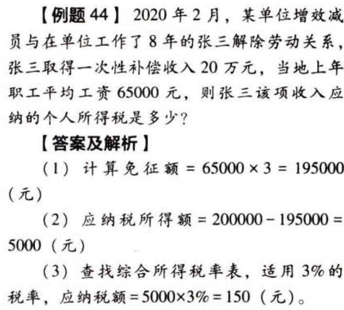

#### 6.20.68.48. 个人提前退休取得补贴收入征收个人所得税的规定

【政策核心】提前退休属于特殊情形下的正式退休，退休工资法定免税，一次性补贴收入不属于免税范畴，需要将一次性收入折算成办理提前退休手续至法定离退休年龄之间的年度平均所得水平，减去年度费用扣除标准、查找税率计税。

【具体规定】个人办理提前退休手续而取得的一次性补贴收入，应按照办理提前退休手续至法定离退休年龄之间实际年度数平均分摊，确定适用税率和速算扣除数，单独适用综合所得税率表，计算纳税。计算公式：

```
应纳税额＝｜〔（一次性补贴收入÷办理提前退休手续至法定退休年龄的实际年度数）－费用扣除标准〕x适用税率－速算扣除数｜x办理提前退休手续至法定退休年龄的实际年度数
```
该项计算不与办理提前退休手续当月的工资薪金所得合并，即按照统一标准取得的提前退休－次性补贴收入与其当月取得的工资薪金或其他收入应分别计算个人所得税。


#### 6.20.68.49. 关于企业减员增效和行政事业单位、社会团体在机构改革过程中实行内部退养办法人员取得收入的征税问题

实行内部退养的个人在其办理内部退养手续后至法定离退休年龄之间从原任职单位取得的工资薪金，不属于离退休工资，应按“工资薪金所得”项目计征个人所得税。个人办理内部退养手续后从原任职单位取得的一次性收入，应按规定计征个人所得税。

个人在办理内部退养手续后从原任职单位取得的一次性收入，应按办理内部退养手续后至法定离退休年龄之间的所属月份进行平均，并与领取当月的“工资薪金”所得合并后减除当月费用扣除标准，以余额为基数确定适用税率，再将当月工资薪金加上取得的一次性收入，减去费用扣除标准，按适用税率计征个人所得税。


### 6.20.69. 个人股票期权所得个人所得税的征税方法

实施股票期权计划的企业授予该企业员、工的股票期权所得，应按《个人所得税法》及其实施条例有关规定征收个人所得税。

企业员工股票期权（以下简称“股票期权”）是指上市公司按照规定的程序授予本公司及其控股企业员工的一项权利，该权利允许被授权员工在未来时间内以某一特定价格购买本公司一定数量的股票。

【解释】

（1）股票期权的计税规则一一在2021年12月31日前不计入综合所得，全额单独适用综合所得税率表，计算纳税。计算公式为：

```
应纳税额＝股权激励收入×适用税率－速算扣除数
```
居民个人一个纳税年度内取得两次以上（含两次）股权激励的，应合并按上述规定公式计算纳税。

（2）股权激励个人所得税有递延纳税的规定。上市公司授予个人的股票期权、限制性股票和股权奖励，经向主管税务机关备案，个人可自股票期权行权、限制性股票解禁或取得股权奖励之日起，在不超过12个月的期限内缴纳个人所得税。

（3）为了方便考生理解，对于股票期权的涉税情况图示如下：

第一种情况，如果取得不可公开交易的股票期权。


第二种情况，如果取得可公开交易的股票期权。


### 6.20.70. 科技人员取得职务科技成果转化现金奖励有关个人所得税政策

依法批准设立的非营利性研究开发机构和高等学校（以下简称“非营利性科研机构和高校”）根据《中华人民共和国促进科技成果转化法》规定，从职务科技成果转化收人中给予科技人员巳现金奖励，可减按50%计入科技人员当月“工资薪金所得”，依法缴纳个人所得税。

非营利性科研机构和高校包括国家设立的科研机构和高校、民办非营利性科研机构和高校。

科技成果转化是指非营利性科研机构和高校向他人转让科技成果或者许可他人使用科技成果。现金奖励是指非营利性科研机构和高校在取得科技成果转化收人3年（36个月）内奖励给科技人员的现金。

### 6.20.71. 关于股权奖励个人所得税规定

（1）针对科研机构和高校的正式员工职务科技成果的股权、出资比例的奖励暂不征税一一科研机构、高等学校转化职务科技成果以股份或出资比例等股权形式给予科技人员个人奖励，经主管税务机关审核后，暂不征收个人所得税。

（2）针对非上市非新三板企业技术人员的成果转化股权奖励可分期递延纳税一一全国范围内的高新技术企业转化科技成果，给予本企业相关技术人员的股权奖励，个人一次缴纳税款有困难的，可根据实际情况自行制定分期缴税计划，在不超过5个公历年度内（含）分期缴纳，并将有关资料报主管税务机关备案。

上述政策的最大特点是区分不同的获奖主体和不同的限定条件设计暂不征税和分期递延纳税。

企业技术人员的该所得项目按照工资薪金所得缴纳个人所得税。可根据实际情况自行制定分期缴税计划，报主管税务机关备案，在不超过5个公历年度内（含）分期缴纳。

获得股权奖励的企业技术人员一旦转让奖励的股权（含奖励股权孳生的送、转股）并取得现金收人的，该现金收入应优先用于缴纳尚未缴清的税款（股权转让收入首先要用于缴纳分摊税额中未到期的税款）。

如果技术人员在转让奖励的股权之前企业依法宣告破产，技术人员进行相关权益处置后没有取得收益或资产，或取得的收益和资产不足以缴纳其取得股权尚未缴纳的应纳税款的部分，税务机关可不予追征。

企业面向全体员工实施的股权奖励，不得按本政策执行，不得享受分期纳税政策。上市公司及新三板公司也不在本政策的范围内。

（3）个人获得上市公司股权奖励时，按照“工资薪金所得”项目纳税，在2021年12月31日前，该部分收人不并入当年综合所得，金额单独适用综合所得税率表按照下列公式和要求计算扣缴其个人所得税：

```
应纳税额＝股权激励收入x适用税率－速算扣除数
```
居民个人一个纳税年度内取得两次以上（含两次）股权激励的，应合并按上述公式计税。股权奖励的计税价格参照获得股权时的公平市场价格确定。

与工资薪金所得相关的特殊计税规则一览表：

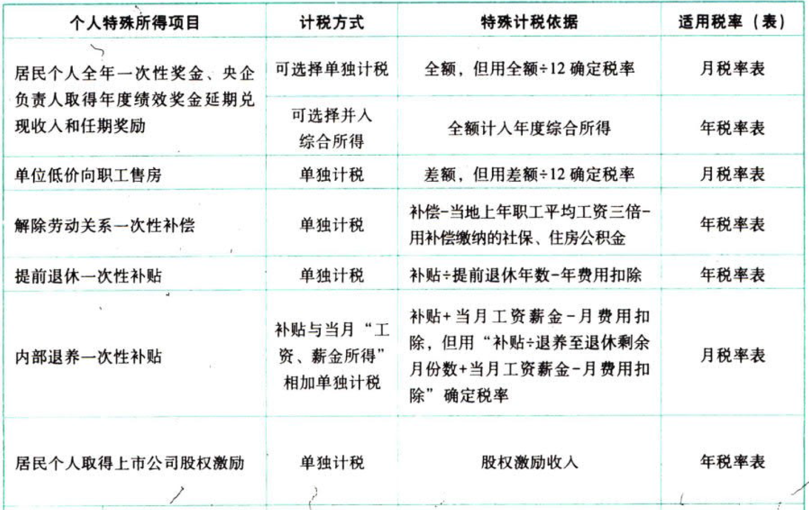


### 6.20.72. 在外商投资企业、外国企业和外国驻华机构工作的中方人员取得的工资〉薪金所得的征税问题

（1）工资薪金自雇佣单位和派遣单位分别支付的（从两处以上取得工资薪金收入的情况）

纳税人从两处以上取得工资薪金收入的，只能扣除1次基本减除费用，即由雇佣单位扣除基本减除费用，派遣单位不能对其重复扣除基本减除费用。

（2）有效合同或凭证能够证明其工资薪金所得的一部分按规定上缴派遣（介绍）单位的（名义工资与实际工资不一致的情况）

个人的实际工资和名义工资不一致的，在能提供有效证明的前提下，按实际工资纳税。

【案例】某外商投资企业财务经理张某劳动合同上能明名义工资每月30000元，张某与中方派遣单位签订协议，每月上缴中方派遣单位10000元，则其个人所得税锻实际工资20000元扣除各项扣除后查表找税率计算个人所得税。

### 6.20.73. 在中国境内无住所的个人取得工资薪金所得的征税问题（调整）

关于工资薪金所得来源地的确定，要明确工资薪金的来源地与支付地是可能存在差异的。即个人实际在中国境内工作期间取得的工资薪金，不论是由中国境内还是境外企业或个人雇主支付的，均属于来源于中国境内的所得；个人实际在中国境外工作期间取得的工资薪金，不论是由中国境内还是境外企业或个人雇主支付的，均属于来源于中国境外的所得。

个人取得归属于中国境内（以下称“境内”）工作期间的工资薪金所得为来源于境内的工资薪金所得。境内工作期间按照个人在境内工作天数计算，包括其在境内的实际工作日以及境内工作期间在境内、境外享受的公休假、个人休假、接受培训的天数。在境内、境外单位同时担任职务或者仅在境外单位任职的个人，在境内停留的当天不足24小时的，按照半天计算境内工作天数。

无住所个人在境内、境外单位同时担任职务或者仅在境外单位任职，且当期同时在境内、境外工作的，按照工资薪金所属境内、境外工作天数占当期公历天数的比例计算确定来源乎境内、境外工资薪金所得的收入额。境外工作天数按照当期公历天数减去当期境内工作天数计算。

#### 6.20.73.50. 无住所个人为非居民个人的情形

（1）非居民个人境内居住时间累计不超过90天的情形。

在一个纳税年度内，在境内累计居住不超过90天的非居民个人，仅就归属于境内工作期间并由境内雇主支付或者负担的工资薪金所得计算缴纳个人所得税。


（2）非居民个人境内居住时间累计超过90天不满183天的情形。

在一个纳税年度内，在境内禀计居住跑过90天但不满183天的非居民个人，取得归属于境内工作期间的工资薪金所得，均应当计算缴纳个人所得税；其取得归属于境外工作期间的工资薪金所得，不征收个人所得税。


#### 6.20.73.51. 无住所个人为居民个人的情形

在一个纳税年度内，在境内累计居住满183天的无住所居民个人取得工资薪金所得，当月工资薪金收入额按照以下规定计算：

（1）无住所居民个人在境内居住累计满183天的年度连续不满6年的情形。

在中国境内无住所的个人，在中国境内居住累计满183天的年度连续不满6年的，经向主管税务机关备案，其来源于中国境外且由境外单位或者个人支付的所得，免予缴纳个人所得税。则其取得的全部工资薪金所得，除归属于境外工作期间且由境外单位或者个人支付的工资薪金所得部分外，均应计算缴纳个人所得税。


（2）无住所居民个人在境内居住累计满183天的年度连续满6年的情形。

在境内居住累计满183天的年度连续满6年后，不符合《个人所得税法实施条例》第四条优惠条件的无住所居民个人，其从境内、境外取得的全部工资薪金所得均应计算缴纳个人所得税。即：

```
当月工资薪金收入额＝当月境内外工资薪金总额
```
在中国境内居住累计满183天的任一年度中有一次离境超过30天的，其在中国境内居住累计满183天的年度的连续年限重新起算。

#### 6.20.73.52. ［归纳与说明］

在中国境内无住所的个人，我国对其实施税收管辖权的范围，随着其居住时间的增长而扩大。具体规则如下表：


对于担任境内居民企业的董事、监事及高层管理职务的个人（以下统称高管人员），无论是否在境内履行职务，取得由境内居民企业支付或者负担的董事费、监事费、工资薪金或者其他类似报酬（以下统称高管人员报酬），属于来源于境内的所得。

所称高层管理职务包括企业正、副（总）经理、各职能总师、总监及其他类似公司管理层的职务。


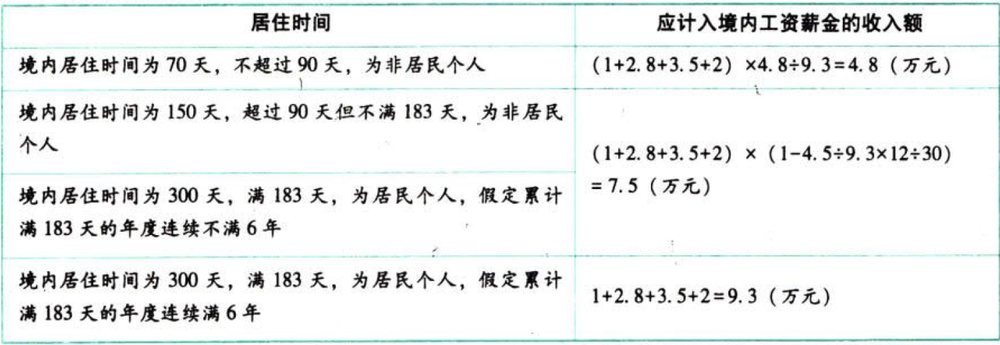

### 6.20.74. 单位为个人办理补充养老保险退保后个人所得税的处理

单位为职工个人购买商业性补克养老保险等，在办理投保手续时应作为个人所得税的“工资薪金所得”项目，按税法规定缴纳个人所得税；因各种原因退保，个人采取得实际收入的，已缴纳的个人所得税应予以退回。

### 6.20.75. “长江学者奖励计划”有关个人所得税的规定

（1）特聘教授取得的岗位津贴应并人其当月的工资薪金所得计征个人所得税，税款由所在学校代扣代辙。

（2）对特聘教授获得“长江学者成就奖”的奖金，可视为国务院部委颁发的教育方面的奖金，免予、征收个人所得税。

（3）对教育部颁发的特聘教授在聘期内事受的“特聘教授奖金”，免予征收个人所得税。

## 6.21. 与投资相关的几个特殊问题的处理:star: :star: :star: 

非货币资产投资等政策已在本辅导书上一节收录，本节收录几个特殊政策。

### 6.21.76. 个人终止投资经营收回款项征收个人所得税的规定

个人因各种原因终止投资、联营、经营合作等行为，从被投资企业或合作项目、被投资企业的其他投资者以及合作项目的经营合作人取得股权转让收人、违约金、补偿金、赔偿金及以其他名目收回的款项等，均属于个人所得税应税收入，应按照“财产转让所得”项目适用的规定计算缴纳个人所得税。

```
应纳税所得额＝个人取得的股权转让收入、违约金、补偿金、赔偿金及以其他名目收回款项合计数－原实际出资额（投入额）及相关税费
应纳税额＝应纳税所得额X20%
```
### 6.21.77. 纳税人收回转让的股权征收个人所得税的规定

股权转让合同履行完毕、股权已作变更登记，且所得已经实现的，转让人取得的股权转让收入应当依法缴纳个人所得税。转让行为结束后，当事人双方签订并执行解除原股权转让合同、退回股权的协议，是另一次股权转让行为，对前次转让行为征收的个人所得税款不予退回。

收回转让的股权不属于解除原有交易，而是视为新的交易。

股权转让合同未履行完毕，因执行仲裁委员会作出的解除股权转让合同及补充协议的裁决、停止执行原股权转让合同，并原价收回已转让股权的，由于其股权转让行为尚未完成、收入未完全实现，随着股权转让关系的解除，股权收益不复存在，根据《个人所得税法》和《税收征收管理法》的有关规定，以及从行政行为合理性原则出发，纳税人不应缴纳个人所得税。

### 6.21.78. 关于创业投资企业个人合伙人和天使投资个人有关个人所得税的规定

合伙创投企业采取股权投资方式直接投资于初创科技型企业满2年（24个月，下间）的，合伙创投企业的个人合伙人可以按照对初创科技型企业投资额的70%抵扣个人合伙人从合伙创投企业分得的经营所得；当、年不足抵扣的，可以在以后纳税年度结转抵扣。

天使投资个人采取股权投资方式直接投资于初创科技型企业满2年的，可以按照投资额的70%抵扣转让该初创科技型企业股权取得的应纳税所得额；当期不足抵扣的，可以在以后取得转让该初创科技型企业股权的应纳税所得额时结转抵扣。

天使投资个人投资多个初创科技型企业的，对其中办理注销清算的初创科技型企业，天使投资个人对其投资额的70%尚未抵扣完的，可自注销清算之日起36个月内抵扣天使投资个人转让其他初创科技型企业股权取得的应纳税所得额。

该政策与企业所得税优惠政策中关于创业在资企业直接投资初创科技型企业的政策原理相同。

### 6.21.79. 关于创业投资企业个人合伙人所得税政策的规定

自2019年1月1日起至2023年12月31日止：

（1）创投企业可以选择按单一投资基金核算或者恻投企业年度所得整体核算两种方式之一，对其个人合伙人来源于创投企业的所得计算个人所得税应纳税额。

（2）创投企业选择按单一投资基金核算的，其个人合伙人从该基金应分得的股权转让所得和股息红利所得，按照20%税率计算缴纳个人所得税。

创投企业选择按年度所得整体核算的，其个人合伙人应从创投企业取得的所得，按照“经营所得”项目、5%～35%的姐额累进税率计算缴纳个人所得税。

该政策对创投企业个人合伙人给予了“二选一”的核算方式，使得投资人能在一定期限内选择对自身有利的方式，体现出政府对创投行业的支持。

#### 6.21.79.53. 单一投资基金核算

个人合伙人根据项目取得所得计税

股权转让所得和股息红利所得，20%税率

一个纳税年度内不同项目之间盈亏可以互抵，但不能将互抵后的亏损结转下年（股权转让所得）

符合条件的，可以按照被转让项目对应投资额的70%抵扣其应从基金年度股权转让所得中分得的份额后再计算其应纳税额，当期不足抵扣的，不得向以后年度结转

创投企业选得接单一投资基金核算或按创投企业年度所得整体核算后，3年内不能变更

#### 6.21.79.54. 年度所得整体核算

个人合伙人根据从创投企业取得所得计税

经营所得，5%-35%的超额累进税率

整体核算盈亏，亏损可以结转5年

符合条件的，可以饺照被转让项目对应投资额的70%抵扣其可以从创投企业应分得的经营所得后再计算其应纳税额

按照“经营所得”项目计税的个人合伙人，没有综合所得的，可依法减除基本减除费用、专项扣除、专项附加扣除以及国务院确定的其他扣除。从多处取得经营所得的，应汇总计算个人所得税，只减除一次上述费用和扣除

创投企业选得接单一投资基金核算或按创投企业年度所得整体核算后，3年内不能变更

### 6.21.80. 符合条件的非上市公司股票期权、股权期权、限制性股票和股权奖励实行递延纳税政策

非上市公司授予本公司员工的股票期权、股权期权、限制性股票和股权奖励，符合规定条件的，经向主管税务机关备案，可实行递延纳税政策，即员工在取得股权激励时可暂不纳税，递延至转让该股权时纳税；股权转让时，按照股权转让收入减除股权取得成本以及合理税费后的差额，适用“财产转让所得”项目，按照20%的税率计算缴纳个人所得税。

股权转让时，股票（权）期权取得戚本按行权价确定，限制性股票取得成本按实际出资额确定，股权奖励取得戚本为零。

企业或个人以技术成果投资人股到境内居民企业，被投资企业支付的对价全部为股票（权）的，企业或个人可选择继续按现行有关税收政策执行，也可选择适用递延纳税优惠政策。

选择技术成果投资人股递延纳税政策的，经向主管税务机关备案，投资人股当期可暂不纳税，允许递延至转让股权时，按股权转让收入减去技术成果原值和合理税费后的差额计算缴纳所得税。


## 6.22. 真他易考的政策规定

### 6.22.81. 北京2022年冬奥会和冬残奥会个人所得税的规定

个人捐赠北京2022年冬奥会、冬残奥会、测试赛的资金和物资支出可在计算个人应纳税所得额时予以全额扣除。

对受北京冬奥组委邀请的，在北京202.2年冬奥会、冬残奥会、测试赛期间临时来华，从事奥运相关工作的外籍顾问以及裁判员等外籍技术官员取得的由北京冬奥组委、测试赛赛事组委会支付的劳务报酬免征个人所得税。

对于参赛运动员因北京2022年冬奥会、冬残奥会、测试赛比赛获得的奖金和其他奖赏收入，按现行税收法律法规的有关规定征免应缴纳的个人所得税。

### 6.22.82. 原城市信用社在转制为城市合作银行过程中个人股增值所得应纳个人所得税的规定

城市信用社改制为城市合作银行过程中，个人以现金或股份及其他形式取得的资产评估增值数额，应当按“利息、股息、红利所得”项目计征个人所得税，税款由城市合作银行负责代扣代缴。

### 6.22.83. 保险营销员、证券经纪人取得的佣金收入的个人所得税规定

保险营销员、证券经纪人取得的佣金收人，属于劳务报酬所得，以不含增值税的收入减除20%的费用后的余额为收入额，收入额减去展业成本以及附加税费后，并人当年综合所得，计算缴纳个人所得税。保险营销员、证券经纪人展业成本按照收入额的25%计算。

对保险营销员、证券经纪人取得的佣金收入，扣缴单位呼当按照累计预扣法计算预扣个人所得税。结合个人所得税法及其实施条例有关规定，累计预扣法预扣预缴个人所得税的具体计算公式为：本期应预扣预缴税额＝（累计预扣预缴佳纳税所得额×预扣率－速算扣除数）－累计减免税额－累计已预扣预缴税额，累计预扣预缴应纳税所得额＝累计收入额－累计减除费用－累计其他扣除，其中，收入额按照不含增值税的收入减除20%的费用后的余额计算；累计减除费用按照5000元／月乘以纳税人当年截至本月在本单位的从业月份数计算；其他扣除按照展业成本、附加税费和依法确定的其他扣除之和计算，其中展业成本按照收入额的25%计算。

尽管保险营销员、证券经纪人取得的佣金收入的性质为劳务报酬所得，但是比照工资薪金所得预扣率衰，采用累计预扣法计算当期应预扣预缴税额。

专项扣除和专项附加扣除，在预扣预缴环节暂不扣除，待年度终了后汇算清缴申报时办理。


### 6.22.84. 律师事务所从业人员取得收入征收小人所得税的有关规定

雇员律师分成收入扣除办案费用支出后，与工资薪金合并征税，办案费用支出在律师当月分成收入的30%比例内确定。

兼职律师从事务所取得工资薪金性质的所得，律师事务所在扣缴其个人所得税时不再减除个人所得税法规定的费用扣除标准，以收入全额（取得分成收入的为扣除办案支出费用后的余额）直接确定适用预扣率，计算预扣预缴个人所得税。

### 6.22.85. 个人的外币收入折合成人民币的换算方法

个人取得的收入和所得为美元、日元、港币的，统一使用中国人民银行公布的人民币对上述三种货币的基准汇价计税。

个人取得的收入和所得为其他货币的，应当根据美元对人民币的基准汇价和国家外汇管理局提供的纽约外汇市场美元对主要外币的汇价套算，按照套算以后的汇价计税。套算公式为：

```
某种货币对人民币的汇价＝美元对人民币的基准汇价／纽约外汇市场美元对该种货币的汇价
```
个人在报送纳税申报表时，应当附送汇价折算的计算过程。

# 7. 征收管理

个人所得税的纳税办法，全国通用实行的有自行申报纳税和全员全额扣缴申报纳税两种。此外，税收征管法还对无法查账征收的纳税人规定了核定征收的方式。

## 7.23. 自行申报纳税:star: :star: :star: 

自行申报纳税，是由纳税人自行在税法规定的纳税期限内，向税务机关申报取得的应税所得项目和数额，如实填写个人所得税的纳税申报表，并按税法规定计算应纳税额，据此缴纳个人所得税的一种方法。

有下列情形之一的，纳税人应当依法办理纳税申报：

（1）取得综合所得需要办理汇算清缴。

（2）取得应税所得没有扣缴义务人。

（3）取得应税所得，扣缴义务人未扣缴税款

（4）取得境外所得。

（5）因移居境外注销中国户籍。

（6）非居民个人在中国境内从两处以上取得工资薪金所得。

（7）国务院规定的其他情形。

纳税人可以采用远程办税、邮寄等方式申报，也可以直接到主管税务机关申报。

纳税人办理自行纳税申报时，应当一并报送税务机关要求很送的其他有关资料。首次申报或着个人基础信息发生变化的，还应报送《个人所得税基础信息表（B表）》。

纳税人在办理纳税申报时需要享受税收协定待遇的，按照享受税收协定待遇有关办法办理。

### 7.23.86. 自行申报纳税的具体情形以及申报时间、地点和资料要求：

（1）取得综合所得需要办理汇算清缴

取得综合所得且符合下列情形之一的纳税人，应当依法办理汇算清缴：

①从两处以上取得综合所得，且综合所得年收入额减除专项扣除产的余额越过6万元

②取得劳务报酬所得、稿酬所得、特许权使用费所得中一项或者多项所得，且综合所得年收入籁减除专项扣除的余额越过6万元

③纳税年度内预缴税额低于应纳税额

④纳税人申请退税

在取得所得的次年3月1日至6月30日内向任职、受雇单位所在地主管税务机关办理纳税申报，并报送《个人所得税年度自行纳税申报表》。纳税人有两处以上任职、受雇单位的，选择向其中一处任职、受雇单位所在地主管税务机关办理纳税申报；纳税人没有任职、受雇单位的，向户籍所在地或经常居住地主管税务机关办理纳税申报

纳税人办理综合所得汇算清缴，应当准备与收人、专项扣除、专项附加扣除、依法确定的其他扣除、捐赠、享受税收优惠等相关的资料，并按规定留存备查或报送

（2）取得应税所得没有扣缴义务人

税法对“经营所得”没有规定扣缴义务人。经营所得包括以下情形：

①个体工商户从事生产、经营活动取得得的所得，个人独资企业投资人、合伙企业的个人合伙人来源于境内注册的个人独资企业、合伙企业生产、经营的所得

②个人依法从事办学、医疗、咨询以及其他有偿服务活动取得的所得

③个人对企业、事业单位承包经营、承租经营以及转包、转租取得的所得

④个人从事其他生产、经营活动取得

纳税人取得经营所得，按年计算个人所得税，由纳税人在月度或季度终了后15日内，向经营管理所在地主管税务机关办理预缴纳税申报，并报送《个人所得税经营所得纳税申报表(A表）》。在取得所得的次年3月31日前，向经营管理所在地主管税务机关办理汇算清缴，并报送《个人所得税经营所得纳税申报表(B表）》

从两处以上取得经营所得的，选择向其中一处经营管理所在地主管税务机关办理年度汇总申报，并报送《个人所得税经营所得纳税申报表(C表）》

（3）取得应税所得，扣缴义务人未扣缴税款

非居民个人取得工资薪金所得，劳务报酬所得，稿酬所得，特许权使用费所得的：

应当在取得所得的次年6月30日前，向扣缴义务人所在地主管税务机关办理纳税申报，并被送《个人所得税自行纳税申报表（A表）》。有两个以上扣缴义务人均未知缴税款的，选择向其中一处扣缴义务人所在地主管税务机关办理纳税申报

非居民个人在次年6月30日前离境（临时离槐除外）的，应当在离境前办理纳税申报

纳税人取得利息、股息、红利所得，财产租赁所得，财产转让所得和偶然所得的：

应当在取得所得的次年6月30日前，按相关规定向主管税务机关办理纳税申报，并报送《个人所得税自行纳税申报表（A袭）》

（4）从中国境外取得所得

应当在取得所得的次年3月1日至6月30日内，向中国境内任职、受雇单位所在地主管税务机关办理纳税申报；在中国统内没有任职、受雇单位的，向户籍所在地或中国境内经常居住地主管税务机关办理纳税申报；户籍所在地与中国城内经常居住地不一致的，选择其中一地主管税务机关办理纳税申报；在中国境内没有户籍的向中国统内经常居住地主管税务机关办理纳税申报

（5）因移居境外注销中国户籍

应当在申请注销中国户籍梢，向户籍所在地主管税务机关办理纳税申报，进行税款清算

①纳税人在注销户籍年度取得综合所得的，应当在注销户籍前，办理当年综合所得的汇算清缴，并报送《个人所得税年度自行纳税申报褒》。尚未办理上一年度综合所得汇，事清缴的，应当在办理注销户籍纳税申报时一并办理

②纳税人在注销户’青年度取得经营所得的，应当在注销户’窗前，办理当年经营所得的汇，草清缴，并报送《个人所得税经营所得纳税申报表（B表）》。从两处以上取得经营所得的，还应当一并报送〈个人所得税经营所得纳税申报表（C表）》。尚未办理上一年度经营所得汇算清徽的，应当在办理注销户籍纳税申报时一并办理

③纳税人在注销户籍当年取得利息、股息、红利所得，财产租赁所得，财产转让所得和偶然所得的，应当在注销户籍前，申报当年上述所得的完税情况，并报送《个人所得税自行纳税申报表（A表）》

④纳税人有未缴或者少缴税款的，应当在注销户籍前，结清欠缴或未缴的税款。纳税人存在分期缴税且禾徽纳完毕的，应当在注销户籍前，结清尚未缴纳的税款

⑤纳税人办理注销户籍纳税申报时，’曹要办理专项附加扣除、依法确定的其他扣除的，应当向税务机关报送《个人所得税专项附加扣除信息表》《商业健靡保险税前扣除情况明细袤》《个人税收递延型商业养老保险税前扣除情况明细袭》等

（6）非居民个人在中国境内从两处以上取得工资薪金所得

非居民个人在中国槐内从两处以上取得工资薪金所得的，应当在取得所得的次月IS日内，向其中一处任职、受雇单位所在地主管税务机关办理纳税申报，并报送《个人所得税自行纳税申报表（A表）》

（7）国务院规定的其他情形

### 7.23.87. 自行申报纳税的申报期限见下表（2019年1月1日起施行）：


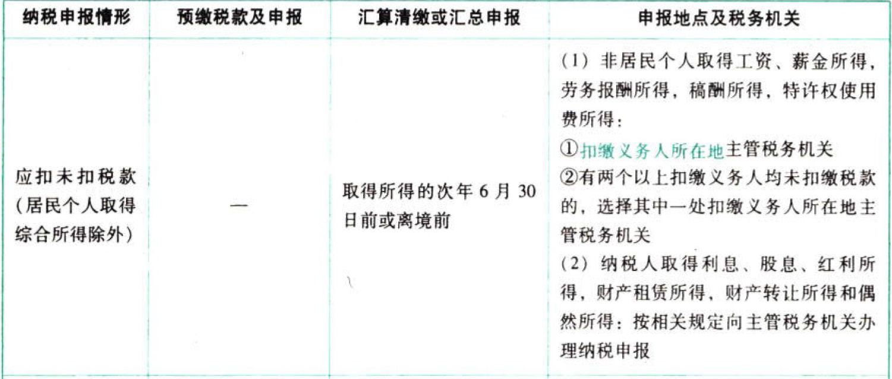

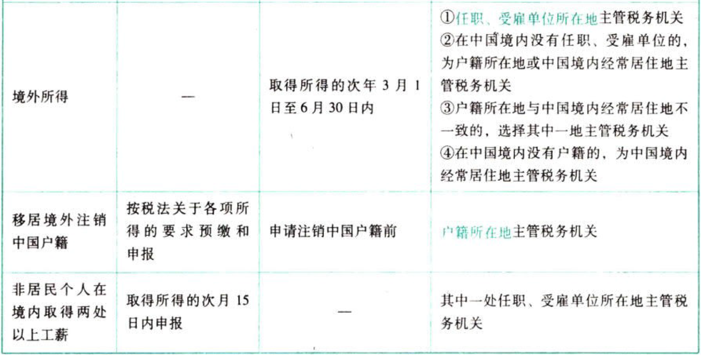

## 7.24. 全员全额扣缴申报纳税:star: :star: 

税法规定：扣缴义务人向个人支付应税款项时，应当依照个人所得税法规定预扣或者代扣税款，按时缴库，并专项记载备查。

全员全额扣缴申报，是指扣缴义务人应当在代扣税款的次月15日内，向主管税务机关报送其支付所得的所有个人的有关信息、支付所得数额、扣除事项和数额、扣缴税款的具体数额和总额以及其他相关涉税信息资料。这种方法有利于控制税源、防止漏税和逃税。

### 7.24.88. 扣缴义务人和代扣预扣税款的范围

全员全额扣缴申报，对代扣代缴个人所得税的范围和规范进行了细致要求。

个人所得税金员全额扣缴申报的拖围包括个人所得税法巾除经营所得以外所列的各个所得项目。所得形式包括现金支付、汇拨支付、转账支付和以有价证券、实物以及其他形式的支付。

从申报内容肴，包含了扣缴义务人支付所得（不论是否达到纳税标准）的所有个人的有关信息、支付所得数额、扣除事项和数额、扣缴税款的具体数额和总额以及其他相关涉税信息资料。

扣缴义务人每月或者每次预扣、代扣的税款，l在当在次月15日内缴入国库，并向税务机关报送《个人所得税扣缴申报表》。

纳税人需要享受税收协定待遇的，应当在取得应税所得时主动向扣缴义务人提出，并提交相关信息、资料，扣缴义务人代扣代缴税款时按照事受税收协定待遇有关办法办理。

对扣缴义务人按照规定扣缴的税款，按年付给2%的手续费。不包括税务机关、司法机关等查补或者责令补扣的税款。

扣缴义务人未将扣缴的税款解缴入库的，不影响纳税人按照规定申请退税，税务机关应当凭纳税人提供的有关资料办理退税。

### 7.24.89. 不同项目所得扣缴方法

（1）扣缴义务人向居民个人支付工资薪金所得时，应当按照累计预扣法计算预扣税款，并按月办理扣缴申报。

累计预扣法，是指扣缴义务人在一个纳税年度内预扣预缴税款时，以纳税人在本单位截至当前月份工资薪金所得累计收入减除累计免税收入、累计减除费用、累计专项扣除、累计专项附加扣除和累计依法确定的其他扣除后的余额为禀计预扣预缴应纳税所得额，造用居民个人工资薪金所得预扣率表，计算累计应预扣预缴税额，再减除累计减免税额和累计已预扣预缴税额，其余额为本期应预扣预缴税额。余额为负值时，暂不退税。纳税年度终了后余额仍为负值时，由纳税人通过办理综合所得年度汇算清缴，税款多退少补。

```
本期应预扣预缴税额＝（累计预扣预缴应纳税所得额×预扣率－速算扣除数）－累计减免税额－累计已预扣预缴税额
累计预扣预缴应纳税所得额＝累计收入－累计免税收入－累计减除费用－累计专项扣除－累计专项附加扣除－累计依法确定的其他扣除
```
其中：累计减除费用，按照5（削元／月乘以纳税人当年截至本月在本单位的任职受雇月份数计算。

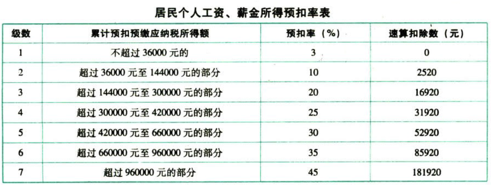

居民个人向扣缴义务人提供有关信息并依法要求办理专项附加扣除的，扣缴义务人应当按照规定在工资薪金所得按月预扣预缴税款时予以扣除，不得拒绝。

年度预扣预缴税额与年度应纳税额不一致的，由居民个人于次年3月l日至6月30日向主管税务机关办理综合所得年度汇算清缴，税款多退少补。

（2）扣缴义务人向居民个人支付劳务报酬所得、稿酬所得、特许权使用费所得时，应当按照以下方法按次或者按月预扣预缴税款：

劳务报酬所得、稿酬所得、特许权使用费所得以收入减除费用后的余额为收入额；其中，稿酬所得的收人额减按70%计算。

减除费用：预扣预缴税款时，劳务报酬所得、稿酬所得、特许权使用费所得每次收入不超过4000元的，减除费用按800元计算；每次收入4000元以上的，减除费用按收入的20%计算。

预扣预缴应纳税所得额：劳务报酬所得、稿酬所得、特许权使用费所得，以每次收入额为预扣预缴应纳税所得额，计算应预扣预缴税额。

劳务报酬所得、稿酬所得、特许权使用费所得，属于一次性收入的，以取得该项收入为一次；属于同一项目连续性收入的，以一个月内取得的收入为一次。

#### 7.24.89.55. 劳务报酬所得的预扣预缴规则。

首先，居民个人劳务报酬所得适用三档预扣率表。


其次，预扣预缴劳务报酬所得的个人所得税有规定的公式。


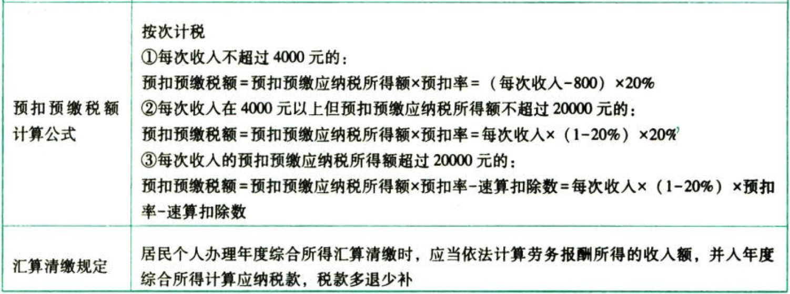

#### 7.24.89.56. 稿酬所得的预扣预缴规则

首先，稿酬所得只有20%一档预扣事。

其次，预扣预缴稿酬所得的个人所得税有减计收入额和规定的公式。


#### 7.24.89.57. 特许权使用费所得的预扣预缴规则。

首先，特许权使用费所得只有20%一档预扣率。

其次，预扣预缴特许权使用费所得的个人所得税有规定的公式。

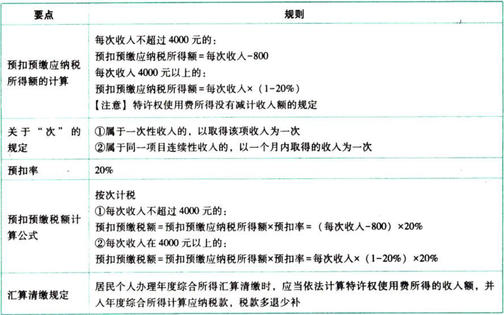

（3）非居民个人取得工资薪金所得，劳务报酬所得，稿酬所得和特许权使用费所得，有扣缴义务人的，由扣缴义务人按月或者按次代扣代缴税款，不办理汇算清辙。

扣缴义务人向非居民个人支付工资薪金所得，劳务报酬所得，稿酬所得和特许权使用费所得时，应当按照以下方法按月或者按次代扣代缴税款：

非居民个人的工资薪金所得，以每月收入额减除费用5000元后的余额为应纳税所得额。

劳务报酬所得、稿酬所得、特许权使用费所得，以每次收人额为应纳税所得额，适用非居民个人工资薪金所得、劳务报酬所得、稿酬所得、特许权使用费所得适用税率表计算应纳税额。劳务报酬所得、稿酬所得、特许权使用费所得以收入减除20o/o的费用后的余额为收入额；其中，稿酬所得的收入额减按70%－计算。

```
非居民个人工资薪金所得，劳务报酬所得，稿酬所得，特许权使用费所得应纳税额＝应纳税所得额x税率－速算扣除数
```
非居民个人在一个纳税年度内税款扣缴方法保持不变，达到居民个人条件时，应当告知扣缴义务人基础信息变化情况，年度终了后按照居民个人有关规定办理汇算清缴。

（4）扣缴义务人支付利息、股息、红利所得，财产租赁所得，财产转让所得或者偶然所得时，应当依法按次或者按月代扣代缴税款。

## 7.25. 办理2019年度个人所得税结合所得汇算清缴的规定（新增）

### 7.25.90. 2019年度汇算的内容

```
2019年度汇算应退或应补税额＝［（综合所得收入额－“阳）（）元－“三险一金”等专项扣除－子女教育等专项附加扣除－依法确定的其他扣除－捐赠）×适用税率－速算扣除数］-2019年已预缴税额
```
依据税法规定，2919年度汇算仅计算并结清本年度综合所得的应退或应补税款，不涉及以前或往后年度，也不涉及财产租赁等分类所得，以及纳税人按规定选择不并人综合所得计算纳税的全年一次性奖企等所得。

确定汇算清缴的综合所得计税依据时，下列未申报扣除或未足额扣除的税前扣除项目，纳税人可在年度汇算期间办理扣除或补充扣除：（1）纳税人及其配偶、未成年子女在2019年度发生的，符合条件的大病医疗支出；（2）纳税人在2019年度来申报享受或未足额享受的子女截育、继续敏膏、住房贷款利息或住房租金、赌养老人专项附加扣除，以及减除费用、专项扣除、依法确定的其他扣除；（3）纳税人在2019年度发生的符合条件的捐赠支出。

### 7.25.91. 无须办理年度汇算的情形和需要办理年度汇算的情形

无须办理年度汇篝的情形：

（1）纳税人年度汇算得补税但年度综合所得收入不超过12万元的

（2）纳税人年度汇算需补税金额不越过400元的

（3）纳税人已预缴税额与年度应纳税额一致或者不申请年度汇算退税的

需要办理年度汇篝的情形：

（1）2019年度已预缴税额大于年度应纳税额且申请退税的。包括2019年度综合所得收入额不超过6万元但已预缴个人所得税；年度中间劳务报酬、稿酬、特许权使用费适用的预扣率高于综合所得年适用税率；预缴税款时，来申报扣除或未足领扣除减除费用、专项扣除、专项附加扣除、依法确定的其他扣除或捐赠，以及未申报享受或未足额享受综合所得税收优惠等情形

（2）2019年度综合所得收入超过12万兀且需要补税金额越过400兀的ι包括取得两处及以上综合所得，合并后适用税率提高导致已预缴税额小子年度应纳税额等情形

### 7.25.92. 征管规定

#### 7.25.92.58. 办理时间

纳税人办理2019年度汇算的时间为2020年3月1日至6月30日。在中国填内无住所的纳税人在2020年3月1日前离境的，可以在离境前办理年度汇算

#### 7.25.92.59. 办理方式

纳税人可自主选择下列办理方式：

（1）自行办理年度汇算

（2）通过取得工资薪金或连续性取得劳务报酬所得的扣缴义务人代为办理。纳税人向相缴义务人键出代办要求的，相缴义务人应当代为办理，或者培训｜、辅导纳税人通过网上税务局（包括孚机个人所得税APP）完成年度汇算申报和退（补）税。由扣缴义务人代为办理的，纳税人应在2020年4月30日前与扣缴义务人进行书面确认，补充提供其2019年度在本单位以外取得的综合所得收入、相关扣除、享受税收优惠等信息资料，并对所提交信息的真实性、准确性、完整性负责

（3）委托涉税专业服务机构或其他单位及个人（以下称“受托人”）办理，受托人需与纳税人签订授权书

扣缴义务入或受托人为纳税人办理年度汇算后，应当及时将办理情况告知纳税人。纳税人发现申报信息存在错误的，可以要求知缴义务人戎受托人办现更正申报，也可自行办理更正申报

#### 7.25.92.60. 接受年度汇算申报的税务机关

（1）纳税人自行办理或受托人为纳税人代为办理2019年度汇’草的，向纳税人任职受雇单位所在地的主管税务机关申报；有两处及以上任职受雇单位的，可自主选择向其中一处单位所在地的主管税务机关申报。纳税人没有任职受鹿单位的，向其户籍所在地或者经常居住地的主管税务机关申报

（2）扣缴义务人在年度re\~草期内为纳税人办理年度汇算的，向扣缴义务人的主管税务机关申报

#### 7.25.92.61. 办理渠道

（1）网络办税渠道办理。纳税人可优先通过网上税务局（包括手机个人所得税APP)办理年度汇算，税务机关将拨规定为纳税人提供申报表预填服务

（2）通过邮寄方式或到办税服务厅办理。选努邮寄申报的，纳税人需将申报表寄送至任职受瘾单位（没有任职受尉单位的，为户籍或者经常居住地）所在省、自治区，直辖市、计划单列市税务局公告指定的税务机关

#### 7.25.92.62. 资料留存

纳税人以及代办年度汇算的扣缴义务人，宿将年度汇1草申报表以及与纳税人综合所得收入、扣除、已缴税额或税收优惠等相关资料，自年度汇算期结束之日起留存5年

#### 7.25.92.63. 年度汇算的退税、补税

纳税人申请年度汇算退锐，应当提供其在中国境内开设的符合条件的银行账户。税务机关按规定审核后，按照国库管理有关规定，在接受年度汇算申报的税务机关所在地（\~p汇算清缴地）就地办理税款退库

纳税人2019年度综合所得收入额不足过6万元且已预缴个人所得税的，税务机关在网上税务局（包括手机个人所得税APP）提供便捷退税功能，纳税人可以在立四年3月1日至5月31日期间，通过简易申报表办理年度汇算退税

## 7.26. 专项附加扣除的操作办法

### 7.26.93. 享受扣除及办理时间

纳税人事受子女教育、继续教育、大病医疗、住房贷款利息或者住房租金、赌养老人专项附加扣除的办理规定：

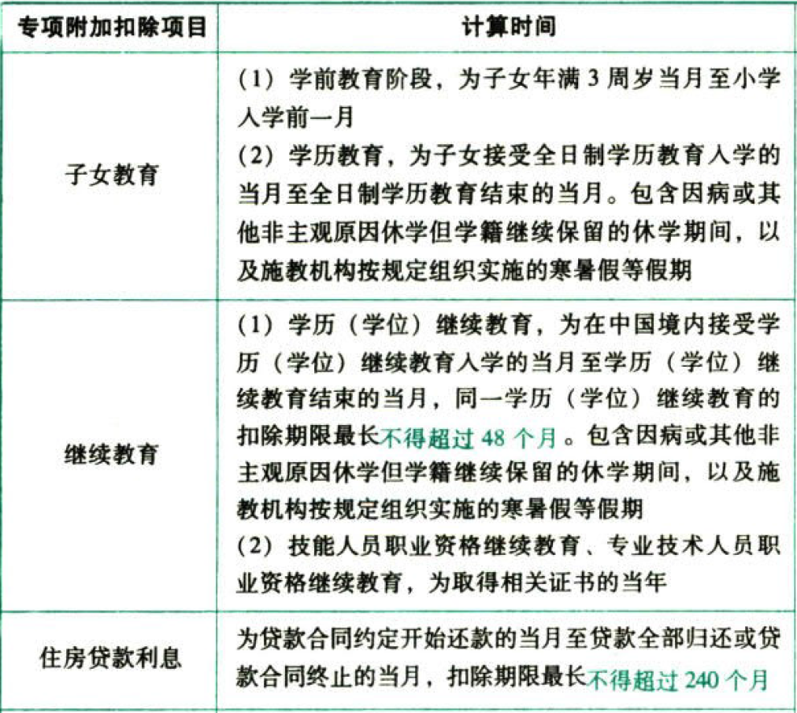


自符合条件开始，可以向支付工资薪金所得的扣缴义务人提供上述专项附加扣除有关信息，由扣缴义务人在预扣预缴税款时，按其在本单位本年可享受的累计扣除额办理扣除；也可以在次年3月1日至6月30日内，向汇缴地主管税务机关办理汇算清缴申报时扣除


由享受扣除的纳税人在次年3月1日至6月30日内，自行向汇缴地主管税务机关办理汇算消缴申报时扣除

### 7.26.94. 报送信息及留存备查资料

（1）纳税人选择在扣缴义务人发放工资薪金所得时享受专项附加扣除的，首次享受时应当填写并向扣缴义务人报送《扣除信息表》；纳税年度中间相关信息发生变化的，纳税人应当更新《扣除信息表》相应栏次，并及时报送给扣缴义务人。

更换工作单位的纳税人，需要由新任职、受雇扣缴义务人办理专项附加扣除的，应当在人职的当月，填写并向扣缴义务人报送《扣除信息表》。

（2）纳税人次年需要由扣缴义务人继续办理专项附加扣除的，应当于每年12月份对次年事受专项附加扣除的内容进行确认，并报送至扣缴义务人。纳税人未及时确认的，扣缴义务人于次年1月起暂停扣除，待纳税人确认后再行办理专项附加扣除。

扣缴义务人应当将纳税人报送的专项附加扣除信息，在次月办理扣缴申报时一并报送至主管税务机关。

（3）纳税人选择在汇算清缴申报时享受专项附加扣除的，应当填写并向汇缴地主管税务机关报送《扣除信息表》。

（4）纳税人将需要享受的专项附加扣除项目信息填报至《扣除信息表》相应栏次。填报要素完整的，扣缴义务人或者主管税务机关应当受理；填报要素不完整的，扣缴义务人或者主管税务机关应当及时告知纳税人补正或重新填报。纳税人来补正或重新填报的，暂不办理相关专项附加扣除，待纳税人补正或重新填报后再行办理。

纳税人应当对报送的专项附加扣除信息的真实性、准确性、完整性负责。

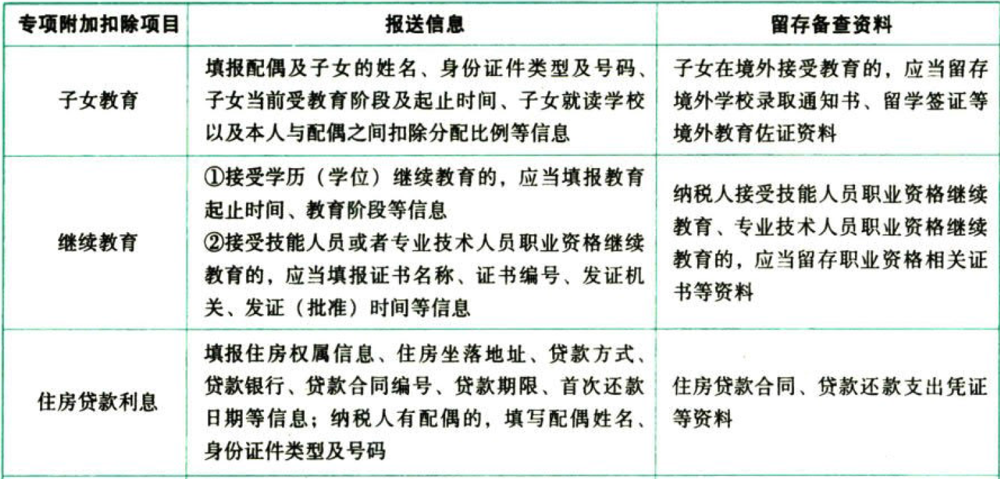


## 7.27. 反避税规定

### 7.27.95. 有下列情形之一的，税务机关有权按照合理方法进行纳税调整

（1）个人与其关联方之间的业务往来不符合独立交易原则而减少本人或者其关联方应纳税额，且元正当理由。

（2）居民个人控制的，或者居民个人和居民企业共同控制的设立在实际税负明显偏低的国家（地区）的企业，无合理经营需要，对应当归属于居民个人的利润不作分配或者减少分配。

（3）个人实施其他不具有合理商业目的的安排而获取不当税收利益。

### 7.27.96. 补税及加征利息

（1）税务机关依照前述规定情形作出纳税调整，需要补征税款的，应当补征税款，并依法加收利息。

（2）依法加征的利息，应当按照税款所属纳税申报期最后一日中国人民银行公布的与补税期间同期的人民币贷款基准利率计算，自税款纳盹申报期满\~日\~至补缴税款期限届满之日止按日：加收。纳税人在补缴税款期限届满前补缴税款的，利息加收至补缴税款之日。

## 7.28. 自然人纳税识别号的规定

自然人纳税人识别号，是自然人纳税人办理各类涉税事项的唯一代码标识。

有中国公民身份号码的，以其中国公民身份号码作为纳税人识别号；没有中国公民身份号码的，由税务机关赋予其纳税人识别号。

纳税人首次办理涉税事项时，应当向税务机关或者扣缴义务人出示有效身份证件，并报送相关基础信息。

税务机关应当在赋予自然人纳税人识别号后告知或者通过扣缴义务人告知纳税人其纳税人识别号，并为自然人纳税人查询本人纳税人识别号提供便利。

自然人纳税人办理纳税申报、税款缴纳、申请退税、开具完税凭证、纳税查询等涉税事项时应当向税务机关或扣缴义务人提供纳税人识别号。

## 7.29. 个人所得税《税收完税证明》调整为《纳税记录》的规定

从2019年1月1日起，纳税人申请开具税款所属期为2019年l月1日（含）以后的个人所得税缴（退）税情况证明的，税务机关不再开具《税收完税证明》（文书式），调整为开具《纳税记录》；纳税人南请开具税款所属期为2018年12月31日（含）以前个人所得税缴（退）税情况证明的，税务机关继续开具《税收完税证明》（文书式）。

纳税人2019年1月1日以后取得应税所得并由扣缴义务人向税务机关办理了全员金额扣缴申报，或根据税法规定自行向税务矶关办理纳税申报的，不论是否实际缴纳税款，均可以申请开具《纳税记录》。

纳税人可以通过电子税务局、手机APP申请开具本人的个人所得税《纳税记录》，也可到办税服务厅申请开具。

纳税人可以委托他人持下列证件和资料到办税服务厅代为开具个人所得税〈纳税记录》：

（1）委托人及受托人有效身份证件原件；

（2）委托人书面’授权资料。

纳税人对个人所得税《纳税记录》存在异议的，可以向该项记录中列明的税务机关申请核实。

税务机关提供个人所得税《纳税记录》的验证服务，支持通过电子税务局、手机APP等方式进行验证。具体验证方法见个人所得税《纳税记录》中的相关说明。

## 7.30. 建立个人所得税纳税信用管理机制（新增）

全面实施个人所得税申报信用承诺制。税务部门在个人所得税自行纳税申报表、个人所得税专项附加扣除信息表等表单中设立格式规范、标准统一的信用承诺书，纳税人需对填报信息的真实性、准确性、完整性作出守信承诺。信用承诺的履行情况纳入个人信用记录，提醒和引导纳税人重视自身纳税信用，并视情况予以失信惩戒。

# 8. 总结

End。
