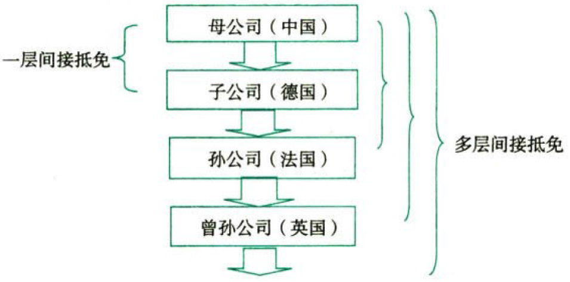

国际税收税务管理实务.境外所得间接负担税额的计算

## 0.1. 境外所得间接负担税额的计算:star: :star: 

子公司只是母公司的投资单位，它与母公司不是统一核算的同一经济实体，而是两个不同的纳税人。

所以，子公司缴纳所得税后，给母公司分红，母公司所在的居住国政府允许母公司抵免的该笔分红在境外由子公司缴纳的所得税，并不是由母公司直接向子公司所在国政府缴纳的，而是`母公司间接负担的`子公司直接缴纳的所得税。

母公司从子公司得到的也只是子公司缴纳所得税后按照股份分配的一部分股息。因此，对母公司从子公司取得股息计征所得税时应该予以抵免的，不能是子公司缴纳的全部所得税，只能是这部分股息所负担的所得税额。所以，这种抵免不是根据实纳税额直接进行，而是按换算的股息应负担的税额进行间接抵免。

【举例】间接抵免存在多层持股的现象：



居民企业在用境外所得间接负担的税额进行税收抵免时，其取得的境外投资收益`实际间接负担的税额`是指根据直接或者间接持股方式合计持股20%以上（含20%，下同）的规定层级的外国企业股份，由此应分得的股息、红利等权益性投资收益中，从最低一层外国企业起逐层计算的属于自上一层企业负担的税额，其计算公式如下：

```
本层企业所纳税额属于由一家上一层企业负担的税额＝（本层企业就利润和投资收益所实际缴纳的税额＋符合财税〔2009〕125号文规定的由本层企业间接负担的税额）×本层企业向一家上一层企业分配的股息（红利）÷本层企业所得税后利润额
```
### 0.1.1. 公式解释

（1）`本层企业`是指实际分配股息（红利）`的境外被投资企业`；

（2）`本层企业就利润和投资收益所实际缴纳的税额`是指本层企业按所在国税法就利润缴纳的企业所得税＋在被投资方所在国就分得的股息等权益性投资收益被源泉扣缴的预提所得税；

（3）符合财税〔2009〕125号文规定的由本层企业间接负担的税额是指该层企业由于从下一层企业分回股息（红利）而间接负担的由下一层企业就其利润缴纳的企业所得税税额；

（4）本层企业向一家上一层企业分配的股息（红利）是指该层企业向上一层企业实际分配的扣缴预提所得税前的股息（红利）数额；

（5）本层企业所得税后利润额是指该层企业实现的利润总额减去就其利润实际缴纳的企业所得税后的余额。

### 0.1.2. 各年未分配利润要分别计算

每一层企业从其持股的下一层企业在一个年度中分得的股息（红利），若是由该下一层企业不同年度的税后未分配利润组成，则应按该股息（红利）对应的每一年度未分配利润，分别计算就该项分配利润所间接负担的税额；按各年度计算的间接负担税额之和，即为取得股息（红利）的企业该一个年度中分得的股息（红利）所得所间接负担的所得税额。

### 0.1.3. 二层

境外第二层及以下层级企业归属不同国家的，在计算居民企业负担境外税额时，均以`境外第一层企业`所在国（地区）为国别划分进行归集计算，而不论该第一层企业的下层企业归属何国（地区）。

上例中要以第一层企业所在国（德国）为国别归集计算负担的境外税款。
